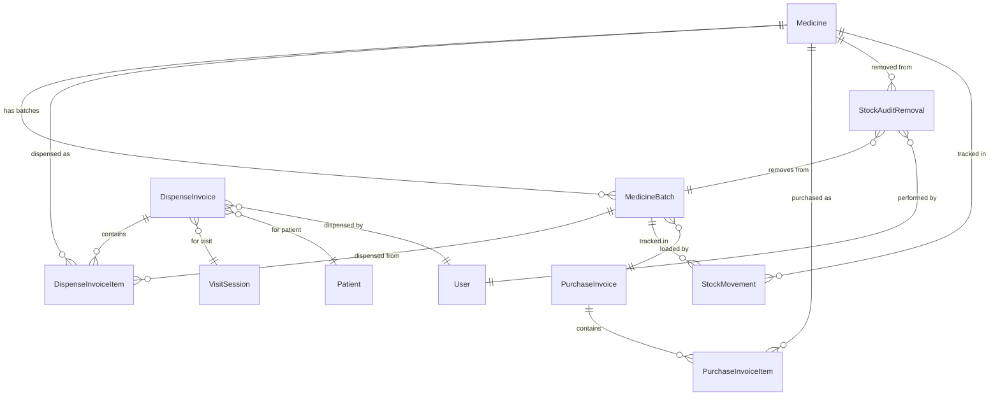
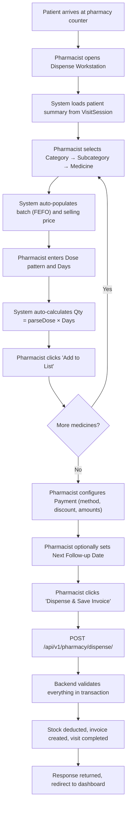

# Pharmacy Backend Architecture Blueprint

> **Version:** 1.0.0  
> **Date:** 2026-05-23  
> **Status:** Specification — Ready for Implementation  
> **Target Stack:** Django 5.x + Django REST Framework 3.15+ + PostgreSQL 16+

---

## Table of Contents

1. [Integration Context](#1-integration-context)
2. [Clarification Questions & Assumptions](#2-clarification-questions--assumptions)
3. [Domain Models](#3-domain-models)
4. [Enum Definitions](#4-enum-definitions)
5. [API Specifications](#5-api-specifications)
6. [Serializer Patterns](#6-serializer-patterns)
7. [Workflow & Business Logic](#7-workflow--business-logic)
8. [Role-Based Access](#8-role-based-access)
9. [Edge Cases & Validation](#9-edge-cases--validation)
10. [Indexing & Query Optimization](#10-indexing--query-optimization)
11. [Async / Background Tasks](#11-async--background-tasks)
12. [Endpoint Inventory Quick Table](#12-endpoint-inventory-quick-table)
13. [Security & Operational Notes](#13-security--operational-notes)

---

## 1. Integration Context

### 1.1 How Pharmacy Fits Into the Existing System

The pharmacy module is a **new Django app** (`pharmacy/`) that sits alongside the existing `accounts`, `patients`, `visits`, and `followups` apps. It owns all inventory, dispensing, and pharmacy-specific reporting models while consuming existing models via foreign keys.

```
┌─────────────────────────────────────────────────────────┐
│                   Django Project                        │
│  ┌──────────┐ ┌──────────┐ ┌──────────┐ ┌───────────┐  │
│  │ accounts │ │ patients │ │  visits  │ │ followups │  │
│  └──────────┘ └──────────┘ └──────────┘ └───────────┘  │
│                       │           │                     │
│                       ▼           ▼                     │
│              ┌────────────────────────┐                 │
│              │      pharmacy          │                 │
│              │  (NEW APP - this doc)  │                 │
│              └────────────────────────┘                 │
└─────────────────────────────────────────────────────────┘
```

### 1.2 Dependencies on Existing Models and APIs

| Dependency | Used By | Relationship |
|---|---|---|
| `accounts.User` | `DispenseInvoice.dispensed_by`, `StockAuditRemoval.removed_by`, `PurchaseInvoice.created_by`, all `*_by` audit fields | FK to User |
| `patients.Patient` | `DispenseInvoice.patient` | FK to Patient |
| `visits.VisitSession` | `DispenseInvoice.visit_session` | FK to VisitSession (OneToOne semantic) |
| `GET /api/v1/receptionist/queue/` | Pharmacy queue page consumes this endpoint client-side, filters by `current_stage='pharmacy'` | API dependency |
| `GET /api/v1/patients/{id}/` | Dispense workstation loads patient detail | API dependency |
| `POST /api/v1/sessions/{sessionId}/transition/` | Dispense save transitions visit to `completed` | API dependency |
| `PATCH /api/v1/patients/{id}/next-followup-date/` | Dispense page schedules next follow-up | API dependency |

### 1.3 Changes Required to Existing Components

#### 1.3.1 `visits.VisitSession` Model Changes

The existing `VisitSession.current_stage` choices must include the full pipeline:

```python
class VisitStage(models.TextChoices):
    CHECKIN    = 'checkin', 'Check-in'
    COUNSELLOR = 'counsellor', 'Counsellor'
    DOCTOR     = 'doctor', 'Doctor'
    PHARMACY   = 'pharmacy', 'Pharmacy'
    COMPLETED  = 'completed', 'Completed'
```

> [!IMPORTANT]
> The existing `VisitStage` enum in the backend already lists `counsellor`, `doctor`, `pharmacy`, `completed`. However, the `CheckinPatientView` currently sets `status=completed` and `current_stage=completed` immediately at check-in. This must be changed to set `status=in_progress` and `current_stage=counsellor` (or `pharmacy` if the counsellor/doctor stages are skipped for now) for the pharmacy queue to function.

#### 1.3.2 `visits.VisitSession` — New Field

```python
medicines_total = models.DecimalField(
    max_digits=10, decimal_places=2, default=0,
    help_text="Total billed amount from pharmacy dispense"
)
```

This field already exists on the model but is never populated. The pharmacy dispense endpoint must update it.

#### 1.3.3 Session Transition Endpoint

`POST /api/v1/sessions/{sessionId}/transition/` must be implemented (or verified) to:
- Accept `{ "next_stage": "completed" }` (and other valid transitions)
- Validate transition is legal (e.g., `pharmacy` → `completed` is valid)
- Set `completed_time` when transitioning to `completed`
- Set `status='completed'` when `current_stage` becomes `completed`

#### 1.3.4 Queue Endpoint Enhancement

The `GET /api/v1/receptionist/queue/` must return sessions with `status='in_progress'` (not just `completed` sessions). The pharmacy frontend filters client-side for `current_stage='pharmacy'`.

Alternatively, a dedicated pharmacy queue endpoint is provided (see §5.7).

### 1.4 Critical Prerequisite: Multi-Stage Visit Workflow

> [!CAUTION]
> **The pharmacy module CANNOT function without the multi-stage visit workflow being operational.** Currently, the backend auto-completes visits at check-in (`status=completed`, `current_stage=completed`). This means no visit will ever have `current_stage='pharmacy'`, and the pharmacy queue will always be empty.
>
> **Before deploying the pharmacy module**, the check-in flow must be modified so that:
> 1. `CheckinPatientView` creates sessions with `status='in_progress'` and `current_stage='counsellor'` (or `current_stage='pharmacy'` as an interim step if counsellor/doctor stages are deferred).
> 2. The session transition endpoint (`POST /api/v1/sessions/{sessionId}/transition/`) correctly advances stages.
> 3. The queue endpoint returns `in_progress` sessions.
>
> **Interim Workaround:** If the multi-stage pipeline is not ready, the check-in can set `current_stage='pharmacy'` directly, bypassing counsellor and doctor stages. The pharmacy will then see all newly checked-in patients immediately.

### 1.5 URL Configuration

The pharmacy app mounts under the existing API prefix:

```python
# backend/backend/urls.py
urlpatterns = [
    # ... existing
    path('api/v1/', include('pharmacy.urls')),
]
```

All pharmacy URLs are prefixed with `pharmacy/` within the app's `urls.py`.

---

## 2. Clarification Questions & Assumptions

### 2.1 Ambiguities Found in the Frontend

| # | Ambiguity | Resolution / Assumption |
|---|---|---|
| 1 | **Invoice number generation**: Frontend generates `INV-{timestamp}` client-side. Should backend accept this or generate its own? | **Assumption:** Backend generates invoice numbers server-side using a sequential format `INV-YYYYMMDD-XXXX` to guarantee uniqueness. The client-generated value is accepted as a `display_invoice_number` field but the canonical `invoice_number` is server-generated. |
| 2 | **Dispense API**: No explicit dispense save endpoint exists in the frontend API client (`inventory-api.ts`). The frontend calls `transitionVisitStage` only. | **Assumption:** A new `POST /api/v1/pharmacy/dispense/` endpoint is required to persist the dispense invoice, line items, payment, and deduct stock. The visit transition should be triggered atomically within this endpoint's transaction. |
| 3 | **Medicine ID format**: Frontend uses string IDs like `"MED-001"`. Backend should use UUID or integer? | **Assumption:** Backend uses UUID primary keys for all new models, consistent with the existing `VisitSession` and `Patient` models. Frontend IDs in mock data are hardcoded placeholders. |
| 4 | **Price per tablet at dispense time**: Frontend allows editing price per tab. Is `sellingPrice` on the medicine the default or authoritative? | **Assumption:** `sellingPrice` on `Medicine` is the default. Pharmacist can override at dispense time. The `DispenseInvoiceItem.unit_price` records the actual price charged (which may differ from `Medicine.sellingPrice`). |
| 5 | **Quantity units**: Frontend references "Tabs" (tablets) everywhere. Is quantity always in tablet units? | **Assumption:** Yes. Quantity across all models is in individual tablet units. The `tablets_per_strip` field on Medicine is informational only (for display/packing reference), not used for quantity conversion. |
| 6 | **Discount logic**: Frontend applies percentage discount (0-100) on subtotal. Is discount per-item or per-invoice? | **Assumption:** Discount is **per-invoice only** (percentage on subtotal). No per-item discounts. |
| 7 | **Audit removal quantity**: The frontend `AuditRemovalPayload` does not include a `quantity` field, but logically an entire batch can't always be removed. | **Assumption:** Audit removal removes the **entire remaining quantity** of the specified batch. A `quantity` field is added to the backend for flexibility; if not provided, the entire batch quantity is removed. |
| 8 | **Supplier list**: Frontend hardcodes 10 supplier companies. Should these be a database model or enum? | **Assumption:** Suppliers are stored as a `CharField` with free-text input. The 10 predefined suppliers are provided as frontend suggestions only. No separate `Supplier` model. |
| 9 | **Purchase invoice photo**: Frontend has `invoicePhotoUrl` field. How is the photo uploaded? | **Assumption:** A separate file upload endpoint or inline base64 submission. The `PurchaseInvoice` model stores a `FileField`. See §5.3. |
| 10 | **Split payment validation**: When `paymentMethod='Split'`, must `cashAmount + onlineAmount == grandTotal`? | **Assumption:** Yes. Backend validates `cash_amount + online_amount == net_payable`. Tolerance of ±1 rupee to handle rounding. |
| 11 | **Next follow-up scheduling**: The dispense page allows scheduling a next visit. Is this the same `patient.next_followup_date`? | **Assumption:** Yes. The dispense endpoint optionally updates `Patient.next_followup_date` via the existing `PATCH /api/v1/patients/{id}/next-followup-date/` endpoint, called within the dispense transaction. |
| 12 | **Audit removal document upload**: The inventory page shows an "Upload Audit Document" feature for removal. | **Assumption:** An optional `FileField` on `StockAuditRemoval` for evidence documents. Not a required field. |
| 13 | **Consumption report data source**: Should consumption reports be computed from `DispenseInvoiceItem` records or from a separate `StockMovement` log? | **Assumption:** Both exist. Reports query `DispenseInvoiceItem` for dispense-based consumption. `StockMovement` serves as a complete audit log for all stock changes (purchase, dispense, removal). |

### 2.2 Critical Assumptions

> [!IMPORTANT]
> **A-1: One dispense per visit.** Each `VisitSession` may have at most ONE `DispenseInvoice`. This is enforced via a unique constraint on `DispenseInvoice.visit_session`.

> [!IMPORTANT]
> **A-2: Stock deduction is per-batch.** Each `DispenseInvoiceItem` references a specific batch. Stock is deducted from that specific batch, not aggregated across batches.

> [!IMPORTANT]
> **A-3: No partial dispense.** Either the full dispense invoice is saved or nothing is saved. No "draft" or "partial" states.

> [!WARNING]
> **A-4: Currency is INR.** All monetary fields are in Indian Rupees. No multi-currency support.

> [!NOTE]
> **A-5: Timezone.** All datetime fields use `Asia/Kolkata` timezone for business date calculations (determining "today's" revenue, queue, etc.). The `settings.TIME_ZONE` should be `'Asia/Kolkata'` and `USE_TZ=True`.

> [!NOTE]
> **A-6: BUP (Buprenorphine) is a controlled substance.** The `BUP` category medicines are Schedule H1 drugs. The backend must ensure complete audit trail for BUP dispensing.

---

## 3. Domain Models

### 3.1 `pharmacy.Medicine`

**Purpose:** Master record for a pharmaceutical product registered in inventory. Does NOT track stock (batches do that). Represents the "definition" of a medicine.

| Field | Type | Constraints | Description |
|---|---|---|---|
| `id` | `UUIDField` | PK, `default=uuid4` | Primary key |
| `name` | `CharField(255)` | Required, not blank | Trade/brand name (e.g., "Buprenorphine Sublingual 2.0mg") |
| `salt` | `CharField(255)` | Required, not blank | Generic/salt composition (e.g., "Buprenorphine + Naloxone") |
| `category` | `CharField(10)` | Required, choices=`MedicineCategory` | One of: `BUP`, `Rx`, `NRx` |
| `bup_category` | `CharField(20)` | Nullable, blank, choices=`BupStrength` | BUP strength subcategory. Required when `category='BUP'`, null otherwise |
| `manufacturer` | `CharField(255)` | Required, not blank | Manufacturer/company name |
| `reorder_level` | `PositiveIntegerField` | Required, `default=50` | Minimum stock threshold (tablets). Low stock alert triggers at or below this level |
| `tablets_per_strip` | `PositiveIntegerField` | Required, `default=10` | Informational: number of tablets per strip/blister |
| `mrp` | `DecimalField(10,2)` | Required, `min=0` | Maximum retail price per tablet |
| `selling_price` | `DecimalField(10,2)` | Required, `min=0` | Default selling price per tablet. Must be ≤ MRP |
| `is_active` | `BooleanField` | `default=True` | Soft delete flag. Inactive medicines cannot be dispensed or restocked |
| `deletion_reason` | `CharField(255)` | Nullable, blank | Reason for soft-deletion |
| `deletion_notes` | `TextField` | Nullable, blank | Additional notes for deletion audit |
| `created_at` | `DateTimeField` | `auto_now_add` | Record creation timestamp |
| `updated_at` | `DateTimeField` | `auto_now` | Last update timestamp |
| `created_by` | `ForeignKey(User)` | Nullable, `SET_NULL` | User who created the record |
| `updated_by` | `ForeignKey(User)` | Nullable, `SET_NULL` | User who last updated the record |

**Unique Constraints:**
```python
class Meta:
    constraints = [
        UniqueConstraint(
            fields=['name', 'category', 'bup_category'],
            condition=Q(is_active=True),
            name='unique_active_medicine'
        )
    ]
    indexes = [
        Index(fields=['category']),
        Index(fields=['is_active']),
        Index(fields=['category', 'bup_category']),
    ]
```

**Validation Rules:**
- `selling_price <= mrp` (enforced in serializer)
- If `category == 'BUP'`, `bup_category` must be one of the valid `BupStrength` values
- If `category != 'BUP'`, `bup_category` must be null
- `name` + `category` + `bup_category` must be unique among active medicines

**Business Logic:**
- `total_stock` property: sum of all active (non-expired, non-removed) batch quantities
- `is_low_stock` property: `total_stock <= reorder_level`

---

### 3.2 `pharmacy.MedicineBatch`

**Purpose:** Tracks specific batch/lot of a medicine with its own expiry date and quantity. Stock is tracked at the batch level.

| Field | Type | Constraints | Description |
|---|---|---|---|
| `id` | `UUIDField` | PK, `default=uuid4` | Primary key |
| `medicine` | `ForeignKey(Medicine)` | Required, `CASCADE` | Parent medicine |
| `batch_number` | `CharField(50)` | Required, not blank | Manufacturer batch/lot number |
| `expiry_date` | `DateField` | Required | Batch expiry date |
| `quantity` | `IntegerField` | Required, `default=0`, `min=0` | Current available quantity in tablets. Decremented on dispense, incremented on purchase |
| `initial_quantity` | `PositiveIntegerField` | Required | Original quantity loaded (immutable after creation). Used for audit |
| `purchase_price` | `DecimalField(10,2)` | Required, `min=0` | Purchase/cost price per tablet for this batch |
| `gst_percentage` | `DecimalField(5,2)` | `default=0`, `min=0`, `max=100` | GST percentage applied on purchase |
| `purchase_invoice` | `ForeignKey(PurchaseInvoice)` | Nullable, `SET_NULL` | The purchase invoice that loaded this batch (null for seed data) |
| `is_active` | `BooleanField` | `default=True` | False when batch is fully consumed, expired-and-removed, or audit-removed |
| `created_at` | `DateTimeField` | `auto_now_add` | |
| `updated_at` | `DateTimeField` | `auto_now` | |

**Unique Constraints:**
```python
class Meta:
    constraints = [
        UniqueConstraint(
            fields=['medicine', 'batch_number'],
            name='unique_medicine_batch'
        )
    ]
    indexes = [
        Index(fields=['medicine', 'expiry_date']),
        Index(fields=['expiry_date']),
        Index(fields=['is_active']),
    ]
    ordering = ['expiry_date']  # FEFO ordering by default
```

**Validation Rules:**
- `batch_number` must be unique per medicine (not globally)
- `expiry_date` must be a future date when creating via purchase invoice
- `quantity` must never go negative (enforced via `F()` expressions and check constraints)

**Properties:**
- `is_expired`: `expiry_date < today`
- `is_near_expiry`: `0 < days_until_expiry <= 180`
- `days_until_expiry`: `(expiry_date - today).days`

---

### 3.3 `pharmacy.PurchaseInvoice`

**Purpose:** Records a purchase/procurement invoice from a supplier. Each invoice loads one or more batches into inventory.

| Field | Type | Constraints | Description |
|---|---|---|---|
| `id` | `UUIDField` | PK, `default=uuid4` | Primary key |
| `invoice_number` | `CharField(50)` | Required, unique | Supplier's invoice number |
| `supplier` | `CharField(255)` | Required, not blank | Supplier company name |
| `invoice_date` | `DateField` | Required | Date on the supplier invoice |
| `delivery_date` | `DateField` | Nullable, blank | Date goods were physically received |
| `invoice_photo` | `FileField` | Nullable, blank, `upload_to='pharmacy/purchase_invoices/'` | Scanned copy of paper invoice |
| `total_amount` | `DecimalField(12,2)` | `default=0` | Computed total purchase amount (sum of all items incl. GST) |
| `items_count` | `PositiveIntegerField` | `default=0` | Number of line items |
| `notes` | `TextField` | Nullable, blank | Optional notes |
| `created_at` | `DateTimeField` | `auto_now_add` | |
| `updated_at` | `DateTimeField` | `auto_now` | |
| `created_by` | `ForeignKey(User)` | Nullable, `SET_NULL` | Pharmacist who entered the invoice |

**Unique Constraints:**
```python
class Meta:
    constraints = [
        UniqueConstraint(fields=['invoice_number'], name='unique_purchase_invoice_number')
    ]
    indexes = [
        Index(fields=['supplier']),
        Index(fields=['invoice_date']),
        Index(fields=['-created_at']),
    ]
    ordering = ['-created_at']
```

**Validation Rules:**
- `invoice_number` must be unique (globally)
- `invoice_date` cannot be in the future
- `delivery_date`, if provided, must be ≥ `invoice_date`

---

### 3.4 `pharmacy.PurchaseInvoiceItem`

**Purpose:** Line item within a purchase invoice. Maps to a batch being loaded.

| Field | Type | Constraints | Description |
|---|---|---|---|
| `id` | `UUIDField` | PK, `default=uuid4` | Primary key |
| `purchase_invoice` | `ForeignKey(PurchaseInvoice)` | Required, `CASCADE`, `related_name='items'` | Parent invoice |
| `medicine` | `ForeignKey(Medicine)` | Required, `PROTECT` | Medicine being stocked |
| `batch` | `ForeignKey(MedicineBatch)` | Required, `PROTECT` | Batch created or updated by this item |
| `category` | `CharField(10)` | Required | Denormalized medicine category at time of purchase |
| `subcategory` | `CharField(20)` | Nullable, blank | Denormalized BUP subcategory |
| `batch_number` | `CharField(50)` | Required | Denormalized batch number |
| `expiry_date` | `DateField` | Required | Denormalized expiry date |
| `quantity` | `PositiveIntegerField` | Required, `min=1` | Number of tablets loaded |
| `purchase_price` | `DecimalField(10,2)` | Required, `min=0` | Cost price per tablet |
| `gst_percentage` | `DecimalField(5,2)` | `default=0` | GST rate |
| `line_total` | `DecimalField(12,2)` | Computed | `quantity * purchase_price * (1 + gst_percentage/100)` |
| `created_at` | `DateTimeField` | `auto_now_add` | |

**Indexes:**
```python
class Meta:
    indexes = [
        Index(fields=['purchase_invoice']),
        Index(fields=['medicine']),
    ]
```

---

### 3.5 `pharmacy.DispenseInvoice`

**Purpose:** Records a single dispensing transaction for a patient visit. This is the "bill" generated at the pharmacy counter.

| Field | Type | Constraints | Description |
|---|---|---|---|
| `id` | `UUIDField` | PK, `default=uuid4` | Primary key |
| `invoice_number` | `CharField(30)` | Required, unique | System-generated invoice number: `INV-YYYYMMDD-XXXX` |
| `display_invoice_number` | `CharField(50)` | Nullable, blank | Optional client-provided invoice number for display |
| `visit_session` | `OneToOneField(VisitSession)` | Required, `PROTECT`, unique | Associated visit session. One dispense per visit |
| `patient` | `ForeignKey(Patient)` | Required, `PROTECT` | Patient receiving medicines |
| `dispensed_by` | `ForeignKey(User)` | Required, `PROTECT` | Pharmacist who dispensed |
| `dispense_date` | `DateField` | Required, `default=today` | Date of dispensing |
| `dispense_time` | `DateTimeField` | Required, `auto_now_add` | Exact time of dispensing |
| `subtotal` | `DecimalField(10,2)` | Required | Sum of all line item totals before discount |
| `discount_percentage` | `DecimalField(5,2)` | `default=0`, `min=0`, `max=100` | Discount percentage applied |
| `discount_amount` | `DecimalField(10,2)` | `default=0` | Computed: `round(subtotal * discount_percentage / 100)` |
| `net_payable` | `DecimalField(10,2)` | Required | `subtotal - discount_amount` |
| `payment_method` | `CharField(10)` | Required, choices=`PaymentMethod` | One of: `Cash`, `Online`, `Split` |
| `cash_amount` | `DecimalField(10,2)` | `default=0` | Amount paid in cash |
| `online_amount` | `DecimalField(10,2)` | `default=0` | Amount paid online |
| `notes` | `TextField` | Nullable, blank | Pharmacist notes/remarks |
| `next_followup_date` | `DateField` | Nullable, blank | Follow-up date scheduled at dispense time (also synced to Patient) |
| `status` | `CharField(10)` | `default='success'`, choices=`DispenseStatus` | `success` or `cancelled` |
| `created_at` | `DateTimeField` | `auto_now_add` | |
| `updated_at` | `DateTimeField` | `auto_now` | |

**Unique Constraints & Indexes:**
```python
class Meta:
    constraints = [
        UniqueConstraint(fields=['invoice_number'], name='unique_dispense_invoice_number'),
        UniqueConstraint(fields=['visit_session'], name='unique_dispense_per_visit'),
        CheckConstraint(
            check=Q(discount_percentage__gte=0, discount_percentage__lte=100),
            name='valid_discount_percentage'
        ),
        CheckConstraint(
            check=Q(cash_amount__gte=0),
            name='non_negative_cash'
        ),
        CheckConstraint(
            check=Q(online_amount__gte=0),
            name='non_negative_online'
        ),
    ]
    indexes = [
        Index(fields=['patient', '-dispense_date']),
        Index(fields=['-dispense_date']),
        Index(fields=['dispensed_by', '-dispense_date']),
        Index(fields=['payment_method']),
        Index(fields=['status']),
    ]
    ordering = ['-dispense_time']
```

**Invoice Number Generation:**
```python
@classmethod
def generate_invoice_number(cls):
    today_str = timezone.localdate().strftime('%Y%m%d')
    prefix = f'INV-{today_str}-'
    last = cls.objects.filter(
        invoice_number__startswith=prefix
    ).order_by('-invoice_number').first()
    if last:
        seq = int(last.invoice_number.split('-')[-1]) + 1
    else:
        seq = 1
    return f'{prefix}{seq:04d}'
```

---

### 3.6 `pharmacy.DispenseInvoiceItem`

**Purpose:** Line item in a dispense invoice. Each row represents one medicine+batch dispensed with dose and quantity info.

| Field | Type | Constraints | Description |
|---|---|---|---|
| `id` | `UUIDField` | PK, `default=uuid4` | Primary key |
| `dispense_invoice` | `ForeignKey(DispenseInvoice)` | Required, `CASCADE`, `related_name='items'` | Parent invoice |
| `medicine` | `ForeignKey(Medicine)` | Required, `PROTECT` | Medicine dispensed |
| `batch` | `ForeignKey(MedicineBatch)` | Required, `PROTECT` | Specific batch dispensed from |
| `medicine_name` | `CharField(255)` | Required | Denormalized medicine name (snapshot at dispense time) |
| `salt` | `CharField(255)` | Required | Denormalized salt composition |
| `category` | `CharField(10)` | Required | Denormalized category |
| `batch_number` | `CharField(50)` | Required | Denormalized batch number |
| `expiry_date` | `DateField` | Required | Denormalized batch expiry |
| `dose` | `CharField(20)` | Required | Dose pattern string (e.g., "1-0-1", "0.5", "2") |
| `days` | `PositiveIntegerField` | Required, `min=1` | Number of days prescribed |
| `quantity` | `PositiveIntegerField` | Required, `min=1` | Total tablets dispensed |
| `unit_price` | `DecimalField(10,2)` | Required, `min=0` | Price per tablet (may differ from medicine.selling_price) |
| `total` | `DecimalField(10,2)` | Required | `quantity * unit_price` |
| `created_at` | `DateTimeField` | `auto_now_add` | |

**Indexes:**
```python
class Meta:
    indexes = [
        Index(fields=['dispense_invoice']),
        Index(fields=['medicine', '-created_at']),
        Index(fields=['batch']),
    ]
```

---

### 3.7 `pharmacy.StockAuditRemoval`

**Purpose:** Records controlled removal of stock due to expiry, damage, return, or defect. Full audit trail.

| Field | Type | Constraints | Description |
|---|---|---|---|
| `id` | `UUIDField` | PK, `default=uuid4` | Primary key |
| `medicine` | `ForeignKey(Medicine)` | Required, `PROTECT` | Medicine being removed |
| `batch` | `ForeignKey(MedicineBatch)` | Required, `PROTECT` | Batch being removed from |
| `batch_number` | `CharField(50)` | Required | Denormalized batch number |
| `quantity_removed` | `PositiveIntegerField` | Required | Number of tablets removed |
| `reason` | `CharField(20)` | Required, choices=`RemovalReason` | One of: `destroyed`, `returned`, `damaged`, `defect` |
| `notes` | `TextField` | Nullable, blank | Additional details |
| `audit_document` | `FileField` | Nullable, blank, `upload_to='pharmacy/audit_removals/'` | Supporting evidence document |
| `removed_by` | `ForeignKey(User)` | Required, `PROTECT` | User who performed removal |
| `removed_at` | `DateTimeField` | `auto_now_add` | |

**Indexes:**
```python
class Meta:
    indexes = [
        Index(fields=['medicine']),
        Index(fields=['batch']),
        Index(fields=['reason']),
        Index(fields=['-removed_at']),
    ]
    ordering = ['-removed_at']
```

---

### 3.8 `pharmacy.StockMovement`

**Purpose:** Immutable audit log for every stock quantity change. Append-only ledger.

| Field | Type | Constraints | Description |
|---|---|---|---|
| `id` | `UUIDField` | PK, `default=uuid4` | Primary key |
| `medicine` | `ForeignKey(Medicine)` | Required, `PROTECT` | |
| `batch` | `ForeignKey(MedicineBatch)` | Required, `PROTECT` | |
| `movement_type` | `CharField(20)` | Required, choices=`MovementType` | One of: `purchase`, `dispense`, `audit_removal`, `adjustment` |
| `quantity_change` | `IntegerField` | Required | Positive for inflow (purchase), negative for outflow (dispense/removal) |
| `quantity_before` | `IntegerField` | Required | Batch quantity before this movement |
| `quantity_after` | `IntegerField` | Required | Batch quantity after this movement |
| `reference_type` | `CharField(30)` | Nullable | `ContentType` name (e.g., `'purchaseinvoiceitem'`, `'dispenseinvoiceitem'`, `'stockauditremoval'`) |
| `reference_id` | `UUIDField` | Nullable | PK of the referencing object |
| `performed_by` | `ForeignKey(User)` | Nullable, `SET_NULL` | |
| `performed_at` | `DateTimeField` | `auto_now_add` | |
| `notes` | `CharField(255)` | Nullable, blank | |

**Indexes:**
```python
class Meta:
    indexes = [
        Index(fields=['medicine', '-performed_at']),
        Index(fields=['batch', '-performed_at']),
        Index(fields=['movement_type']),
        Index(fields=['-performed_at']),
    ]
    ordering = ['-performed_at']
```

> [!NOTE]
> `StockMovement` is **append-only**. No update or delete operations are ever performed on this table. It serves as an immutable audit trail for regulatory compliance.

---

### 3.9 Summary of Model Relationships



---

## 4. Enum Definitions

### 4.1 `MedicineCategory`

```python
class MedicineCategory(models.TextChoices):
    BUP = 'BUP', 'BUP (Controlled Substance)'
    RX  = 'Rx',  'Rx (Prescription Only)'
    NRX = 'NRx', 'NRx (Non-Prescription / General)'
```

### 4.2 `BupStrength`

```python
class BupStrength(models.TextChoices):
    MG_04 = '0.4mg + 0.1mg',  'Buprenorphine 0.4mg + Naloxone 0.1mg'
    MG_10 = '1.0mg + 0.25mg', 'Buprenorphine 1.0mg + Naloxone 0.25mg'
    MG_20 = '2.0mg + 0.5mg',  'Buprenorphine 2.0mg + Naloxone 0.5mg'
```

### 4.3 `PaymentMethod`

```python
class PaymentMethod(models.TextChoices):
    CASH   = 'Cash',   'Cash'
    ONLINE = 'Online', 'Online / Digital Payment'
    SPLIT  = 'Split',  'Split Payment (Cash + Online)'
```

### 4.4 `RemovalReason`

```python
class RemovalReason(models.TextChoices):
    DESTROYED = 'destroyed', 'Destroyed'
    RETURNED  = 'returned',  'Returned to Supplier'
    DAMAGED   = 'damaged',   'Damaged'
    DEFECT    = 'defect',    'Manufacturing Defect'
```

### 4.5 `MovementType`

```python
class MovementType(models.TextChoices):
    PURCHASE      = 'purchase',      'Purchase / Stock In'
    DISPENSE      = 'dispense',      'Dispense / Stock Out'
    AUDIT_REMOVAL = 'audit_removal', 'Audit Removal'
    ADJUSTMENT    = 'adjustment',    'Manual Adjustment'
```

### 4.6 `DispenseStatus`

```python
class DispenseStatus(models.TextChoices):
    SUCCESS   = 'success',   'Success'
    CANCELLED = 'cancelled', 'Cancelled'
```

---

## 5. API Specifications

### 5.1 Medicine CRUD

#### 5.1.1 `GET /api/v1/pharmacy/inventory/medicines/`

**Purpose:** List all active medicines with their batches.

| Attribute | Value |
|---|---|
| **Method** | `GET` |
| **Permission** | `IsReceptionAdminOrPharmacist` |
| **Pagination** | None (returns all active medicines; typically < 200 items) |
| **Filtering** | Query params: `category`, `bup_category`, `search` (name/salt icontains) |

**Query Parameters:**

| Param | Type | Required | Description |
|---|---|---|---|
| `category` | string | No | Filter by medicine category: `BUP`, `Rx`, `NRx` |
| `bup_category` | string | No | Filter by BUP strength (only when `category=BUP`) |
| `search` | string | No | Search by name or salt (case-insensitive contains) |

**Response (200):**
```json
{
  "success": true,
  "data": {
    "items": [
      {
        "id": "uuid",
        "name": "Buprenorphine Sublingual 2.0mg",
        "salt": "Buprenorphine + Naloxone",
        "category": "BUP",
        "bupCategory": "2.0mg + 0.5mg",
        "manufacturer": "Abbott Healthcare",
        "reorderLevel": 50,
        "tabletsPerStrip": 10,
        "mrp": 450.00,
        "sellingPrice": 420.00,
        "batches": [
          {
            "batchNumber": "B-2024-01",
            "expiryDate": "2026-10-15",
            "quantity": 120
          }
        ]
      }
    ],
    "total": 7
  }
}
```

**Field name mapping (backend → frontend):**

| Backend field | Frontend field | Notes |
|---|---|---|
| `bup_category` | `bupCategory` | camelCase in response |
| `reorder_level` | `reorderLevel` | camelCase in response |
| `tablets_per_strip` | `tabletsPerStrip` | camelCase in response |
| `selling_price` | `sellingPrice` | camelCase in response |

> [!TIP]
> Use DRF's `CamelCaseJSONParser` and `CamelCaseJSONRenderer` from `djangorestframework-camel-case` package, or manually define serializer field sources. The existing codebase appears to use snake_case on the backend and camelCase on the frontend. Choose one approach consistently.

**Side Effects:** None (read-only).

---

#### 5.1.2 `POST /api/v1/pharmacy/inventory/medicines/`

**Purpose:** Register a new medicine in the inventory master.

| Attribute | Value |
|---|---|
| **Method** | `POST` |
| **Permission** | `IsPharmacistOrAdmin` |
| **CSRF** | Required |

**Request Body:**
```json
{
  "name": "Olanzapine 5mg",
  "salt": "Olanzapine",
  "category": "Rx",
  "bupCategory": null,
  "manufacturer": "Sun Pharma",
  "reorderLevel": 50,
  "tabletsPerStrip": 10,
  "mrp": 125.00,
  "sellingPrice": 110.00
}
```

| Field | Type | Required | Validation |
|---|---|---|---|
| `name` | string | Yes | 1-255 chars, not blank |
| `salt` | string | Yes | 1-255 chars, not blank |
| `category` | string | Yes | One of: `BUP`, `Rx`, `NRx` |
| `bupCategory` | string/null | Conditional | Required if `category='BUP'`; must be null otherwise |
| `manufacturer` | string | Yes | 1-255 chars |
| `reorderLevel` | integer | Yes | ≥ 0 |
| `tabletsPerStrip` | integer | Yes | ≥ 1 |
| `mrp` | decimal | Yes | ≥ 0 |
| `sellingPrice` | decimal | Yes | ≥ 0, ≤ `mrp` |

**Response (201):**
Returns the full `InventoryMedicine` object (same shape as list response item).

**Error Responses:**

| Code | Condition |
|---|---|
| 400 | Validation failure (missing fields, `sellingPrice > mrp`, BUP category mismatch) |
| 409 | Duplicate medicine: same `name`+`category`+`bupCategory` already exists and is active |
| 401 | Not authenticated |
| 403 | Insufficient permissions / CSRF failure |

**Side Effects:**
- Creates a `Medicine` record with `is_active=True`
- Sets `created_by` to the authenticated user

---

#### 5.1.3 `PATCH /api/v1/pharmacy/inventory/medicines/{id}/`

**Purpose:** Update an existing medicine's details (partial update).

| Attribute | Value |
|---|---|
| **Method** | `PATCH` |
| **Permission** | `IsPharmacistOrAdmin` |
| **CSRF** | Required |

**Request Body:** Any subset of the fields from `POST` payload.

**Validation Rules:**
- Same rules as POST, but all fields optional
- If `category` is changed, `bup_category` consistency must be maintained
- If `sellingPrice` is provided, it must be ≤ existing `mrp` or the new `mrp` if also provided

**Response (200):** Full updated `InventoryMedicine` object.

**Error Responses:**

| Code | Condition |
|---|---|
| 400 | Validation failure |
| 404 | Medicine not found or inactive |
| 409 | Update would create a duplicate active medicine |

**Side Effects:**
- Sets `updated_by` to authenticated user
- Sets `updated_at` to current time

---

#### 5.1.4 `DELETE /api/v1/pharmacy/inventory/medicines/{id}/`

**Purpose:** Soft-delete a medicine from the inventory. The medicine record is retained for historical reference.

| Attribute | Value |
|---|---|
| **Method** | `DELETE` |
| **Permission** | `IsPharmacistOrAdmin` |
| **CSRF** | Required |

**Request Body:**
```json
{
  "reason": "controlled_deletion",
  "notes": "Optional explanation"
}
```

| Field | Type | Required | Validation |
|---|---|---|---|
| `reason` | string | Yes | Non-empty string |
| `notes` | string | No | Free text |

**Response (200):**
```json
{
  "success": true,
  "data": {
    "deleted": true,
    "medicineId": "uuid"
  }
}
```

**Error Responses:**

| Code | Condition |
|---|---|
| 400 | Reason not provided |
| 404 | Medicine not found |

> [!WARNING]
> Soft-delete DOES NOT remove batch records. Existing `DispenseInvoiceItem` records referencing this medicine remain intact. The medicine simply becomes `is_active=False` and no longer appears in listings or can be dispensed.

**Side Effects:**
- Sets `is_active=False`, `deletion_reason`, `deletion_notes`
- Sets `updated_by` to authenticated user

---

### 5.2 Inventory Statistics

#### `GET /api/v1/pharmacy/inventory/stats/`

**Purpose:** Dashboard statistics for the inventory module.

| Attribute | Value |
|---|---|
| **Method** | `GET` |
| **Permission** | `IsReceptionAdminOrPharmacist` |

**Response (200):**
```json
{
  "success": true,
  "data": {
    "totalMedicines": 7,
    "lowStockCount": 2,
    "nearExpiryCount": 3,
    "expiredCount": 1,
    "totalStockValue": 145600.00,
    "todaysRevenue": 8400.00
  }
}
```

**Computation Logic:**

| Field | SQL/ORM Logic |
|---|---|
| `totalMedicines` | `Medicine.objects.filter(is_active=True).count()` |
| `lowStockCount` | Count of active medicines where `sum(batch.quantity) <= reorder_level` |
| `nearExpiryCount` | Count of active batches where `0 < days_to_expiry <= 180` |
| `expiredCount` | Count of active batches where `expiry_date < today` |
| `totalStockValue` | `sum(batch.quantity * medicine.selling_price)` for all active batches of active medicines |
| `todaysRevenue` | `sum(net_payable)` from `DispenseInvoice` where `dispense_date=today` and `status='success'` |

---

### 5.3 Purchase Invoice Submission

#### `POST /api/v1/pharmacy/inventory/invoices/`

**Purpose:** Submit a purchase invoice to load stock into inventory. Creates or updates batches for each line item.

| Attribute | Value |
|---|---|
| **Method** | `POST` |
| **Permission** | `IsPharmacistOrAdmin` |
| **CSRF** | Required |
| **Transaction** | Entire operation is wrapped in `atomic()` |

**Request Body:**
```json
{
  "invoiceNumber": "SUP-2026-0042",
  "supplier": "Abbott Healthcare Ltd",
  "invoiceDate": "2026-05-20",
  "deliveryDate": "2026-05-22",
  "invoicePhotoUrl": null,
  "items": [
    {
      "medicineId": "uuid",
      "category": "BUP",
      "subcategory": "2.0mg + 0.5mg",
      "batchNumber": "B-2026-NEW",
      "expiryDate": "2028-06-30",
      "quantity": 500,
      "purchasePrice": 320.00,
      "gstPercentage": 12.0
    }
  ]
}
```

| Field | Type | Required | Validation |
|---|---|---|---|
| `invoiceNumber` | string | Yes | 1-50 chars, must be unique |
| `supplier` | string | Yes | Non-empty |
| `invoiceDate` | date | Yes | Cannot be in the future |
| `deliveryDate` | date | No | Must be ≥ `invoiceDate` if provided |
| `invoicePhotoUrl` | string/null | No | URL to uploaded photo (or null) |
| `items` | array | Yes | At least 1 item |
| `items[].medicineId` | UUID | Yes | Must reference an active medicine |
| `items[].category` | string | Yes | Informational |
| `items[].subcategory` | string | No | Informational |
| `items[].batchNumber` | string | Yes | Non-empty |
| `items[].expiryDate` | date | Yes | Must be a future date |
| `items[].quantity` | integer | Yes | ≥ 1 |
| `items[].purchasePrice` | decimal | Yes | ≥ 0 |
| `items[].gstPercentage` | decimal | Yes | 0-100 |

**Response (201):**
```json
{
  "success": true,
  "data": {
    "success": true,
    "invoiceNumber": "SUP-2026-0042",
    "itemsLoaded": 1
  }
}
```

**Error Responses:**

| Code | Condition |
|---|---|
| 400 | Validation failure, empty items, invalid medicine ID |
| 404 | Referenced medicine not found |
| 409 | Duplicate invoice number |

**Side Effects (per item, inside transaction):**
1. Look up `MedicineBatch` by `(medicine, batch_number)`
2. If batch exists: increment `quantity` by the item's quantity
3. If batch does not exist: create new `MedicineBatch` with the item's data
4. Create `PurchaseInvoiceItem` record
5. Create `StockMovement` record with `movement_type='purchase'`, positive `quantity_change`
6. Update `PurchaseInvoice.total_amount` and `items_count`

---

### 5.4 Audit Stock Removal

#### `POST /api/v1/pharmacy/inventory/audit-removal/`

**Purpose:** Controlled removal of stock for regulatory/quality reasons.

| Attribute | Value |
|---|---|
| **Method** | `POST` |
| **Permission** | `IsPharmacistOrAdmin` |
| **CSRF** | Required |
| **Transaction** | `atomic()` |

**Request Body:**
```json
{
  "medicineId": "uuid",
  "batchNumber": "B-2024-01",
  "reason": "destroyed",
  "notes": "Expired batch destroyed per protocol"
}
```

| Field | Type | Required | Validation |
|---|---|---|---|
| `medicineId` | UUID | Yes | Must reference an active medicine |
| `batchNumber` | string | Yes | Must reference an existing batch for the medicine |
| `reason` | string | Yes | One of: `destroyed`, `returned`, `damaged`, `defect` |
| `notes` | string | No | Free text |

**Response (200):**
```json
{
  "success": true,
  "data": {
    "success": true,
    "medicineId": "uuid",
    "batchNumber": "B-2024-01"
  }
}
```

**Error Responses:**

| Code | Condition |
|---|---|
| 400 | Invalid reason, batch not found |
| 404 | Medicine not found |

**Side Effects:**
1. Read current `batch.quantity` as `qty_before`
2. Set `batch.quantity = 0` (entire batch removed)
3. Set `batch.is_active = False` if quantity reaches 0
4. Create `StockAuditRemoval` record with `quantity_removed = qty_before`
5. Create `StockMovement` with `movement_type='audit_removal'`, `quantity_change = -qty_before`

---

### 5.5 Product Dispense History

#### `GET /api/v1/pharmacy/inventory/medicines/{medicineId}/dispense-history/`

**Purpose:** Per-medicine dispense log showing every time this medicine was dispensed, with patient and batch details.

| Attribute | Value |
|---|---|
| **Method** | `GET` |
| **Permission** | `IsReceptionAdminOrPharmacist` |
| **Pagination** | Optional (cursor or page-based if data grows large) |

**Query Parameters:**

| Param | Type | Required | Description |
|---|---|---|---|
| `month` | string | No | Filter by month: `YYYY-MM` format |
| `date` | string | No | Filter by exact date: `YYYY-MM-DD` format |

**Response (200):**
```json
{
  "success": true,
  "data": {
    "medicineId": "uuid",
    "items": [
      {
        "id": "uuid",
        "dispenseDate": "2026-05-20",
        "patientName": "Rahul Sharma",
        "patientUid": "uuid-short",
        "batchNumber": "B-2024-01",
        "expiryDate": "2026-10-15",
        "quantity": 20,
        "totalPrice": 8400.00
      }
    ],
    "totalQuantity": 420
  }
}
```

**SQL Logic:**
```python
DispenseInvoiceItem.objects.filter(
    medicine_id=medicine_id,
    dispense_invoice__status='success'
).select_related('dispense_invoice', 'dispense_invoice__patient')
```

With optional `.filter(dispense_invoice__dispense_date=...)` for date filtering.

---

### 5.6 Pharmacy Queue (Dedicated Endpoint)

#### `GET /api/v1/pharmacy/queue/`

**Purpose:** Returns patients currently at the pharmacy stage, ready for dispensing. This is a pharmacy-specific alternative to filtering the receptionist queue client-side.

| Attribute | Value |
|---|---|
| **Method** | `GET` |
| **Permission** | `IsReceptionAdminOrPharmacist` |

> [!NOTE]
> The frontend currently uses `GET /api/v1/receptionist/queue/` and filters client-side for `current_stage='pharmacy'`. This dedicated endpoint is recommended but optional. If the existing queue endpoint is enhanced to support a `current_stage` query parameter, this dedicated endpoint may not be needed.

**Response (200):**
```json
{
  "success": true,
  "data": {
    "items": [
      {
        "session_id": "uuid",
        "patient_id": "uuid",
        "patient_name": "Rahul Sharma",
        "current_stage": "pharmacy",
        "checked_in_at": "2026-05-23T09:30:00+05:30",
        "checked_in_by_name": "Reception Staff",
        "status": "in_progress",
        "outstanding_debt": 0,
        "patient": {
          "file_number": "F-102",
          "registration_number": "REG-2026-0042"
        }
      }
    ],
    "total": 3
  }
}
```

**SQL Logic:**
```python
VisitSession.objects.filter(
    visit_date=timezone.localdate(),
    status='in_progress',
    current_stage='pharmacy'
).select_related('patient', 'checked_in_by')
.order_by('checkin_time')
```

---

### 5.7 Dispense Invoice Creation

#### `POST /api/v1/pharmacy/dispense/`

**Purpose:** The primary dispensing endpoint. Persists the complete dispense invoice with line items and payment, deducts stock from batches, transitions the visit to completed, and optionally sets the next follow-up date.

| Attribute | Value |
|---|---|
| **Method** | `POST` |
| **Permission** | `IsPharmacistOrAdmin` |
| **CSRF** | Required |
| **Transaction** | Entire operation in `atomic()` with `select_for_update()` on batches |

**Request Body:**
```json
{
  "sessionId": "uuid",
  "displayInvoiceNumber": "INV-234567",
  "lineItems": [
    {
      "medicineId": "uuid",
      "batchNumber": "B-2024-01",
      "dose": "1-0-1",
      "days": 10,
      "qty": 20,
      "unitPrice": 420.00
    }
  ],
  "payment": {
    "paymentMethod": "Cash",
    "cashAmount": 7980.00,
    "onlineAmount": 0,
    "discount": 5.0,
    "notes": "Regular patient discount applied"
  },
  "nextFollowupDate": "2026-06-02"
}
```

**Request Field Definitions:**

| Field | Type | Required | Validation |
|---|---|---|---|
| `sessionId` | UUID | Yes | Must reference an existing `VisitSession` with `status='in_progress'` and `current_stage='pharmacy'` |
| `displayInvoiceNumber` | string | No | Client-generated invoice number for display |
| `lineItems` | array | Yes | At least 1 item |
| `lineItems[].medicineId` | UUID | Yes | Active medicine |
| `lineItems[].batchNumber` | string | Yes | Must match an active batch of the medicine |
| `lineItems[].dose` | string | Yes | Dose pattern, 1-20 chars |
| `lineItems[].days` | integer | Yes | ≥ 1 |
| `lineItems[].qty` | integer | Yes | ≥ 1, must be ≤ batch available quantity |
| `lineItems[].unitPrice` | decimal | Yes | ≥ 0 |
| `payment.paymentMethod` | string | Yes | `Cash`, `Online`, or `Split` |
| `payment.cashAmount` | decimal | Conditional | Required when `paymentMethod` is `Cash` or `Split`. ≥ 0 |
| `payment.onlineAmount` | decimal | Conditional | Required when `paymentMethod` is `Online` or `Split`. ≥ 0 |
| `payment.discount` | decimal | No | 0-100. Default 0 |
| `payment.notes` | string | No | Free text |
| `nextFollowupDate` | date/null | No | Must be a future date if provided |

**Validation Rules (beyond field-level):**

1. **Session validation:**
   - Session must exist
   - `session.status` must be `'in_progress'`
   - `session.current_stage` must be `'pharmacy'`
   - No existing `DispenseInvoice` for this session (enforced by unique constraint)

2. **Line item validation (per item):**
   - Medicine must exist and be `is_active=True`
   - Batch must exist, be active, and belong to the specified medicine
   - Batch must NOT be expired (`expiry_date >= today`)
   - `qty` must be ≤ `batch.quantity` (checked after `select_for_update()`)

3. **Payment validation:**
   - Compute: `subtotal = sum(item.qty * item.unitPrice)`
   - Compute: `discount_amount = round(subtotal * discount / 100)`
   - Compute: `net_payable = subtotal - discount_amount`
   - If `paymentMethod == 'Cash'`: `cashAmount == net_payable`, `onlineAmount == 0`
   - If `paymentMethod == 'Online'`: `onlineAmount == net_payable`, `cashAmount == 0`
   - If `paymentMethod == 'Split'`: `abs(cashAmount + onlineAmount - net_payable) <= 1` (tolerance for rounding)

**Response (201):**
```json
{
  "success": true,
  "data": {
    "invoiceNumber": "INV-20260523-0001",
    "sessionId": "uuid",
    "patientId": "uuid",
    "patientName": "Rahul Sharma",
    "subtotal": 8400.00,
    "discountPercentage": 5.0,
    "discountAmount": 420.00,
    "netPayable": 7980.00,
    "paymentMethod": "Cash",
    "cashAmount": 7980.00,
    "onlineAmount": 0,
    "itemCount": 1,
    "dispensedAt": "2026-05-23T10:30:00+05:30",
    "dispensedBy": "Dr. Pharmacist",
    "currentStage": "completed",
    "status": "completed"
  }
}
```

**Error Responses:**

| Code | Condition |
|---|---|
| 400 | Validation failure: empty items, invalid quantities, payment mismatch, expired batch, insufficient stock |
| 404 | Session, medicine, or batch not found |
| 409 | Dispense already exists for this session |
| 409 | Concurrent stock deduction made batch insufficient (race condition) |

**Side Effects (in order, within transaction):**

1. Generate `invoice_number` using `DispenseInvoice.generate_invoice_number()`
2. Lock all referenced batches with `select_for_update()`
3. Re-validate batch quantities after locking
4. Create `DispenseInvoice` record
5. For each line item:
   a. Create `DispenseInvoiceItem`
   b. Deduct `qty` from `MedicineBatch.quantity` using `F('quantity') - item_qty`
   c. Create `StockMovement` with `movement_type='dispense'`, `quantity_change = -qty`
   d. If batch quantity reaches 0, set `batch.is_active = False`
6. Update `VisitSession.medicines_total = net_payable`
7. Transition `VisitSession.current_stage = 'completed'`, `status = 'completed'`, `completed_time = now()`
8. If `nextFollowupDate` is provided:
   a. Update `Patient.next_followup_date`
9. Return response

> [!CAUTION]
> **Concurrency:** The `select_for_update()` on batches prevents race conditions where two pharmacists dispense from the same batch simultaneously. If a batch's quantity becomes insufficient after locking, return 409 Conflict.

---

### 5.8 Dispense Invoice History

#### `GET /api/v1/pharmacy/dispense-history/`

**Purpose:** List all dispense invoices with search and date filtering. Powers the Invoice History page.

| Attribute | Value |
|---|---|
| **Method** | `GET` |
| **Permission** | `IsReceptionAdminOrPharmacist` |
| **Pagination** | Yes, via `paginate_queryset` |

**Query Parameters:**

| Param | Type | Required | Description |
|---|---|---|---|
| `q` | string | No | Search by patient name, registration number, or invoice number |
| `page` | integer | No | Default: 1 |
| `pageSize` | integer | No | Default: 50, max 200 |
| `start_date` | date | No | Filter invoices from this date (inclusive) |
| `end_date` | date | No | Filter invoices up to this date (inclusive) |
| `status` | string | No | Filter by status: `success`, `cancelled` |

**Response (200):**
```json
{
  "success": true,
  "data": {
    "items": [
      {
        "id": "uuid",
        "invoiceNumber": "INV-20260523-0001",
        "patient": "Rahul Sharma",
        "fileNumber": "F-102",
        "amount": 7980.00,
        "date": "2026-05-23",
        "time": "10:30 AM",
        "pharmacist": "Dr. Pharmacist",
        "status": "Success",
        "paymentMethod": "Cash"
      }
    ],
    "pagination": {
      "page": 1,
      "pageSize": 50,
      "total": 128
    }
  }
}
```

**SQL Logic:**
```python
qs = DispenseInvoice.objects.select_related('patient', 'dispensed_by')
if q:
    qs = qs.filter(
        Q(patient__full_name__icontains=q) |
        Q(patient__registration_number__icontains=q) |
        Q(invoice_number__icontains=q)
    )
if start_date:
    qs = qs.filter(dispense_date__gte=start_date)
if end_date:
    qs = qs.filter(dispense_date__lte=end_date)
qs = qs.order_by('-dispense_time')
```

---

### 5.9 Revenue Report

#### `GET /api/v1/pharmacy/reports/revenue/`

**Purpose:** Aggregated revenue data with daily/monthly breakdowns and cash/online split.

| Attribute | Value |
|---|---|
| **Method** | `GET` |
| **Permission** | `IsPharmacistOrAdmin` |

**Query Parameters:**

| Param | Type | Required | Description |
|---|---|---|---|
| `range` | string | No | `daily`, `monthly`, `custom`. Default: `monthly` |
| `date` | date | Conditional | Required when `range=daily`. `YYYY-MM-DD` |
| `month` | string | Conditional | Required when `range=monthly`. `YYYY-MM` |
| `start_date` | date | Conditional | Required when `range=custom` |
| `end_date` | date | Conditional | Required when `range=custom` |

**Response (200):**
```json
{
  "success": true,
  "data": {
    "period": "May 2026",
    "summary": {
      "totalRevenue": 245000.00,
      "totalCash": 145000.00,
      "totalOnline": 100000.00,
      "totalTransactions": 348
    },
    "breakdown": [
      {
        "date": "2026-05-01",
        "dayName": "Thursday",
        "revenue": 8500.00,
        "cash": 5200.00,
        "online": 3300.00,
        "transactions": 12
      }
    ]
  }
}
```

**SQL Logic:**
```python
qs = DispenseInvoice.objects.filter(status='success')
# Apply date filters based on range parameter
daily_data = qs.values('dispense_date').annotate(
    revenue=Sum('net_payable'),
    cash=Sum('cash_amount'),
    online=Sum('online_amount'),
    transactions=Count('id')
).order_by('dispense_date')
```

---

### 5.10 Consumption Report

#### `GET /api/v1/pharmacy/reports/consumption/`

**Purpose:** Medicine consumption data aggregated by category, with optional BUP strength breakdown.

| Attribute | Value |
|---|---|
| **Method** | `GET` |
| **Permission** | `IsPharmacistOrAdmin` |

**Query Parameters:**

| Param | Type | Required | Description |
|---|---|---|---|
| `range` | string | No | `daily`, `monthly`, `custom`. Default: `monthly` |
| `date` | date | Conditional | For daily range |
| `month` | string | Conditional | For monthly range |
| `start_date` | date | Conditional | For custom range |
| `end_date` | date | Conditional | For custom range |
| `category` | string | No | Filter: `All`, `Rx`, `NRx`, `BUP` |

**Response (200):**
```json
{
  "success": true,
  "data": {
    "period": "May 2026",
    "trendData": [
      {
        "date": "2026-05-01",
        "dayName": "Thursday",
        "rx": 45,
        "nrx": 20,
        "bup": 30,
        "total": 95
      }
    ],
    "medicineBreakdown": [
      {
        "name": "Buprenorphine Sublingual 2.0mg",
        "salt": "Buprenorphine + Naloxone",
        "category": "BUP",
        "strength": "2.0mg + 0.5mg",
        "quantity": 150,
        "sellingValue": 63000.00
      }
    ]
  }
}
```

**SQL Logic:**
```python
# Trend data per day
trend = DispenseInvoiceItem.objects.filter(
    dispense_invoice__status='success',
    # date filters...
).values('dispense_invoice__dispense_date').annotate(
    rx=Sum('quantity', filter=Q(category='Rx')),
    nrx=Sum('quantity', filter=Q(category='NRx')),
    bup=Sum('quantity', filter=Q(category='BUP')),
    total=Sum('quantity')
).order_by('dispense_invoice__dispense_date')

# Medicine breakdown
breakdown = DispenseInvoiceItem.objects.filter(
    dispense_invoice__status='success',
    # date filters...
).values('medicine__name', 'medicine__salt', 'category', 'medicine__bup_category').annotate(
    quantity=Sum('quantity'),
    selling_value=Sum('total')
).order_by('-quantity')
```

---

### 5.11 Low Stock Report

#### `GET /api/v1/pharmacy/reports/low-stock/`

**Purpose:** List all medicines at or below their reorder level.

| Attribute | Value |
|---|---|
| **Method** | `GET` |
| **Permission** | `IsReceptionAdminOrPharmacist` |

**Response (200):**
```json
{
  "success": true,
  "data": {
    "items": [
      {
        "id": "uuid",
        "name": "Olanzapine 5mg",
        "salt": "Olanzapine",
        "category": "Rx",
        "currentStock": 45,
        "reorderLevel": 50
      }
    ],
    "total": 2
  }
}
```

**SQL Logic:**
```python
Medicine.objects.filter(is_active=True).annotate(
    current_stock=Coalesce(
        Sum('batches__quantity', filter=Q(batches__is_active=True)),
        0
    )
).filter(current_stock__lte=F('reorder_level'))
.order_by('current_stock')
```

---

### 5.12 Expiry Report

#### `GET /api/v1/pharmacy/reports/expiry/`

**Purpose:** List expired and near-expiry batches.

| Attribute | Value |
|---|---|
| **Method** | `GET` |
| **Permission** | `IsReceptionAdminOrPharmacist` |

**Response (200):**
```json
{
  "success": true,
  "data": {
    "expired": [
      {
        "medicineName": "Paracetamol 500mg",
        "batchNumber": "BAT-9921",
        "expiryDate": "2026-03-15",
        "quantity": 50
      }
    ],
    "nearExpiry": [
      {
        "medicineName": "Olanzapine 5mg",
        "batchNumber": "OLZ-991",
        "expiryDate": "2026-08-10",
        "quantity": 45,
        "daysUntilExpiry": 79
      }
    ]
  }
}
```

**SQL Logic:**
```python
today = timezone.localdate()
threshold = today + timedelta(days=180)

expired = MedicineBatch.objects.filter(
    is_active=True,
    expiry_date__lt=today
).select_related('medicine')

near_expiry = MedicineBatch.objects.filter(
    is_active=True,
    expiry_date__gte=today,
    expiry_date__lte=threshold
).select_related('medicine').order_by('expiry_date')
```

---

### 5.13 Visit Stage Transition (Pharmacy → Completed)

This endpoint already exists at `POST /api/v1/sessions/{sessionId}/transition/` in the `visits` app. The pharmacy module invokes it internally during the dispense flow (§5.7). The endpoint specification is included here for completeness.

#### `POST /api/v1/sessions/{sessionId}/transition/`

**Request Body:**
```json
{
  "next_stage": "completed"
}
```

**Valid Transitions:**
| From | To |
|---|---|
| `checkin` | `counsellor` |
| `counsellor` | `doctor` |
| `doctor` | `pharmacy` |
| `pharmacy` | `completed` |

**Side Effects when transitioning to `completed`:**
- Set `status = 'completed'`
- Set `completed_time = timezone.now()`

> [!IMPORTANT]
> The dispense endpoint (§5.7) handles this transition internally. The frontend should NOT call this endpoint separately — it should only call `POST /api/v1/pharmacy/dispense/`.

---

## 6. Serializer Patterns

### 6.1 Medicine Serializers

```python
class MedicineBatchSerializer(serializers.ModelSerializer):
    """Read-only nested batch representation."""
    class Meta:
        model = MedicineBatch
        fields = ['batch_number', 'expiry_date', 'quantity']
    
    # camelCase mapping
    batch_number = serializers.CharField(source='batch_number')  # batchNumber
    expiry_date = serializers.DateField(source='expiry_date')    # expiryDate


class MedicineListSerializer(serializers.ModelSerializer):
    """Full medicine with nested batches. Used for list and detail."""
    batches = MedicineBatchSerializer(
        many=True, read_only=True,
        source='active_batches'  # Custom manager/queryset
    )
    
    class Meta:
        model = Medicine
        fields = [
            'id', 'name', 'salt', 'category', 'bup_category',
            'manufacturer', 'reorder_level', 'tablets_per_strip',
            'mrp', 'selling_price', 'batches'
        ]


class MedicineCreateSerializer(serializers.ModelSerializer):
    """Write serializer for medicine creation."""
    class Meta:
        model = Medicine
        fields = [
            'name', 'salt', 'category', 'bup_category',
            'manufacturer', 'reorder_level', 'tablets_per_strip',
            'mrp', 'selling_price'
        ]
    
    def validate(self, data):
        if data.get('selling_price', 0) > data.get('mrp', 0):
            raise serializers.ValidationError(
                {'selling_price': 'Selling price cannot exceed MRP.'}
            )
        category = data.get('category')
        bup_cat = data.get('bup_category')
        if category == 'BUP' and not bup_cat:
            raise serializers.ValidationError(
                {'bup_category': 'BUP category requires a strength subcategory.'}
            )
        if category != 'BUP' and bup_cat:
            raise serializers.ValidationError(
                {'bup_category': 'Non-BUP medicines must not have a BUP subcategory.'}
            )
        return data


class MedicineUpdateSerializer(MedicineCreateSerializer):
    """Partial update serializer. All fields optional."""
    class Meta(MedicineCreateSerializer.Meta):
        extra_kwargs = {
            field: {'required': False}
            for field in MedicineCreateSerializer.Meta.fields
        }
```

### 6.2 Dispense Serializers

```python
class DispenseLineItemWriteSerializer(serializers.Serializer):
    """Write serializer for a single line item in dispense request."""
    medicine_id = serializers.UUIDField()
    batch_number = serializers.CharField(max_length=50)
    dose = serializers.CharField(max_length=20)
    days = serializers.IntegerField(min_value=1)
    qty = serializers.IntegerField(min_value=1)
    unit_price = serializers.DecimalField(max_digits=10, decimal_places=2, min_value=0)


class PaymentWriteSerializer(serializers.Serializer):
    """Write serializer for payment details."""
    payment_method = serializers.ChoiceField(choices=PaymentMethod.choices)
    cash_amount = serializers.DecimalField(
        max_digits=10, decimal_places=2, min_value=0, default=0
    )
    online_amount = serializers.DecimalField(
        max_digits=10, decimal_places=2, min_value=0, default=0
    )
    discount = serializers.DecimalField(
        max_digits=5, decimal_places=2, min_value=0, max_value=100, default=0
    )
    notes = serializers.CharField(required=False, allow_blank=True, default='')


class DispenseCreateSerializer(serializers.Serializer):
    """Top-level write serializer for the dispense endpoint."""
    session_id = serializers.UUIDField()
    display_invoice_number = serializers.CharField(
        max_length=50, required=False, allow_blank=True
    )
    line_items = DispenseLineItemWriteSerializer(many=True, min_length=1)
    payment = PaymentWriteSerializer()
    next_followup_date = serializers.DateField(required=False, allow_null=True)
    
    def validate_next_followup_date(self, value):
        if value and value <= timezone.localdate():
            raise serializers.ValidationError('Follow-up date must be in the future.')
        return value


class DispenseInvoiceItemReadSerializer(serializers.ModelSerializer):
    """Read serializer for dispense invoice line items."""
    class Meta:
        model = DispenseInvoiceItem
        fields = [
            'id', 'medicine_name', 'salt', 'category',
            'batch_number', 'expiry_date', 'dose', 'days',
            'quantity', 'unit_price', 'total'
        ]


class DispenseInvoiceListSerializer(serializers.ModelSerializer):
    """Summary serializer for invoice list."""
    patient = serializers.CharField(source='patient.full_name')
    file_number = serializers.CharField(
        source='patient.registration_number', default=''
    )
    pharmacist = serializers.CharField(source='dispensed_by.full_name')
    amount = serializers.DecimalField(
        source='net_payable', max_digits=10, decimal_places=2
    )
    date = serializers.DateField(source='dispense_date')
    time = serializers.SerializerMethodField()
    
    class Meta:
        model = DispenseInvoice
        fields = [
            'id', 'invoice_number', 'patient', 'file_number',
            'amount', 'date', 'time', 'pharmacist', 'status',
            'payment_method'
        ]
    
    def get_time(self, obj):
        return obj.dispense_time.strftime('%I:%M %p')
```

### 6.3 Serializer Design Principles

| Pattern | Description |
|---|---|
| **Read vs Write separation** | Every endpoint uses distinct read and write serializers. Write serializers validate input; read serializers format output. |
| **Denormalized snapshots** | `DispenseInvoiceItem` stores `medicine_name`, `salt`, `category` at write time. This ensures historical invoices remain accurate even if the medicine record is later updated. |
| **Nested writes** | The `DispenseCreateSerializer` uses nested serializers (`line_items`, `payment`) but does NOT use DRF's nested create — the view handles transactional creation manually. |
| **CamelCase output** | Response field names use camelCase to match frontend expectations. Use `to_representation()` override or `djangorestframework-camel-case`. |

---

## 7. Workflow & Business Logic

### 7.1 Dispensing Workflow (Step-by-Step)



### 7.2 Purchase Invoice Processing (Step-by-Step)

1. Pharmacist opens "Enter New Invoice" tab
2. Enters invoice metadata: number, supplier, dates
3. Optionally uploads invoice photo
4. For each medicine being stocked:
   a. Selects medicine from registered list
   b. Enters batch number, expiry date, quantity
   c. Enters purchase price per tablet and GST%
   d. Adds item to invoice
5. Submits the complete invoice
6. Backend (`POST /api/v1/pharmacy/inventory/invoices/`):
   a. Validates all items
   b. For each item:
      - Creates or finds `MedicineBatch`
      - Adds quantity to batch
      - Records `PurchaseInvoiceItem`
      - Records `StockMovement` (type=`purchase`)
   c. Computes `total_amount` on `PurchaseInvoice`
7. Stock is immediately available for dispensing

### 7.3 Stock Audit Removal (Step-by-Step)

1. Pharmacist opens "Audit Stock Removal" tab
2. Views near-expiry and expired batch alerts
3. Selects medicine and batch to remove
4. Selects reason: `destroyed`, `returned`, `damaged`, `defect`
5. Optionally adds notes and uploads audit document
6. Submits removal
7. Backend (`POST /api/v1/pharmacy/inventory/audit-removal/`):
   a. Records `StockAuditRemoval`
   b. Sets `batch.quantity = 0`, `batch.is_active = False`
   c. Records `StockMovement` (type=`audit_removal`)

### 7.4 Stock Deduction Logic: FEFO Strategy

**FEFO = First Expiry, First Out**

When the frontend auto-selects a batch for a medicine, it should default to the batch with the **earliest expiry date** that still has available stock. The backend does NOT enforce FEFO — the pharmacist explicitly selects the batch number in the dispense request. However:

- The medicine list endpoint returns batches ordered by `expiry_date ASC` (FEFO order)
- The frontend auto-selects `batches[0]` (earliest expiry) by default
- The backend validates that the selected batch has sufficient stock

```python
# MedicineBatch default ordering
class Meta:
    ordering = ['expiry_date']  # FEFO
```

### 7.5 Low Stock Alert Logic

A medicine is considered "low stock" when:

```python
total_stock = sum(batch.quantity for batch in medicine.active_batches) 
is_low_stock = total_stock <= medicine.reorder_level
```

- `active_batches` = batches where `is_active=True`
- Low stock count is computed in the inventory stats endpoint
- Low stock medicines are highlighted in the inventory list UI
- Alert banner appears on dashboard and inventory page

### 7.6 Near-Expiry Detection Logic

```python
today = timezone.localdate()
NEAR_EXPIRY_THRESHOLD_DAYS = 180

# Expired
expired_batches = MedicineBatch.objects.filter(
    is_active=True,
    expiry_date__lt=today
)

# Near-expiry (expires within 180 days but not yet expired)
near_expiry_batches = MedicineBatch.objects.filter(
    is_active=True,
    expiry_date__gte=today,
    expiry_date__lte=today + timedelta(days=NEAR_EXPIRY_THRESHOLD_DAYS)
)
```

### 7.7 Revenue Calculation Logic

- **Today's Revenue:** `sum(net_payable)` for `DispenseInvoice` records where `dispense_date = today` and `status = 'success'`
- **Period Revenue:** Same aggregation over the requested date range
- **Cash vs Online split:** Direct `sum(cash_amount)` and `sum(online_amount)` aggregation
- **Transaction count:** `count()` of invoices in the period

### 7.8 Visit Completion from Pharmacy

The pharmacy is the **final clinical stage** before visit completion:

1. Pharmacist saves dispense invoice via `POST /api/v1/pharmacy/dispense/`
2. Within the same transaction, the backend:
   - Sets `visit_session.current_stage = 'completed'`
   - Sets `visit_session.status = 'completed'`
   - Sets `visit_session.completed_time = timezone.now()`
   - Sets `visit_session.medicines_total = dispense_invoice.net_payable`
3. The visit disappears from the pharmacy queue
4. The visit appears in the reception's completed visits list

---

## 8. Role-Based Access

### 8.1 Permission Classes

```python
class IsPharmacistOrAdmin(BasePermission):
    """Only pharmacist and admin roles can access."""
    def has_permission(self, request, view):
        return (
            request.user.is_authenticated and
            request.user.role in ('pharmacist', 'admin')
        )

class IsReceptionAdminOrPharmacist(BasePermission):
    """Reception, admin, and pharmacist roles can access (read-heavy endpoints)."""
    def has_permission(self, request, view):
        return (
            request.user.is_authenticated and
            request.user.role in ('admin', 'reception', 'receptionist', 'pharmacist')
        )
```

### 8.2 Per-Endpoint Permission Mapping

| Endpoint | Method | Permission | Admin | Pharmacist | Reception |
|---|---|---|---|---|---|
| `GET /pharmacy/inventory/medicines/` | GET | `IsReceptionAdminOrPharmacist` | ✅ | ✅ | ✅ |
| `POST /pharmacy/inventory/medicines/` | POST | `IsPharmacistOrAdmin` | ✅ | ✅ | ❌ |
| `PATCH /pharmacy/inventory/medicines/{id}/` | PATCH | `IsPharmacistOrAdmin` | ✅ | ✅ | ❌ |
| `DELETE /pharmacy/inventory/medicines/{id}/` | DELETE | `IsPharmacistOrAdmin` | ✅ | ✅ | ❌ |
| `GET /pharmacy/inventory/stats/` | GET | `IsReceptionAdminOrPharmacist` | ✅ | ✅ | ✅ |
| `GET /pharmacy/inventory/medicines/{id}/dispense-history/` | GET | `IsReceptionAdminOrPharmacist` | ✅ | ✅ | ✅ |
| `POST /pharmacy/inventory/invoices/` | POST | `IsPharmacistOrAdmin` | ✅ | ✅ | ❌ |
| `POST /pharmacy/inventory/audit-removal/` | POST | `IsPharmacistOrAdmin` | ✅ | ✅ | ❌ |
| `GET /pharmacy/queue/` | GET | `IsReceptionAdminOrPharmacist` | ✅ | ✅ | ✅ |
| `POST /pharmacy/dispense/` | POST | `IsPharmacistOrAdmin` | ✅ | ✅ | ❌ |
| `GET /pharmacy/dispense-history/` | GET | `IsReceptionAdminOrPharmacist` | ✅ | ✅ | ✅ |
| `GET /pharmacy/reports/revenue/` | GET | `IsPharmacistOrAdmin` | ✅ | ✅ | ❌ |
| `GET /pharmacy/reports/consumption/` | GET | `IsPharmacistOrAdmin` | ✅ | ✅ | ❌ |
| `GET /pharmacy/reports/low-stock/` | GET | `IsReceptionAdminOrPharmacist` | ✅ | ✅ | ✅ |
| `GET /pharmacy/reports/expiry/` | GET | `IsReceptionAdminOrPharmacist` | ✅ | ✅ | ✅ |

### 8.3 Admin vs Pharmacist Access Differences

| Capability | Admin | Pharmacist |
|---|---|---|
| View inventory & stats | ✅ | ✅ |
| Add/edit/delete medicines | ✅ | ✅ |
| Submit purchase invoices | ✅ | ✅ |
| Perform audit removals | ✅ | ✅ |
| Dispense medicines | ✅ | ✅ |
| View all reports | ✅ | ✅ |
| Access Django admin | ✅ | ❌ |
| Manage user accounts | ✅ | ❌ |

> [!NOTE]
> In the current system, pharmacists and admins have identical access to pharmacy functionality. The distinction exists primarily for future RBAC refinement (e.g., limiting discount authority to admins, requiring admin approval for high-value discounts).

---

## 9. Edge Cases & Validation

### 9.1 Concurrent Dispensing (Same Batch)

**Scenario:** Two pharmacists open dispense workstations for different patients and both select the same batch (which has 20 tablets remaining). Pharmacist A wants 15 tablets, Pharmacist B wants 10 tablets.

**Solution:**
- The dispense endpoint uses `select_for_update()` on all referenced batches
- The first request to acquire the row lock proceeds; the second waits
- After the first transaction commits (batch now has 5 tablets), the second request re-validates
- The second request finds only 5 tablets available for its 10-tablet request → returns 409 Conflict

```python
batches = MedicineBatch.objects.select_for_update().filter(
    id__in=[item.batch_id for item in validated_items]
)
for item in validated_items:
    batch = batches.get(id=item.batch_id)
    if batch.quantity < item.qty:
        raise ConflictError(
            f'Insufficient stock for batch {batch.batch_number}. '
            f'Available: {batch.quantity}, Requested: {item.qty}'
        )
```

### 9.2 Stock Going Negative

**Prevention:**
1. Database-level: `CheckConstraint(check=Q(quantity__gte=0), name='non_negative_batch_qty')`
2. Application-level: `select_for_update()` + pre-deduction validation
3. Use `F()` expressions: `batch.quantity = F('quantity') - deduction_qty`
4. If the DB check constraint is violated, the transaction rolls back automatically

### 9.3 Expired Batch Dispensing Prevention

**Rule:** Batches where `expiry_date < today` CANNOT be dispensed.

```python
if batch.expiry_date < timezone.localdate():
    raise serializers.ValidationError(
        f'Batch {batch.batch_number} has expired on {batch.expiry_date}. '
        'Expired batches cannot be dispensed.'
    )
```

> [!WARNING]
> Expired batches should be flagged prominently in the medicine list response (frontend handles display), but they are NOT auto-removed from the system. They require explicit audit removal via the `POST /audit-removal/` endpoint.

### 9.4 Duplicate Invoice Numbers

**Purchase invoices:** `invoice_number` has a unique constraint. Attempting to submit a duplicate returns 409 Conflict.

**Dispense invoices:** `invoice_number` is server-generated with a sequential pattern, guaranteeing uniqueness. The `display_invoice_number` from the client is not unique-constrained.

### 9.5 Medicine with Active Stock Being Deleted

**Rule:** Soft-delete is always allowed regardless of stock levels. The `is_active=False` flag prevents:
- The medicine from appearing in inventory lists
- New dispensing against this medicine
- New stock being added via purchase invoices

Existing batch records remain for historical reporting. Existing dispense history records remain intact due to denormalized fields.

### 9.6 Dispensing After Visit Already Completed

**Rule:** The dispense endpoint checks `visit_session.status == 'in_progress'` AND `visit_session.current_stage == 'pharmacy'`. If the visit is already completed (or at any other stage), the request is rejected with 400.

```python
session = VisitSession.objects.get(id=session_id)
if session.status != 'in_progress':
    raise serializers.ValidationError('Visit is not in progress.')
if session.current_stage != 'pharmacy':
    raise serializers.ValidationError(
        f'Visit is at stage "{session.current_stage}", not at pharmacy.'
    )
```

### 9.7 Dispensing Same Medicine Multiple Times in One Invoice

**Rule:** Allowed. The frontend stacks quantities when the same medicine+batch is added again. The backend accepts multiple `DispenseInvoiceItem` rows for the same medicine (even same batch) — each line item is independent. However, total quantity across all items for a given batch must not exceed the batch's available stock.

```python
# Group requested quantities by batch
batch_totals = defaultdict(int)
for item in line_items:
    batch_totals[item['batch_id']] += item['qty']

for batch_id, total_qty in batch_totals.items():
    batch = locked_batches[batch_id]
    if batch.quantity < total_qty:
        raise ConflictError(...)
```

### 9.8 Zero-Amount Invoices

**Rule:** Allowed. A 100% discount results in `net_payable = 0`. This is valid for charity/free dispensing.

### 9.9 Patient Checked In Multiple Times Same Day

**Existing Rule:** The check-in endpoint already rejects same-day duplicate check-ins (409 Conflict). Therefore, there can be at most one `VisitSession` per patient per day, and at most one `DispenseInvoice` per session.

### 9.10 Medicine Name Updates After Dispensing

**Protection:** `DispenseInvoiceItem` stores `medicine_name`, `salt`, `category`, `batch_number`, `expiry_date` as denormalized fields. Even if the `Medicine` record is updated later, historical invoices retain the original data.

---

## 10. Indexing & Query Optimization

### 10.1 Recommended Indexes

| Table | Index Fields | Type | Purpose |
|---|---|---|---|
| `Medicine` | `(category)` | B-tree | Filter by category |
| `Medicine` | `(is_active)` | B-tree | Filter active medicines |
| `Medicine` | `(category, bup_category)` | Composite | BUP strength filtering |
| `MedicineBatch` | `(medicine_id, expiry_date)` | Composite | FEFO ordering per medicine |
| `MedicineBatch` | `(expiry_date)` | B-tree | Near-expiry queries |
| `MedicineBatch` | `(is_active)` | B-tree | Filter active batches |
| `DispenseInvoice` | `(patient_id, -dispense_date)` | Composite | Patient invoice history |
| `DispenseInvoice` | `(-dispense_date)` | B-tree | Invoice listing (recent first) |
| `DispenseInvoice` | `(dispensed_by_id, -dispense_date)` | Composite | Pharmacist activity log |
| `DispenseInvoice` | `(payment_method)` | B-tree | Revenue report filtering |
| `DispenseInvoice` | `(status)` | B-tree | Status filtering |
| `DispenseInvoiceItem` | `(medicine_id, -created_at)` | Composite | Product dispense history |
| `DispenseInvoiceItem` | `(dispense_invoice_id)` | B-tree (FK) | Invoice detail loading |
| `PurchaseInvoice` | `(-created_at)` | B-tree | Recent invoices |
| `PurchaseInvoice` | `(invoice_number)` | Unique | Duplicate detection |
| `StockMovement` | `(medicine_id, -performed_at)` | Composite | Medicine audit log |
| `StockMovement` | `(batch_id, -performed_at)` | Composite | Batch audit log |

### 10.2 Common Query Patterns

| Query Pattern | Frequency | Optimization |
|---|---|---|
| Medicine list with batches | Every page load | `select_related` not applicable (reverse FK). Use `Prefetch('batches', queryset=...)` |
| Today's pharmacy queue | Every 10 seconds (polling) | Index on `(visit_date, status, current_stage)`. Consider caching with 5s TTL |
| Inventory stats (dashboard) | On dashboard load | Consider caching with 30s TTL using Django cache framework |
| Revenue aggregation (monthly) | On report page | Use `annotate()` with `Sum`. For large datasets, consider materialized views or pre-computed daily totals |
| Product dispense history | On medicine detail page | Index on `(medicine_id, -created_at)`, paginate |

### 10.3 Caching Opportunities

| Data | Cache Strategy | TTL | Invalidation |
|---|---|---|---|
| Inventory stats | Per-request cache | 30 seconds | Invalidate on dispense, purchase, or removal |
| Pharmacy queue | Per-request cache | 5 seconds | Invalidate on stage transition |
| Medicine list | Per-request cache | 60 seconds | Invalidate on medicine CRUD or stock change |
| Revenue report (monthly) | Longer cache | 5 minutes | Invalidate on dispense |

> [!TIP]
> Use Django's `cache` framework with Redis backend. Cache keys should be namespaced: `pharmacy:stats`, `pharmacy:queue`, `pharmacy:medicines`.

---

## 11. Async / Background Tasks

### 11.1 Low Stock Notifications

**Trigger:** After every dispense or audit removal, check if any medicine has fallen below its reorder level.

**Implementation:**
```python
# In the dispense view, after stock deduction:
from django.db.models.signals import post_save
# OR: Check inline after deduction

for item in line_items:
    medicine = item.medicine
    total_stock = medicine.batches.filter(is_active=True).aggregate(
        total=Sum('quantity')
    )['total'] or 0
    if total_stock <= medicine.reorder_level:
        # Log warning, send notification, etc.
        logger.warning(
            f'LOW STOCK ALERT: {medicine.name} has {total_stock} tablets '
            f'(reorder level: {medicine.reorder_level})'
        )
```

For a production setup with Celery:
```python
@shared_task
def check_low_stock_alerts():
    """Periodic task: runs every hour."""
    low_stock = Medicine.objects.filter(is_active=True).annotate(
        total=Coalesce(Sum('batches__quantity', filter=Q(batches__is_active=True)), 0)
    ).filter(total__lte=F('reorder_level'))
    
    for med in low_stock:
        # Send email/SMS/push notification to pharmacist
        pass
```

### 11.2 Expiry Alerts

**Periodic Task:** Daily check for batches expiring within 30, 60, 90, 180 days.

```python
@shared_task
def check_expiry_alerts():
    """Runs daily at 8 AM IST."""
    today = timezone.localdate()
    
    # Newly expired (expired yesterday or today)
    newly_expired = MedicineBatch.objects.filter(
        is_active=True,
        expiry_date__lte=today,
        expiry_date__gte=today - timedelta(days=1)
    )
    
    # Expiring within 30 days
    expiring_soon = MedicineBatch.objects.filter(
        is_active=True,
        expiry_date__gt=today,
        expiry_date__lte=today + timedelta(days=30)
    )
    
    # Generate alerts...
```

### 11.3 Report Generation

For large datasets, revenue and consumption reports may be pre-computed:

```python
@shared_task
def precompute_daily_revenue(date_str):
    """Compute and cache daily revenue after end of business."""
    date = datetime.strptime(date_str, '%Y-%m-%d').date()
    stats = DispenseInvoice.objects.filter(
        dispense_date=date, status='success'
    ).aggregate(
        total=Sum('net_payable'),
        cash=Sum('cash_amount'),
        online=Sum('online_amount'),
        count=Count('id')
    )
    cache.set(f'pharmacy:revenue:{date_str}', stats, timeout=86400)
```

> [!NOTE]
> Background tasks are optional for MVP. The system should work without Celery by computing stats on-the-fly. Background tasks become important as data volume grows beyond ~10,000 dispense records.

---

## 12. Endpoint Inventory Quick Table

| # | Method | Path | Purpose | Permission |
|---|---|---|---|---|
| 1 | `GET` | `/api/v1/pharmacy/inventory/medicines/` | List all active medicines with batches | ReceptionAdminOrPharmacist |
| 2 | `POST` | `/api/v1/pharmacy/inventory/medicines/` | Register new medicine | PharmacistOrAdmin |
| 3 | `PATCH` | `/api/v1/pharmacy/inventory/medicines/{id}/` | Update medicine details | PharmacistOrAdmin |
| 4 | `DELETE` | `/api/v1/pharmacy/inventory/medicines/{id}/` | Soft-delete medicine | PharmacistOrAdmin |
| 5 | `GET` | `/api/v1/pharmacy/inventory/stats/` | Inventory dashboard stats | ReceptionAdminOrPharmacist |
| 6 | `GET` | `/api/v1/pharmacy/inventory/medicines/{id}/dispense-history/` | Per-medicine dispense log | ReceptionAdminOrPharmacist |
| 7 | `POST` | `/api/v1/pharmacy/inventory/invoices/` | Submit purchase invoice | PharmacistOrAdmin |
| 8 | `POST` | `/api/v1/pharmacy/inventory/audit-removal/` | Controlled stock removal | PharmacistOrAdmin |
| 9 | `GET` | `/api/v1/pharmacy/queue/` | Pharmacy-stage queue | ReceptionAdminOrPharmacist |
| 10 | `POST` | `/api/v1/pharmacy/dispense/` | Create dispense invoice | PharmacistOrAdmin |
| 11 | `GET` | `/api/v1/pharmacy/dispense-history/` | List all dispense invoices | ReceptionAdminOrPharmacist |
| 12 | `GET` | `/api/v1/pharmacy/reports/revenue/` | Revenue report | PharmacistOrAdmin |
| 13 | `GET` | `/api/v1/pharmacy/reports/consumption/` | Consumption report | PharmacistOrAdmin |
| 14 | `GET` | `/api/v1/pharmacy/reports/low-stock/` | Low stock report | ReceptionAdminOrPharmacist |
| 15 | `GET` | `/api/v1/pharmacy/reports/expiry/` | Expiry report | ReceptionAdminOrPharmacist |

**Existing endpoints consumed by pharmacy frontend:**

| # | Method | Path | Purpose | Notes |
|---|---|---|---|---|
| E1 | `GET` | `/api/v1/receptionist/queue/` | Queue data (filtered client-side) | Pharmacy filters for `current_stage='pharmacy'` |
| E2 | `GET` | `/api/v1/patients/{id}/` | Patient detail for dispense header | Read-only |
| E3 | `POST` | `/api/v1/sessions/{sessionId}/transition/` | Visit stage transition | Called internally by dispense endpoint |
| E4 | `PATCH` | `/api/v1/patients/{id}/next-followup-date/` | Set follow-up date | Called internally by dispense endpoint |

---

## 13. Security & Operational Notes

### 13.1 File Upload Handling

**Purchase Invoice Photos:**
- Accepted formats: `image/jpeg`, `image/png`, `application/pdf`
- Max size: 10 MB
- Storage: `MEDIA_ROOT/pharmacy/purchase_invoices/`
- Served via authenticated endpoint (not direct media URL)

**Audit Removal Documents:**
- Same constraints as above
- Storage: `MEDIA_ROOT/pharmacy/audit_removals/`

**Upload Approach Options:**

| Approach | Description |
|---|---|
| **Option A: Base64 inline** | Similar to patient photo upload in existing system. Photo sent as base64 in JSON body. Simple but increases request size. |
| **Option B: Multipart form** | Standard `multipart/form-data` upload. Requires `MultiPartParser` in DRF. |
| **Option C: Presigned URL** | For S3/cloud storage. Return a presigned upload URL, client uploads directly, then sends the URL to the API. |

> [!TIP]
> **Recommended:** Use Option A (base64 inline) for consistency with the existing patient photo upload pattern. Add fields `invoice_photo_base64` and `invoice_photo_mime_type` to the purchase invoice payload.

### 13.2 CSRF Considerations

All mutating pharmacy endpoints (POST, PATCH, DELETE) require CSRF validation, consistent with the existing `CookieJWTAuthentication` middleware:

```python
# core/authentication.py (existing)
def authenticate(self, request):
    # ... token validation ...
    if request.method not in SAFE_METHODS:
        enforce_csrf(request)
    return (user, token)
```

The frontend's `api-client.ts` already handles CSRF:
- Reads `csrftoken` cookie
- Sends `X-CSRFToken` header on mutating requests
- Calls `GET /api/v1/auth/csrf/` to prime the cookie if missing

### 13.3 Audit Trail Requirements

**Every stock change must be traceable.** The `StockMovement` table serves as the immutable audit log:

| Event | Movement Type | Reference |
|---|---|---|
| Purchase invoice loaded | `purchase` | `PurchaseInvoiceItem` |
| Medicine dispensed | `dispense` | `DispenseInvoiceItem` |
| Stock removed via audit | `audit_removal` | `StockAuditRemoval` |
| Manual adjustment | `adjustment` | Admin action |

**Retention Policy:** Stock movement records are never deleted. Soft-deleted medicines retain their movement history.

**BUP Controlled Substance Tracking:**
- All BUP category dispensing must include the dispense invoice as a paper trail
- The `StockMovement` log for BUP medicines should include the patient ID in the `notes` field
- Consider additional regulatory fields if required by NDPS (Narcotic Drugs and Psychotropic Substances) Act compliance

### 13.4 Data Integrity Constraints

| Constraint | Implementation |
|---|---|
| Batch quantity ≥ 0 | DB-level `CheckConstraint` + application-level `F()` expression |
| One dispense per visit | `OneToOneField` on `DispenseInvoice.visit_session` |
| Unique purchase invoice number | `UniqueConstraint` on `PurchaseInvoice.invoice_number` |
| Unique medicine per category | Conditional `UniqueConstraint` on active medicines |
| Unique batch per medicine | `UniqueConstraint` on `(medicine, batch_number)` |
| Cash + Online = Net Payable | Application-level validation in serializer (±1 tolerance) |
| Selling Price ≤ MRP | Application-level validation in serializer |

### 13.5 Logging

```python
import logging
logger = logging.getLogger('pharmacy')

# Log all dispense transactions
logger.info(
    f'DISPENSE: Invoice {invoice.invoice_number} | '
    f'Patient {patient.registration_number} | '
    f'Amount ₹{invoice.net_payable} | '
    f'Items {invoice.items.count()} | '
    f'By {user.full_name}'
)

# Log all stock changes
logger.info(
    f'STOCK: {movement_type} | Medicine {medicine.name} | '
    f'Batch {batch.batch_number} | '
    f'Change {quantity_change:+d} | '
    f'Before {qty_before} → After {qty_after}'
)
```

### 13.6 URL Routing Configuration

```python
# pharmacy/urls.py
from django.urls import path
from . import views

urlpatterns = [
    # Inventory
    path('pharmacy/inventory/medicines/',
         views.MedicineListCreateView.as_view()),
    path('pharmacy/inventory/medicines/<uuid:pk>/',
         views.MedicineDetailView.as_view()),
    path('pharmacy/inventory/medicines/<uuid:pk>/dispense-history/',
         views.ProductDispenseHistoryView.as_view()),
    path('pharmacy/inventory/invoices/',
         views.PurchaseInvoiceCreateView.as_view()),
    path('pharmacy/inventory/audit-removal/',
         views.AuditStockRemovalView.as_view()),
    path('pharmacy/inventory/stats/',
         views.InventoryStatsView.as_view()),
    
    # Queue
    path('pharmacy/queue/',
         views.PharmacyQueueView.as_view()),
    
    # Dispensing
    path('pharmacy/dispense/',
         views.DispenseCreateView.as_view()),
    path('pharmacy/dispense-history/',
         views.DispenseHistoryListView.as_view()),
    
    # Reports
    path('pharmacy/reports/revenue/',
         views.RevenueReportView.as_view()),
    path('pharmacy/reports/consumption/',
         views.ConsumptionReportView.as_view()),
    path('pharmacy/reports/low-stock/',
         views.LowStockReportView.as_view()),
    path('pharmacy/reports/expiry/',
         views.ExpiryReportView.as_view()),
]
```

### 13.7 Migration Strategy

1. **Phase 1:** Create `pharmacy` app with all models. Run migrations.
2. **Phase 2:** Seed initial medicine data (predefined formulations from frontend mock data).
3. **Phase 3:** Modify `visits` app to support multi-stage workflow (set `current_stage='pharmacy'` at check-in as interim).
4. **Phase 4:** Deploy pharmacy endpoints. Frontend connects to real APIs.
5. **Phase 5:** (Future) Implement full multi-stage pipeline (counsellor → doctor → pharmacy).

### 13.8 Testing Checklist

| Test Category | Key Scenarios |
|---|---|
| **Unit Tests** | Serializer validation, invoice number generation, FEFO ordering |
| **Integration Tests** | Full dispense flow (create → deduct → transition), purchase invoice loading |
| **Concurrency Tests** | Two simultaneous dispenses on same batch |
| **Edge Case Tests** | Zero-amount invoice, 100% discount, expired batch rejection, split payment rounding |
| **Permission Tests** | Pharmacist vs reception vs admin access for each endpoint |
| **Regression Tests** | Existing check-in and queue endpoints still work after visit workflow changes |

---

> **End of Document**
>
> This blueprint is the single source of truth for implementing the pharmacy backend module. All field names, validation rules, API contracts, and business logic described here must be followed precisely. Any deviation should be discussed and documented as an amendment to this specification.
