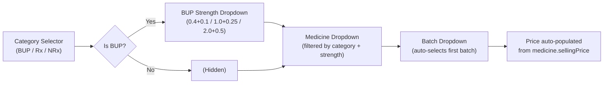

# Pharmacy Module — Frontend Specification & API Integration Guide

> **Purpose:** This document is a complete technical specification of every pharmacy-related page, component, UI element, user interaction, and data flow in the frontend codebase. It maps every mock data source and client-side state to the corresponding backend API endpoints defined in [API_BLUEPRINT.md](file:///d:/startup/Frontend-Pharmacy/API_BLUEPRINT.md).
>
> **Audience:** A developer agent who will re-implement these pages with real backend integration.

---

## Table of Contents

1. [Module Architecture](#1-module-architecture)
2. [Page 1 — Pharmacy Dashboard](#2-pharmacy-dashboard)
3. [Page 2 — Prescription Queue](#3-prescription-queue)
4. [Page 3 — Dispense Workstation](#4-dispense-workstation)
5. [Page 4 — Inventory Workstation](#5-inventory-workstation)
6. [Page 5 — Medicine Detail (Product Dispense History)](#6-medicine-detail-page)
7. [Page 6 — Invoice History](#7-invoice-history)
8. [Page 7 — Reports](#8-reports)
9. [Shared Infrastructure](#9-shared-infrastructure)
10. [API Integration Gap Analysis](#10-api-integration-gap-analysis)

---

## 1. Module Architecture

### 1.1 Routing & Layout

| Route | File | Purpose |
|---|---|---|
| `/pharmacy` | [page.tsx](file:///d:/startup/Frontend-Pharmacy/app/pharmacy/page.tsx) | Dashboard |
| `/pharmacy/prescription-queue` | [page.tsx](file:///d:/startup/Frontend-Pharmacy/app/pharmacy/prescription-queue/page.tsx) | Queue |
| `/pharmacy/dispense/[sessionId]` | [page.tsx](file:///d:/startup/Frontend-Pharmacy/app/pharmacy/dispense/%5BsessionId%5D/page.tsx) | Dispense workstation |
| `/pharmacy/inventory` | [page.tsx](file:///d:/startup/Frontend-Pharmacy/app/pharmacy/inventory/page.tsx) | Inventory management |
| `/pharmacy/inventory/[medicineId]` | [page.tsx](file:///d:/startup/Frontend-Pharmacy/app/pharmacy/inventory/%5BmedicineId%5D/page.tsx) | Per-medicine dispense history |
| `/pharmacy/dispense-data` | [page.tsx](file:///d:/startup/Frontend-Pharmacy/app/pharmacy/dispense-data/page.tsx) | Invoice history |
| `/pharmacy/reports` | [page.tsx](file:///d:/startup/Frontend-Pharmacy/app/pharmacy/reports/page.tsx) | Analytics & reports |

All pharmacy routes are wrapped in [layout.tsx](file:///d:/startup/Frontend-Pharmacy/app/pharmacy/layout.tsx) which enforces `pharmacist` or `admin` role via `useAuth()` and renders the `DashboardLayout` component (sidebar + main area).

### 1.2 Sidebar Navigation (Pharmacist Role)

Defined in [dashboard-sidebar.tsx](file:///d:/startup/Frontend-Pharmacy/components/dashboard-sidebar.tsx#L67-L73):

| Menu Item | Route | Icon |
|---|---|---|
| Dashboard | `/pharmacy` | `LayoutDashboard` |
| Prescription Queue | `/pharmacy/prescription-queue` | `ClipboardList` |
| Inventory | `/pharmacy/inventory` | `Hospital` |
| Invoice History | `/pharmacy/dispense-data` | `FileText` |
| Reports | `/pharmacy/reports` | `BarChart3` |

### 1.3 API Client Layer

| File | Responsibility |
|---|---|
| [inventory-api.ts](file:///d:/startup/Frontend-Pharmacy/lib/inventory-api.ts) | Inventory CRUD, purchase invoices, audit removal, stats, dispense history |
| [hms-api.ts](file:///d:/startup/Frontend-Pharmacy/lib/hms-api.ts) | Auth, queue, patient lookup, visit stage transitions |
| [mock-data.ts](file:///d:/startup/Frontend-Pharmacy/lib/mock-data.ts) | In-memory mock data store for all API endpoints (uses `window.__mockInventory`) |
| [api-client.ts](file:///d:/startup/Frontend-Pharmacy/lib/api-client.ts) | Base `apiRequest()` wrapper; intercepts calls and routes to mock when backend is unavailable |

### 1.4 Authentication Context

All pharmacy pages consume `useAuth()` from [auth-context.tsx](file:///d:/startup/Frontend-Pharmacy/lib/auth-context.tsx) to obtain `accessToken` and `user` object. The `accessToken` is passed to API functions but currently unused by the mock layer (parameter named `_token`).

### 1.5 Design System & Styling

- **Framework:** Next.js (App Router) + Tailwind CSS v4
- **UI Components:** shadcn/ui (Card, Badge, Button, Dialog, Select, Input, Label, Checkbox, Tabs, Textarea, Table, HoverCard, ScrollArea)
- **Icons:** `lucide-react`
- **Notifications:** `sonner` (toast)
- **Charts:** `recharts` (AreaChart, BarChart)
- **Brand Color:** `#0d7377` (teal) — used throughout as primary accent
- **CSS Variables:** Defined in [globals.css](file:///d:/startup/Frontend-Pharmacy/app/globals.css)

---

## 2. Pharmacy Dashboard

**File:** [app/pharmacy/page.tsx](file:///d:/startup/Frontend-Pharmacy/app/pharmacy/page.tsx)
**Route:** `/pharmacy`

### 2.1 Purpose

Central hub showing inventory KPIs, today's queue status, and quick-action navigation buttons.

### 2.2 Data Fetching

| What | Current Source | Target Backend Endpoint |
|---|---|---|
| Queue items (today's sessions) | `getQueueStatus()` → [hms-api.ts](file:///d:/startup/Frontend-Pharmacy/lib/hms-api.ts#L564-L569) | `GET /api/v1/pharmacy/queue/` (§7.12) — **preferred** dedicated pharmacy queue |
| Inventory stats | `getInventoryStats()` → [inventory-api.ts](file:///d:/startup/Frontend-Pharmacy/lib/inventory-api.ts#L231-L238) | `GET /api/v1/pharmacy/inventory/stats/` (§7.8) |

### 2.3 UI Layout

```
┌─────────────────────────────────────────────────┐
│  HEADER: "Pharmacy Dashboard" + badges          │
├────────┬────────┬────────┬────────┬────────────┤
│ KPI 1  │ KPI 2  │ KPI 3  │ KPI 4  │ KPI 5      │
│ Total  │ Low    │ Near   │ Expired│ Today Rev  │
│ Meds   │ Stock  │ Expiry │ Batches│            │
├────────┴────────┴────────┴────────┴────────────┤
│  QUEUE SECTION: "Today's Prescription Queue"    │
│  ┌──────────────────────────────────────┐       │
│  │  Queue Item Card (per session)       │       │
│  │  - Patient name, avatar initials     │       │
│  │  - Stage badge, outstanding debt     │       │
│  │  - "Dispense" button → navigates     │       │
│  └──────────────────────────────────────┘       │
│  ...more queue items                            │
├─────────────────────────────────────────────────┤
│  QUICK ACTIONS: Inventory | Queue | Invoice Hist│
└─────────────────────────────────────────────────┘
```

### 2.4 KPI Cards

| Card Label | Data Source Field | Backend Field |
|---|---|---|
| Total Formulations | `stats.totalMedicines` | `data.total_medicines` |
| Low Stock Alerts | `stats.lowStockCount` | `data.low_stock_count` |
| Near Expiry | `stats.nearExpiryCount` | `data.near_expiry_count` |
| Expired Batches | `stats.expiredCount` | `data.expired_count` |
| Today's Revenue | `stats.todaysRevenue` | `data.todays_revenue` |

### 2.5 Queue Section

The dashboard filters `queueData.items` where `current_stage === 'pharmacy'` and renders patient cards. Each card has a **"Dispense"** button that navigates to `/pharmacy/dispense/{session_id}`.

### 2.6 API Mapping for Backend Integration

```
CURRENT:  getQueueStatus()          → GET /api/v1/receptionist/queue/
REPLACE:  (new function needed)     → GET /api/v1/pharmacy/queue/

CURRENT:  getInventoryStats()       → GET /api/v1/pharmacy/inventory/stats/
STATUS:   ✅ Already correct endpoint
```

> [!IMPORTANT]
> The current frontend calls the **receptionist** queue endpoint and filters client-side. The backend provides a dedicated `GET /api/v1/pharmacy/queue/` (§7.12) that returns only pharmacy-stage sessions pre-filtered. The new implementation should use this instead.

---

## 3. Prescription Queue

**File:** [app/pharmacy/prescription-queue/page.tsx](file:///d:/startup/Frontend-Pharmacy/app/pharmacy/prescription-queue/page.tsx)
**Route:** `/pharmacy/prescription-queue`

### 3.1 Purpose

Full-screen queue view showing all patients waiting at the pharmacy stage, with the ability to start dispensing.

### 3.2 Data Fetching

| What | Current Source | Target Backend Endpoint |
|---|---|---|
| Queue items | `getQueueStatus()` → [hms-api.ts](file:///d:/startup/Frontend-Pharmacy/lib/hms-api.ts#L564-L569) | `GET /api/v1/pharmacy/queue/` (§7.12) |

### 3.3 UI Layout

```
┌─────────────────────────────────────────────────┐
│  HEADER: "Prescription Queue" + stats badge     │
├─────────────────────────────────────────────────┤
│  TABLE: Patient queue                           │
│  ┌─────────┬──────────┬──────────┬───────────┐  │
│  │ Patient │ Check-in │ Stage    │ Actions   │  │
│  │ Name    │ Time     │ Badge    │ Dispense ▶│  │
│  └─────────┴──────────┴──────────┴───────────┘  │
│  ...more rows                                   │
└─────────────────────────────────────────────────┘
```

### 3.4 Queue Item Fields

| UI Element | Source Field | Backend Response Field (§7.12) |
|---|---|---|
| Patient Name | `item.patient_name` | `patient_name` |
| Check-in Time | `item.checked_in_at` | `checked_in_at` |
| Stage Badge | `item.current_stage` | `current_stage` (always `pharmacy`) |
| Outstanding Debt | `item.outstanding_debt` | `outstanding_debt` |
| Checked in by | `item.checked_in_by_name` | `checked_in_by_name` |

### 3.5 User Interactions

| Interaction | Action |
|---|---|
| Click "Dispense" button | `navigate('/pharmacy/dispense/{session_id}')` |
| Back button | `navigate('/pharmacy')` |

### 3.6 Filtering

The current implementation filters `data.items.filter(i => i.current_stage === 'pharmacy')` client-side. With `GET /api/v1/pharmacy/queue/`, this filter is unnecessary — the endpoint returns only pharmacy-stage items.

---

## 4. Dispense Workstation

**File:** [app/pharmacy/dispense/[sessionId]/page.tsx](file:///d:/startup/Frontend-Pharmacy/app/pharmacy/dispense/%5BsessionId%5D/page.tsx)
**Route:** `/pharmacy/dispense/[sessionId]`

> [!WARNING]
> This is the most complex page in the pharmacy module. It currently uses a **hardcoded `PREDEFINED_MEDICINES` array** (lines 59-154) instead of fetching from the backend inventory API.

### 4.1 Purpose

Full dispensing workflow: select medicines → choose batches → set dosage → build invoice → settle payment → save & complete visit.

### 4.2 Data Fetching

| What | Current Source | Target Backend Endpoint |
|---|---|---|
| Session/Queue item | `getQueueStatus()` filtered by `sessionId` | `GET /api/v1/pharmacy/queue/` (§7.12) |
| Patient details | `getPatientById(patient_id)` | `GET /api/v1/patients/<patient_id>/` (§5.7) |
| Medicine list (for picker) | **Hardcoded `PREDEFINED_MEDICINES`** ⚠️ | `GET /api/v1/pharmacy/inventory/medicines/` (§7.3) |
| Save dispense invoice | `transitionVisitStage(token, sessionId, 'completed')` ⚠️ | `POST /api/v1/pharmacy/dispense/` (§7.13) |

### 4.3 UI Layout (4-Panel Grid)

```
┌──────────────────────────────────────────────────────────────────┐
│  HEADER: "Dispense Medicines & Bill" + Invoice # + Patient Card │
├──────────────────────────────┬───────────────────────────────────┤
│  TOP-LEFT: Medicine Entry    │  TOP-RIGHT: Dispensing List       │
│  ┌─────────────────────┐     │  ┌───────────────────────────┐   │
│  │ Category Tabs       │     │  │ Line Item Cards           │   │
│  │ [BUP] [Rx] [NRx]   │     │  │ - Medicine, Batch, Qty    │   │
│  │                     │     │  │ - Dose, Days, Total       │   │
│  │ BUP Strength (cond.)│     │  │ - Delete button           │   │
│  │ Medicine Dropdown   │     │  │ ...more items             │   │
│  │ Batch Dropdown      │     │  └───────────────────────────┘   │
│  │ Dose / Days / Qty   │     │                                  │
│  │ Unit Price           │     │                                  │
│  │ [Add to List] button│     │                                  │
│  └─────────────────────┘     │                                  │
├──────────────────────────────┼───────────────────────────────────┤
│  BOTTOM-LEFT:                │  BOTTOM-RIGHT:                   │
│  - Schedule Next Visit       │  Settlement & Pricing            │
│    (day presets + date)      │  - Payment Method dropdown       │
│  - Ledger Remarks/Notes     │  - Discount %                    │
│                              │  - Split payment (conditional)   │
│                              │  - Subtotal / Discount / Net     │
│                              │  - [Dispense & Save Invoice]     │
└──────────────────────────────┴───────────────────────────────────┘
```

### 4.4 State Variables

| Variable | Type | Purpose | Maps to API Field |
|---|---|---|---|
| `queueItem` | `QueueItem \| null` | Current session | Response from queue |
| `patient` | `PatientDetailResponse \| null` | Patient details | Response from patient API |
| `formCategory` | `"BUP" \| "Rx" \| "NRx"` | Category filter for medicine picker | Filter for `GET /medicines/?category=` |
| `formSubcategory` | `string` | BUP strength sub-filter | Filter for `GET /medicines/?bup_category=` |
| `formMedicineId` | `string` | Selected medicine UUID | `line_items[].medicine_id` |
| `formBatchNumber` | `string` | Selected batch | `line_items[].batch_number` |
| `formDose` | `string` | Dose pattern (e.g. "1-0-1") | `line_items[].dose` |
| `formDays` | `number` | Number of days | `line_items[].days` |
| `formQty` | `number` | Total tablets (auto-calculated) | `line_items[].qty` |
| `formPrice` | `number` | Unit selling price | `line_items[].unit_price` |
| `lineItems` | `LineItem[]` | Committed dispense list | `line_items[]` in POST body |
| `paymentMethod` | `"Cash" \| "Online" \| "Split"` | Settlement type | `payment.payment_method` |
| `cashAmount` | `number` | Cash portion | `payment.cash_amount` |
| `onlineAmount` | `number` | Online portion | `payment.online_amount` |
| `discount` | `number` | Discount percentage | `payment.discount` |
| `notes` | `string` | Ledger remarks | `payment.notes` |
| `nextVisitDate` | `string` | Follow-up date (YYYY-MM-DD) | `next_followup_date` |
| `nextVisitDays` | `number \| ""` | Days until follow-up | Derived; not sent directly |
| `isSaving` | `boolean` | Loading flag during save | N/A |
| `invoiceNo` | `string` | Client-generated invoice ID | `display_invoice_number` |

### 4.5 Medicine Entry Form — Cascading Dropdowns



**Cascade Reset Logic (lines 284-297):**
- Changing **Category** → resets subcategory (defaults to `"2.0mg + 0.5mg"` for BUP), clears medicine, batch, price
- Changing **Subcategory** → clears medicine, batch, price
- Changing **Medicine** → auto-selects first batch, populates price from `sellingPrice`

### 4.6 Auto-Calculation: Dose × Days = Qty

```typescript
// Line 277-281
const dailyAmount = parseDoseToNumeric(formDose); // "1-0-1" → 2
const calculated = Math.ceil(dailyAmount * formDays);
setFormQty(calculated || 0);
```

The `parseDoseToNumeric` function splits dose strings by `-` and sums the numeric parts.

### 4.7 Add to List Validation (lines 300-361)

1. Medicine must be selected
2. Batch must be selected and valid
3. Qty must be > 0
4. **Stock validation:** `currentBatch.quantity >= formQty`
5. If same medicine+batch already in list, quantities are **stacked** (summed) with re-validation

### 4.8 LineItem Interface

```typescript
interface LineItem {
  id: string;           // Client-generated unique ID
  medicineId: string;   // → line_items[].medicine_id
  medicineName: string; // Display only
  salt: string;         // Display only
  category: MedicineCategory; // Display only
  batchNumber: string;  // → line_items[].batch_number
  expiryDate: string;   // Display only
  dose: string;         // → line_items[].dose
  days: number;         // → line_items[].days
  qty: number;          // → line_items[].qty
  unitPrice: number;    // → line_items[].unit_price
  total: number;        // qty × unitPrice (display only)
}
```

### 4.9 Pricing Calculation

```typescript
subtotal = Σ(lineItem.total)                    // = Σ(qty × unitPrice)
discountAmount = round(subtotal × discount / 100)
grandTotal = subtotal - discountAmount          // = net_payable
```

### 4.10 Payment Method Logic

| Method | `cashAmount` | `onlineAmount` |
|---|---|---|
| `Cash` | `= grandTotal` | `= 0` |
| `Online` | `= 0` | `= grandTotal` |
| `Split` | User-entered (default: 50/50) | `grandTotal - cashAmount` |

Split mode provides **preset buttons**: "50/50 Split", "100% Cash", "100% Online".

### 4.11 Next Visit Scheduling

- **Quick Presets:** 7, 10, 15, 30, 45 days → auto-computes date
- **Manual Days Input:** computes date forward from today
- **Manual Date Picker:** reverse-computes days from today
- **Clear:** resets both fields

### 4.12 Save Invoice — Current vs. Required

**CURRENT IMPLEMENTATION (lines 407-438):**
```typescript
// WRONG — only transitions the visit stage, does NOT submit dispense data
await transitionVisitStage(accessToken, sessionId, "completed");
```

**REQUIRED IMPLEMENTATION — `POST /api/v1/pharmacy/dispense/` (§7.13):**

```json
{
  "session_id": "<sessionId from URL params>",
  "display_invoice_number": "<invoiceNo state>",
  "line_items": [
    {
      "medicine_id": "<lineItem.medicineId>",
      "batch_number": "<lineItem.batchNumber>",
      "dose": "<lineItem.dose>",
      "days": "<lineItem.days>",
      "qty": "<lineItem.qty>",
      "unit_price": "<lineItem.unitPrice>"
    }
  ],
  "payment": {
    "payment_method": "<paymentMethod>",
    "cash_amount": "<cashAmount>",
    "online_amount": "<onlineAmount>",
    "discount": "<discount>",
    "notes": "<notes>"
  },
  "next_followup_date": "<nextVisitDate or null>"
}
```

> [!CAUTION]
> The backend `POST /api/v1/pharmacy/dispense/` handles **everything atomically**: invoice creation, stock deduction, visit stage transition, and follow-up date update. Do NOT call `transitionVisitStage()` separately. The entire `handleSaveInvoice` function must be rewritten.

### 4.13 Backend Validation (Server-side, §7.13)

The backend enforces these constraints that the frontend should mirror for UX:

- Session must be `in_progress` at `pharmacy` stage
- No existing dispense invoice for the session (409 Conflict)
- All referenced medicines must be active
- All referenced batches must be active, belong to the medicine, and not expired
- Per-batch aggregate quantity ≤ batch stock (re-checked under lock)
- Payment amounts must match net_payable within ₹1 tolerance
- `next_followup_date` must be in the future

### 4.14 Patient Info Banner

| UI Element | Source |
|---|---|
| Avatar initials | Derived from `patient_name` |
| Patient name | `queueItem.patient_name` |
| Age | Calculated from `patient.date_of_birth` |
| Sex | `patient.sex` (M/F badge) |
| Phone | `patient.phone_number` |
| Outstanding Debt | `queueItem.outstanding_debt` |
| Registration # | `patient.registration_number` |

### 4.15 Cancel Prescription Flow

Not currently implemented in the UI. The backend provides `POST /api/v1/pharmacy/dispense/<session_id>/cancel/` (§7.14) for this purpose. Should be added as a button on the dispense page.

---

## 5. Inventory Workstation

**File:** [app/pharmacy/inventory/page.tsx](file:///d:/startup/Frontend-Pharmacy/app/pharmacy/inventory/page.tsx)
**Route:** `/pharmacy/inventory`

### 5.1 Purpose

Full inventory management with medicine registry, purchase invoice entry, and audit stock removal.

### 5.2 Data Fetching

| What | Current Source | Target Backend Endpoint |
|---|---|---|
| All medicines + batches | `getInventoryMedicines()` | `GET /api/v1/pharmacy/inventory/medicines/` (§7.3) |
| Add new medicine | `addInventoryMedicine()` | `POST /api/v1/pharmacy/inventory/medicines/` (§7.4) |
| Delete medicine | `deleteInventoryMedicine()` | `DELETE /api/v1/pharmacy/inventory/medicines/<id>/` (§7.7) |
| Submit purchase invoice | `submitPurchaseInvoice()` | `POST /api/v1/pharmacy/inventory/invoices/` (§7.9) |
| Audit stock removal | `auditStockRemoval()` | `POST /api/v1/pharmacy/inventory/audit-removal/` (§7.10) |

> [!NOTE]
> The inventory API functions in [inventory-api.ts](file:///d:/startup/Frontend-Pharmacy/lib/inventory-api.ts) already target the correct endpoint URLs. However, they use `apiRequest()` which currently routes to mock data.

### 5.3 UI Layout — Three Tab Modes

```
┌──────────────────────────────────────────────────────────────────────┐
│  HEADER: "Inventory Workstation" + formulation count + [+ Register] │
├──────────┬──────────┬──────────┬──────────────────────────────────────┤
│  All     │  BUP     │  Rx      │  NRx                                │
│  (stat)  │  (stat)  │  (stat)  │  (stat)                             │
├──────────┴──────────┴──────────┴──────────────────────────────────────┤
│  TAB BAR: [Registered List] [Enter Invoice] [Audit Removal]         │
├──────────────────────────────────────────────────────────────────────┤
│  TAB CONTENT (varies by selected tab)                                │
└──────────────────────────────────────────────────────────────────────┘
```

### 5.4 Tab 1: Registered List (Default)

#### Stat Filter Cards

4 clickable cards that filter the table:

| Card | Filter Applied | Visual State |
|---|---|---|
| All Formulations | `categoryFilter = "all"` | Teal ring |
| BUP (Controlled) | `categoryFilter = "BUP"` | Rose ring |
| Rx Formulations | `categoryFilter = "Rx"` | Blue ring |
| NRx Formulations | `categoryFilter = "NRx"` | Amber ring |

The BUP card also has a **HoverCard** showing strength breakdowns (0.4mg, 1.0mg, 2.0mg counts).

When `categoryFilter === "BUP"`, an additional **BUP Strength** dropdown appears.

#### Alert Banners

- **Low Stock Alert** (rose): Shown when medicines have `totalStock ≤ reorderLevel`. Clicking "View Details" opens a dialog.
- **Near Expiry Alert** (orange): Shown when batches expire within 180 days. Clicking "View Details" opens a dialog.

#### Medicine Table

| Column | Source Field | Backend Field |
|---|---|---|
| Medicine & Salt | `med.name`, `med.salt` | `name`, `salt` |
| Category | `med.category` + `med.bupCategory` | `category`, `bup_category` |
| Active Batches & Expiry | `med.batches[]` | `batches[]` with `batch_number`, `expiry_date`, `quantity` |
| Price | `med.sellingPrice`, `med.mrp` | `selling_price`, `mrp` |
| Stock | `Σ(batches.quantity)` | Computed client-side |
| Manage | History, Edit, Delete buttons | — |

**Row Actions (appear on hover):**
- **History** → `navigate('/pharmacy/inventory/{med.id}')` — opens product dispense history
- **Edit** → (button exists but no handler implemented yet)
- **Delete** → Opens `ControlledDeleteDialog` with reason selection

#### Search & Filters

| Filter | Type | Backend Query Param |
|---|---|---|
| Text search | Input (name or salt) | `?search=` (§7.3) |
| Category | Select dropdown | `?category=` (§7.3) |
| BUP Strength | Select dropdown (conditional) | `?bup_category=` (§7.3) |

### 5.5 Tab 2: Enter New Invoice (Purchase Invoice Form)

**Component:** `PurchaseInvoiceForm` (lines 1015-1437)

#### Invoice Metadata Fields

| Field | Type | State Variable | Backend Field |
|---|---|---|---|
| Invoice / Challan No | Text input | `invoiceNo` | `invoice_number` |
| Company Name | Select (from `SUPPLIER_COMPANIES`) | `supplier` | `supplier` |
| Invoice Date | Date input | `invoiceDate` | `invoice_date` |
| Delivery Date | Date input | `deliveryDate` | `delivery_date` |
| Invoice Photo | File input | `invoicePhoto` | Not in current API — separate upload needed |

#### Supplier Companies (Hardcoded)

```
Abbott Healthcare Ltd, Cipla Ltd, Sun Pharmaceutical Industries Ltd,
Zydus Lifesciences Ltd, Lupin Ltd, Pfizer Ltd,
GlaxoSmithKline Pharmaceuticals, Alkem Laboratories Ltd,
Sanofi India Ltd, Quantumcure Lifesciences Wholesale
```

#### Invoice Item Selection Flow

1. Click **"Select Medicines"** → Opens a dialog with checkbox list of all medicines
2. Check/uncheck medicines → Confirm selection
3. For each selected medicine, a row appears with editable fields:

| Field | Type | State | Backend Field |
|---|---|---|---|
| Medicine Name | Display only | From medicine lookup | `medicine_id` (UUID sent) |
| Category | Display only | `item.category` | `category` |
| Subcategory | Display only | `item.subcategory` | `subcategory` |
| Batch Number | Text input (uppercase) | `item.batchNumber` | `batch_number` |
| Expiry Date | Date input | `item.expiryDate` | `expiry_date` |
| Quantity | Number input | `item.quantity` | `quantity` |
| Purchase Price (₹) | Number input | `item.purchasePrice` | `purchase_price` |
| GST % | Number input | `item.gstPercentage` | `gst_percentage` |

#### Financial Summary

```
Unique Formulations: count(items with medicineId)
Loaded Volume:       Σ(item.quantity)
GST Total:           Σ(purchasePrice × quantity × gstPercentage/100)
Invoice Grand Total: Σ(purchasePrice × quantity) + GST Total
```

#### Validation (Client-side)

1. Invoice number required
2. Supplier required
3. At least 1 item
4. Each item: medicineId, batchNumber, expiryDate required; quantity > 0; price ≥ 0; GST ≥ 0

#### API Mapping

```
POST /api/v1/pharmacy/inventory/invoices/
Body: {
  invoice_number, supplier, invoice_date, delivery_date,
  items: [{ medicine_id, category, subcategory, batch_number,
            expiry_date, quantity, purchase_price, gst_percentage }]
}
```

### 5.6 Tab 3: Audit Stock Removal

**Component:** `ControlledDeleteView` (lines 1439-1601)

#### UI Structure

Two info panels (Near-Expiry Alerts + Expired Stock Safeguard) followed by the removal form.

#### Removal Form Fields

| Field | Type | State | Backend Field |
|---|---|---|---|
| Choose Medicine | Select dropdown (all medicines) | `selectedMedId` | `medicine_id` |
| Target Batch | Select dropdown (filtered by medicine) | `batchNo` | `batch_number` |
| Batch Expiry | Disabled input (auto-populated) | — | — |
| Deletion Reason | Select: destroyed / returned / damaged | `reason` | `reason` |
| Compliance Notes | Textarea | `notes` | `notes` |
| Upload Document | File drop zone | — | Not in current API |

#### API Mapping

```
POST /api/v1/pharmacy/inventory/audit-removal/
Body: { medicine_id, batch_number, reason, notes }
```

> [!NOTE]
> The backend also accepts an optional `quantity` field. If omitted, the entire batch is removed. The current frontend does not expose a quantity field — it removes the entire batch.

### 5.7 Add Medicine Dialog

**Component:** `AddMedicineDialog` (lines 823-987)

| Field | Type | Backend Field |
|---|---|---|
| Formulation Category | Select: BUP / Rx / NRx | `category` |
| BUP Strength (conditional) | Select: 0.4mg+0.1mg / 1.0mg+0.25mg / 2.0mg+0.5mg | `bup_category` |
| Medicine Name | Text input | `name` |
| Salt Composition | Text input | `salt` |
| Manufacturer Brand | Text input | `manufacturer` |
| MRP Price (₹) | Number input | `mrp` |
| Selling Price (₹) | Number input | `selling_price` |
| Reorder Level (Tablets) | Number input | `reorder_level` |

**Backend validation (§7.4):** `selling_price ≤ mrp`, BUP requires `bup_category`, unique constraint on `(name, category, bup_category)`.

### 5.8 Row Delete Dialog

**Component:** `ControlledDeleteDialog` (lines 1604-1680)

Confirmation dialog with reason selection (destroyed / returned / defect), compliance notes, and document upload. Calls `deleteInventoryMedicine(token, medId, { reason })`.

---

## 6. Medicine Detail Page

**File:** [app/pharmacy/inventory/[medicineId]/page.tsx](file:///d:/startup/Frontend-Pharmacy/app/pharmacy/inventory/%5BmedicineId%5D/page.tsx)
**Route:** `/pharmacy/inventory/[medicineId]`

### 6.1 Purpose

Per-medicine dispense history with date/month filtering and CSV export.

### 6.2 Data Fetching

| What | Current Source | Target Backend Endpoint |
|---|---|---|
| Medicine details | `getInventoryMedicines()` + filter by ID | `GET /api/v1/pharmacy/inventory/medicines/<id>/` (§7.5) |
| Dispense history | `getProductDispenseHistory(token, medicineId, params)` | `GET /api/v1/pharmacy/inventory/medicines/<id>/dispense-history/` (§7.11) |

### 6.3 UI Layout

```
┌────────────────────────────────────────────────────────────┐
│  ← Back  "Product Dispense History"                       │
├───────────────────────────────────────┬────────────────────┤
│  MEDICINE CARD (3 cols):             │  STOCK CARD:       │
│  - Name, Salt, Category, Price       │  - Current stock   │
│  - Total Dispensed                   │  - Reorder alert   │
├───────────────────────────────────────┴────────────────────┤
│  FILTER BAR: [By Month / By Day] [Date Picker] [CSV ↓]   │
├────────────────────────────────────────────────────────────┤
│  TABLE: Dispense Logs                                     │
│  Columns: Date&Time | Patient | Batch | Quantity | Price  │
└────────────────────────────────────────────────────────────┘
```

### 6.4 Filter Controls

| Filter | Type | Query Param |
|---|---|---|
| By Month | `<input type="month">` | `?month=YYYY-MM` |
| By Day | `<input type="date">` | `?date=YYYY-MM-DD` |

### 6.5 Table Columns

| Column | Source Field | Backend Field |
|---|---|---|
| Date & Time | `log.dispenseDate` | `dispense_date` |
| Patient Name | `log.patientName` | `patient_name` |
| Patient UID | `log.patientUid` | `patient_id` |
| Batch Number | `log.batchNumber` | `batch_number` |
| Expiry Date | `log.expiryDate` | `expiry_date` |
| Quantity | `log.quantity` | `quantity` |
| Total Price | `log.totalPrice` | `total_price` |

### 6.6 CSV Export

Client-side CSV generation from the displayed data. Columns: Date, Time, Patient Name, Patient UID, Batch Number, Expiry Date, Quantity, Total Price.

---

## 7. Invoice History

**File:** [app/pharmacy/dispense-data/page.tsx](file:///d:/startup/Frontend-Pharmacy/app/pharmacy/dispense-data/page.tsx)
**Route:** `/pharmacy/dispense-data`

### 7.1 Purpose

Historical record of all dispensed invoices.

### 7.2 Data Source — Current

**Fully hardcoded mock data** (lines 38-44). No API call is made.

```typescript
const mockDispenseLogs = [
  { patient: "Rahul Sharma", file: "F-102", amount: 4200,
    date: "2026-04-25", time: "10:30 AM",
    pharmacist: "John Doe", status: "Success" },
  // ...4 more
];
```

### 7.3 Target Backend Endpoint

`GET /api/v1/pharmacy/dispense-history/` (§7.15)

**Query Params:**
- `q` — search by patient name, registration number, invoice number
- `page`, `pageSize` — pagination
- `start_date`, `end_date` — date range filter
- `status` — `success` or `cancelled`
- `today_only` — boolean

### 7.4 UI Layout

```
┌──────────────────────────────────────────────────────────┐
│  HEADER: "Invoice History" + [Audit Compliant] [Export]  │
├──────────────────────┬───────────────────────────────────┤
│  Total Patients Card │  Total Revenue Card               │
├──────────────────────┴───────────────────────────────────┤
│  SEARCH BAR + [Filter Date]                              │
├──────────────────────────────────────────────────────────┤
│  TABLE: Invoice History                                  │
│  Columns: Patient | Fulfillment | Amount | Actions       │
│  Actions: Download | View                                │
└──────────────────────────────────────────────────────────┘
```

### 7.5 Field Mapping — Mock → Backend

| UI Field | Current Mock Field | Backend Response Field (§7.15) |
|---|---|---|
| Patient Name | `log.patient` | `patient` |
| File Number | `log.file` | `file_number` |
| Amount | `log.amount` | `amount` |
| Date | `log.date` | `date` |
| Time | `log.time` | `time` |
| Pharmacist | `log.pharmacist` | `pharmacist` |
| Status | `log.status` | `status` |
| — | — | `invoice_number` (add to UI) |
| — | — | `payment_method` (add to UI) |

### 7.6 Missing Features to Implement

- **Pagination** — backend supports `page`/`pageSize`
- **Date range filter** — `start_date`/`end_date` query params
- **Status filter** — `success`/`cancelled` toggle
- **Search** — backend supports `q` parameter
- **Invoice number display** — not shown currently
- **"View" and "Download" buttons** — no handlers implemented

---

## 8. Reports

**File:** [app/pharmacy/reports/page.tsx](file:///d:/startup/Frontend-Pharmacy/app/pharmacy/reports/page.tsx)
**Route:** `/pharmacy/reports`

### 8.1 Purpose

Multi-tab reporting with revenue analysis, consumption tracking, low stock, and expiry reports.

### 8.2 Report Types & Backend Mapping

| Tab | Current Data Source | Target Backend Endpoint |
|---|---|---|
| Revenue Report | `Math.random()` mock generation | `GET /api/v1/pharmacy/reports/revenue/` (§7.16) |
| Consumption Report | `getInventoryMedicines()` + mock quantities | `GET /api/v1/pharmacy/reports/consumption/` (§7.17) |
| Low Stock Report | `getInventoryMedicines()` + client-side filter | `GET /api/v1/pharmacy/reports/low-stock/` (§7.18) |
| Expiry Report | `getInventoryMedicines()` + client-side filter | `GET /api/v1/pharmacy/reports/expiry/` (§7.19) |

### 8.3 Filter Controls (Revenue & Consumption)

| Filter | Type | Backend Query Param |
|---|---|---|
| Date Range | Select: Daily / Monthly / Custom | `range=daily\|monthly\|custom` |
| Date (Daily) | `<input type="date">` | `date=YYYY-MM-DD` |
| Month (Monthly) | `<input type="month">` | `month=YYYY-MM` |
| From/To (Custom) | Two date inputs | `start_date`, `end_date` |
| Category (Consumption only) | Button group: All / RX / NRX / BUP | `category=All\|Rx\|NRx\|BUP` |

### 8.4 Revenue Report Tab

#### KPI Cards

| Card | Current Source | Backend Field (§7.16) |
|---|---|---|
| Total Revenue | `Σ(revenueData.revenue)` | `summary.total_revenue` |
| Cash Sales | `Σ(revenueData.cash)` | `summary.total_cash` |
| Online Sales | `Σ(revenueData.online)` | `summary.total_online` |
| Total Transactions | Hardcoded `348` | `summary.total_transactions` |

#### Revenue Table

| Column | Backend Field |
|---|---|
| Sr. No. | Row index |
| Date | `breakdown[].date` |
| Day | `breakdown[].day_name` |
| Cash | `breakdown[].cash` |
| Online | `breakdown[].online` |
| Total Revenue | `breakdown[].revenue` |

#### Revenue Chart

`recharts` AreaChart plotting `revenue` by date. Green gradient fill.

#### Export Actions

- **Download CSV** — client-side generation from displayed data
- **Download PDF** — triggers `window.print()`

### 8.5 Consumption Report Tab

#### BUP Subcategory Grouping

When `selectedCategory === 'BUP'`, the table is split into 3 sub-tables grouped by BUP strength:
- `0.4mg + 0.1mg`
- `1.0mg + 0.25mg`
- `2.0mg + 0.5mg`

Each sub-table has its own totals row.

#### Medicine Table

| Column | Backend Field (§7.17) |
|---|---|
| Sr. No. | Row index |
| Medicine Name | `medicine_breakdown[].name` |
| Salt | `medicine_breakdown[].salt` |
| Consumed | `medicine_breakdown[].quantity` |
| Total Selling Value | `medicine_breakdown[].selling_value` |
| Details (daily only) | Opens dispense logs dialog |

#### Daily Dispense Logs Modal

When `dateRange === 'daily'`, each BUP/NRx medicine row shows a **"View Logs"** button that opens a dialog with per-patient dispense records. Currently uses `mockDispenseLogs()` function. Should map to backend dispense history per medicine.

### 8.6 Low Stock Report Tab

| Column | Backend Field (§7.18) |
|---|---|
| Sr. No. | Row index |
| Medicine Name | `name` |
| Salt | `salt` |
| Remaining Balance | `current_stock` |
| Reorder Level | `reorder_level` |

### 8.7 Expiry Report Tab

Three sections:

1. **Expired Medicines** — backend `data.expired[]` → `medicine_name`, `batch_number`, `expiry_date`, `quantity`
2. **Near Expiry Medicines** — backend `data.near_expiry[]` → same fields + `days_until_expiry`
3. **Historical Expired Records** — currently uses hardcoded mock data; no direct backend endpoint for this view

---

## 9. Shared Infrastructure

### 9.1 Field Name Convention Translation

The backend uses `snake_case` while the frontend uses `camelCase`. Key translations:

| Frontend (camelCase) | Backend (snake_case) |
|---|---|
| `bupCategory` | `bup_category` |
| `reorderLevel` | `reorder_level` |
| `tabletsPerStrip` | `tablets_per_strip` |
| `sellingPrice` | `selling_price` |
| `batchNumber` | `batch_number` |
| `expiryDate` | `expiry_date` |
| `medicineId` | `medicine_id` |
| `invoiceNumber` | `invoice_number` |
| `invoiceDate` | `invoice_date` |
| `deliveryDate` | `delivery_date` |
| `purchasePrice` | `purchase_price` |
| `gstPercentage` | `gst_percentage` |
| `paymentMethod` | `payment_method` |
| `cashAmount` | `cash_amount` |
| `onlineAmount` | `online_amount` |
| `nextVisitDate` | `next_followup_date` |
| `unitPrice` | `unit_price` |

### 9.2 Response Envelope Unwrapping

The backend wraps responses in `{ success: true, data: ... }`. The `apiRequest()` function in `api-client.ts` should unwrap the `data` field before returning. The `hms-api.ts` already has an `unwrapNestedData()` utility.

### 9.3 Error Handling Pattern

```typescript
try {
  setIsLoading(true);
  const response = await apiFunction(accessToken, payload);
  toast.success("Operation completed!");
  // update state
} catch (error) {
  console.error("Failed to ...", error);
  toast.error("Failed to ...");
} finally {
  setIsLoading(false);
}
```

### 9.4 Navigation Utility

Uses `navigate()` from [lib/navigation.ts](file:///d:/startup/Frontend-Pharmacy/lib/navigation.ts) which wraps `window.location.href` assignment for client-side navigation (not Next.js router `push`).

### 9.5 Mock Data Store Architecture

The mock data layer in [mock-data.ts](file:///d:/startup/Frontend-Pharmacy/lib/mock-data.ts) uses `window.__mockInventory` as an in-memory array that persists within a browser session. It handles:

- GET/POST/PATCH/DELETE for medicines
- Purchase invoice processing (batch creation/update)
- Audit removal (batch removal)
- Stats computation
- Dispense history generation

When integrating with the real backend, the mock layer should be completely bypassed.

---

## 10. API Integration Gap Analysis

### 10.1 Endpoints Used Correctly

| Frontend Function | Endpoint | Status |
|---|---|---|
| `getInventoryMedicines()` | `GET /api/v1/pharmacy/inventory/medicines/` | ✅ Correct URL |
| `addInventoryMedicine()` | `POST /api/v1/pharmacy/inventory/medicines/` | ✅ Correct URL |
| `updateInventoryMedicine()` | `PATCH /api/v1/pharmacy/inventory/medicines/<id>/` | ✅ Correct URL |
| `deleteInventoryMedicine()` | `DELETE /api/v1/pharmacy/inventory/medicines/<id>/` | ✅ Correct URL |
| `submitPurchaseInvoice()` | `POST /api/v1/pharmacy/inventory/invoices/` | ✅ Correct URL |
| `auditStockRemoval()` | `POST /api/v1/pharmacy/inventory/audit-removal/` | ✅ Correct URL |
| `getInventoryStats()` | `GET /api/v1/pharmacy/inventory/stats/` | ✅ Correct URL |
| `getProductDispenseHistory()` | `GET /api/v1/pharmacy/inventory/medicines/<id>/dispense-history/` | ✅ Correct URL |

### 10.2 Endpoints Missing or Wrong

| Feature | Current Behavior | Required Endpoint | Action |
|---|---|---|---|
| **Pharmacy Queue** | Uses `GET /api/v1/receptionist/queue/` + client filter | `GET /api/v1/pharmacy/queue/` (§7.12) | Create new API function |
| **Dispense Save** | Calls `transitionVisitStage()` only | `POST /api/v1/pharmacy/dispense/` (§7.13) | Create new API function; complete rewrite of save handler |
| **Cancel Dispense** | Not implemented | `POST /api/v1/pharmacy/dispense/<session_id>/cancel/` (§7.14) | Create API function + UI button |
| **Invoice History** | Hardcoded mock array | `GET /api/v1/pharmacy/dispense-history/` (§7.15) | Create API function; rewrite page |
| **Revenue Report** | `Math.random()` generated | `GET /api/v1/pharmacy/reports/revenue/` (§7.16) | Create API function |
| **Consumption Report** | Mock quantities from medicine name length | `GET /api/v1/pharmacy/reports/consumption/` (§7.17) | Create API function |
| **Low Stock Report** | Client-side computed from inventory | `GET /api/v1/pharmacy/reports/low-stock/` (§7.18) | Create API function |
| **Expiry Report** | Client-side computed from inventory | `GET /api/v1/pharmacy/reports/expiry/` (§7.19) | Create API function |

### 10.3 Frontend Data Not Sent to Backend

| UI Feature | Not Sent | Notes |
|---|---|---|
| Invoice Photo (Purchase) | `invoicePhoto` File | Backend doesn't have a file upload field; needs separate upload endpoint or FormData |
| Audit Document Upload | File drop zone | Backend doesn't accept file attachments on audit-removal |
| Compliance Notes (Audit) | `notes` field exists but may not be sent | Verify API accepts `notes` |
| Historical Expired Records | Hardcoded mock | No backend endpoint exists for this view |
| BUP Strength Filter on Dispense | Used for client-side filtering only | Backend `GET /medicines/?bup_category=` supports this |

### 10.4 Backend Features Not in Frontend

| Backend Endpoint/Feature | Description | Recommended UI Location |
|---|---|---|
| `GET /api/v1/pharmacy/inventory/medicines/<id>/` (§7.5) | Single medicine detail | Medicine detail page could use this instead of fetching entire list |
| `POST /api/v1/pharmacy/dispense/<session_id>/cancel/` (§7.14) | Cancel dispense | Add cancel button to dispense page + dispense history |
| `category` query param on medicines (§7.3) | Server-side category filtering | Replace client-side filter on inventory page |
| `search` query param on medicines (§7.3) | Server-side search | Replace client-side search on inventory page |
| `DispenseStatus: cancelled` | Cancelled invoices | Add to invoice history filter |
| `today_only` param on dispense-history (§7.15) | Today's invoices only | Add toggle on invoice history page |
| `is_active` field on medicines (§7.3) | Soft-delete tracking | Show/hide inactive medicines |
| `StockMovement` audit trail | Immutable ledger | Consider adding a stock movement log view |
| Dispense invoice `dispensed_by` | Staff attribution | Show on invoice history |
| Backend pagination on all list endpoints | `page`/`pageSize` | Add pagination to inventory, history, reports |

---

> **Next Steps for the Developer Agent:**
>
> 1. Create missing API functions in `inventory-api.ts` for pharmacy queue, dispense, cancel, dispense-history, and all 4 report endpoints
> 2. Rewrite `handleSaveInvoice()` in the dispense page to call `POST /api/v1/pharmacy/dispense/` with the full payload
> 3. Replace `PREDEFINED_MEDICINES` hardcoded array with a live `getInventoryMedicines()` call
> 4. Replace mock data in Invoice History with `GET /api/v1/pharmacy/dispense-history/`
> 5. Replace mock/random data in Reports with the 4 dedicated report endpoints
> 6. Switch queue fetching from receptionist queue to pharmacy queue endpoint
> 7. Add `snake_case ↔ camelCase` transformation in the API client layer
> 8. Add pagination support to all list views
> 9. Add cancel dispense UI flow
