# Pharmacy Module — System Architecture Diagrams

> **Document Version:** 1.0  
> **Last Updated:** 2026-05-23  
> **Scope:** Complete MermaidJS diagram suite for the Pharmacy module of the Hospital Management System.  
> **Audience:** Frontend engineers, backend engineers, QA, and technical leads.

This document contains **18 detailed Mermaid diagrams** that collectively describe every aspect of the Pharmacy module: data models, workflows, state machines, API lifecycles, security flows, and cross-module interactions. Each diagram is accompanied by a brief narrative explanation.

---

## Table of Contents

1. [Entity Relationship Diagram](#1-entity-relationship-diagram)
2. [Complete Visit Lifecycle](#2-complete-visit-lifecycle-including-pharmacy)
3. [Dispensing Workflow — Sequence Diagram](#3-dispensing-workflow--sequence-diagram)
4. [Purchase Invoice Processing — Sequence Diagram](#4-purchase-invoice-processing--sequence-diagram)
5. [Stock Audit Removal — Sequence Diagram](#5-stock-audit-removal--sequence-diagram)
6. [Inventory Stock Flow Diagram](#6-inventory-stock-flow-diagram)
7. [Medicine Lifecycle State Machine](#7-medicine-lifecycle-state-machine)
8. [Batch Lifecycle State Machine](#8-batch-lifecycle-state-machine)
9. [Dispense Invoice State Machine](#9-dispense-invoice-state-machine)
10. [API Request Lifecycle](#10-api-request-lifecycle)
11. [Authentication & Authorization Flow](#11-authentication--authorization-flow)
12. [Dashboard Data Flow](#12-dashboard-data-flow)
13. [Revenue Calculation Flow](#13-revenue-calculation-flow)
14. [Stock Alert Detection Flow](#14-stock-alert-detection-flow)
15. [Prescription Queue → Dispense → Complete Flow](#15-prescription-queue--dispense--complete-flow)
16. [Service / Module Interaction Diagram](#16-servicemodule-interaction-diagram)
17. [Concurrent Dispensing Safety Flow](#17-concurrent-dispensing-safety-flow)
18. [Purchase Invoice Validation Flow](#18-purchase-invoice-validation-flow)

---

## 1. Entity Relationship Diagram

The ERD below captures **every pharmacy model** and its relationships to the core models (`User`, `Patient`, `VisitSession`). Cardinality markers follow standard Mermaid ER notation: `||` = exactly one, `o{` = zero-or-many, `|{` = one-or-many, `o|` = zero-or-one.

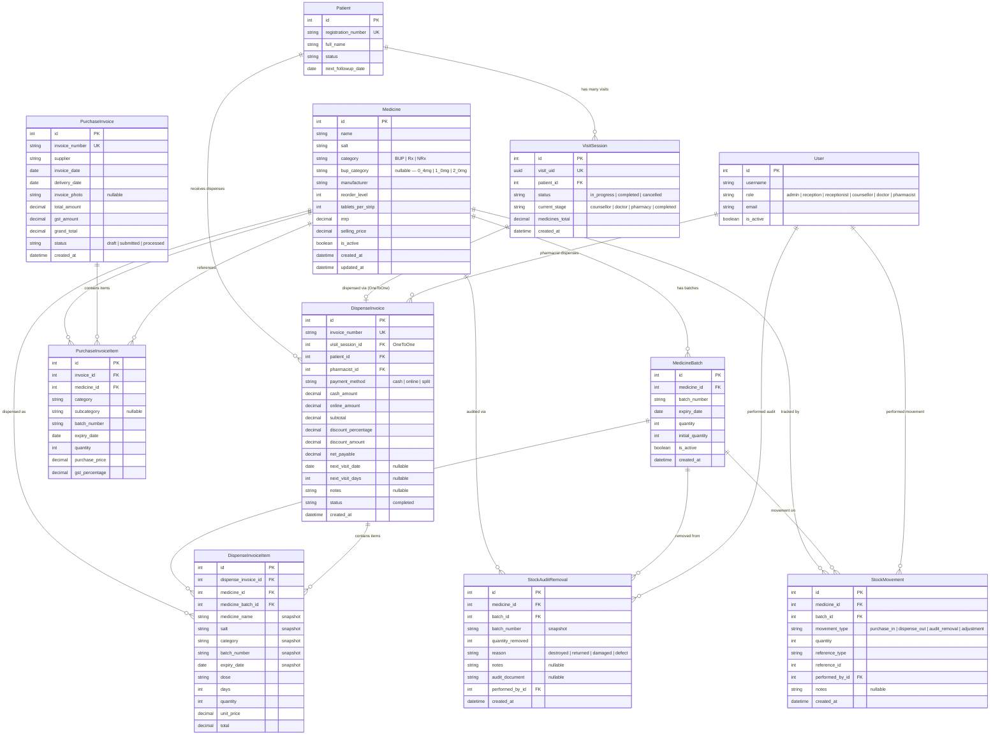
```mermaid
erDiagram

    %% ── Core / Existing Models ──────────────────────────────
    User {
        int id PK
        string username
        string role "admin | reception | receptionist | counsellor | doctor | pharmacist"
        string email
        boolean is_active
    }

    Patient {
        int id PK
        string registration_number UK
        string full_name
        string status
        date next_followup_date
    }

    VisitSession {
        int id PK
        uuid visit_uid UK
        int patient_id FK
        string status "in_progress | completed | cancelled"
        string current_stage "counsellor | doctor | pharmacy | completed"
        decimal medicines_total
        datetime created_at
    }

    %% ── Pharmacy Models ─────────────────────────────────────
    Medicine {
        int id PK
        string name
        string salt
        string category "BUP | Rx | NRx"
        string bup_category "nullable — 0_4mg | 1_0mg | 2_0mg"
        string manufacturer
        int reorder_level
        int tablets_per_strip
        decimal mrp
        decimal selling_price
        boolean is_active
        datetime created_at
        datetime updated_at
    }

    MedicineBatch {
        int id PK
        int medicine_id FK
        string batch_number
        date expiry_date
        int quantity
        int initial_quantity
        boolean is_active
        datetime created_at
    }

    PurchaseInvoice {
        int id PK
        string invoice_number UK
        string supplier
        date invoice_date
        date delivery_date
        string invoice_photo "nullable"
        decimal total_amount
        decimal gst_amount
        decimal grand_total
        string status "draft | submitted | processed"
        datetime created_at
    }

    PurchaseInvoiceItem {
        int id PK
        int invoice_id FK
        int medicine_id FK
        string category
        string subcategory "nullable"
        string batch_number
        date expiry_date
        int quantity
        decimal purchase_price
        decimal gst_percentage
    }

    DispenseInvoice {
        int id PK
        string invoice_number UK
        int visit_session_id FK "OneToOne"
        int patient_id FK
        int pharmacist_id FK
        string payment_method "cash | online | split"
        decimal cash_amount
        decimal online_amount
        decimal subtotal
        decimal discount_percentage
        decimal discount_amount
        decimal net_payable
        date next_visit_date "nullable"
        int next_visit_days "nullable"
        string notes "nullable"
        string status "completed"
        datetime created_at
    }

    DispenseInvoiceItem {
        int id PK
        int dispense_invoice_id FK
        int medicine_id FK
        int medicine_batch_id FK
        string medicine_name "snapshot"
        string salt "snapshot"
        string category "snapshot"
        string batch_number "snapshot"
        date expiry_date "snapshot"
        string dose
        int days
        int quantity
        decimal unit_price
        decimal total
    }

    StockAuditRemoval {
        int id PK
        int medicine_id FK
        int batch_id FK
        string batch_number "snapshot"
        int quantity_removed
        string reason "destroyed | returned | damaged | defect"
        string notes "nullable"
        string audit_document "nullable"
        int performed_by_id FK
        datetime created_at
    }

    StockMovement {
        int id PK
        int medicine_id FK
        int batch_id FK
        string movement_type "purchase_in | dispense_out | audit_removal | adjustment"
        int quantity
        string reference_type
        int reference_id
        int performed_by_id FK
        string notes "nullable"
        datetime created_at
    }

    %% ── Relationships ───────────────────────────────────────

    Patient        ||--o{ VisitSession        : "has many visits"
    Patient        ||--o{ DispenseInvoice     : "receives dispenses"

    VisitSession   ||--o| DispenseInvoice     : "dispensed via (OneToOne)"

    Medicine       ||--o{ MedicineBatch       : "has batches"
    Medicine       ||--o{ PurchaseInvoiceItem : "purchased as"
    Medicine       ||--o{ DispenseInvoiceItem : "dispensed as"
    Medicine       ||--o{ StockAuditRemoval   : "audited via"
    Medicine       ||--o{ StockMovement       : "tracked by"

    MedicineBatch  ||--o{ DispenseInvoiceItem : "dispensed from"
    MedicineBatch  ||--o{ StockAuditRemoval   : "removed from"
    MedicineBatch  ||--o{ StockMovement       : "movement on"

    PurchaseInvoice ||--o{ PurchaseInvoiceItem : "contains items"
    PurchaseInvoiceItem }o--|| Medicine         : "references"

    DispenseInvoice ||--o{ DispenseInvoiceItem : "contains items"

    User           ||--o{ DispenseInvoice     : "pharmacist dispenses"
    User           ||--o{ StockAuditRemoval   : "performed audit"
    User           ||--o{ StockMovement       : "performed movement"
```

**Explanation:** Every pharmacy table maintains explicit foreign keys back to `Medicine` and, where applicable, to `MedicineBatch`. `DispenseInvoice` has a **OneToOne** link to `VisitSession`, ensuring a visit can only be dispensed once. Snapshot fields on `DispenseInvoiceItem` (medicine_name, salt, category, batch_number, expiry_date) preserve historical data even if the medicine record is later modified.

---

## 2. Complete Visit Lifecycle (Including Pharmacy)

This state diagram captures the **full patient visit flow** from initial check-in through each clinical stage to final completion after pharmacy dispensing.

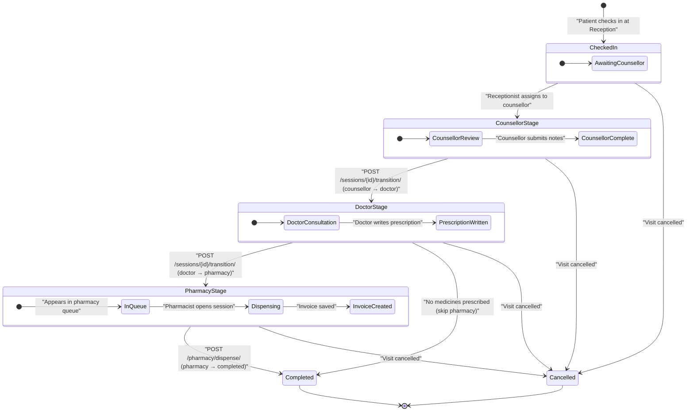
```mermaid
stateDiagram-v2
    [*] --> CheckedIn : "Patient checks in at Reception"

    CheckedIn --> CounsellorStage : "Receptionist assigns to counsellor"

    CounsellorStage --> DoctorStage : "POST /sessions/{id}/transition/ (counsellor → doctor)"

    DoctorStage --> PharmacyStage : "POST /sessions/{id}/transition/ (doctor → pharmacy)"
    DoctorStage --> Completed : "No medicines prescribed (skip pharmacy)"

    PharmacyStage --> Completed : "POST /pharmacy/dispense/ (pharmacy → completed)"

    Completed --> [*]

    CheckedIn --> Cancelled : "Visit cancelled"
    CounsellorStage --> Cancelled : "Visit cancelled"
    DoctorStage --> Cancelled : "Visit cancelled"
    PharmacyStage --> Cancelled : "Visit cancelled"

    Cancelled --> [*]

    state CheckedIn {
        direction LR
        [*] --> AwaitingCounsellor
    }

    state CounsellorStage {
        direction LR
        [*] --> CounsellorReview
        CounsellorReview --> CounsellorComplete : "Counsellor submits notes"
    }

    state DoctorStage {
        direction LR
        [*] --> DoctorConsultation
        DoctorConsultation --> PrescriptionWritten : "Doctor writes prescription"
    }

    state PharmacyStage {
        direction LR
        [*] --> InQueue : "Appears in pharmacy queue"
        InQueue --> Dispensing : "Pharmacist opens session"
        Dispensing --> InvoiceCreated : "Invoice saved"
    }
```

**Explanation:** The visit progresses linearly through four stages: check-in → counsellor → doctor → pharmacy → completed. At any stage the visit may be cancelled. The doctor stage can optionally skip pharmacy if no medicines are prescribed. The pharmacy stage itself has internal sub-states: the visit appears in the queue, a pharmacist picks it up, dispenses medicines, and creates the invoice — which atomically transitions the visit to `completed`.

---

## 3. Dispensing Workflow — Sequence Diagram

This is the **core dispensing flow**: from pharmacist opening the queue, selecting a patient, adding medicine line items, and submitting the dispense invoice.

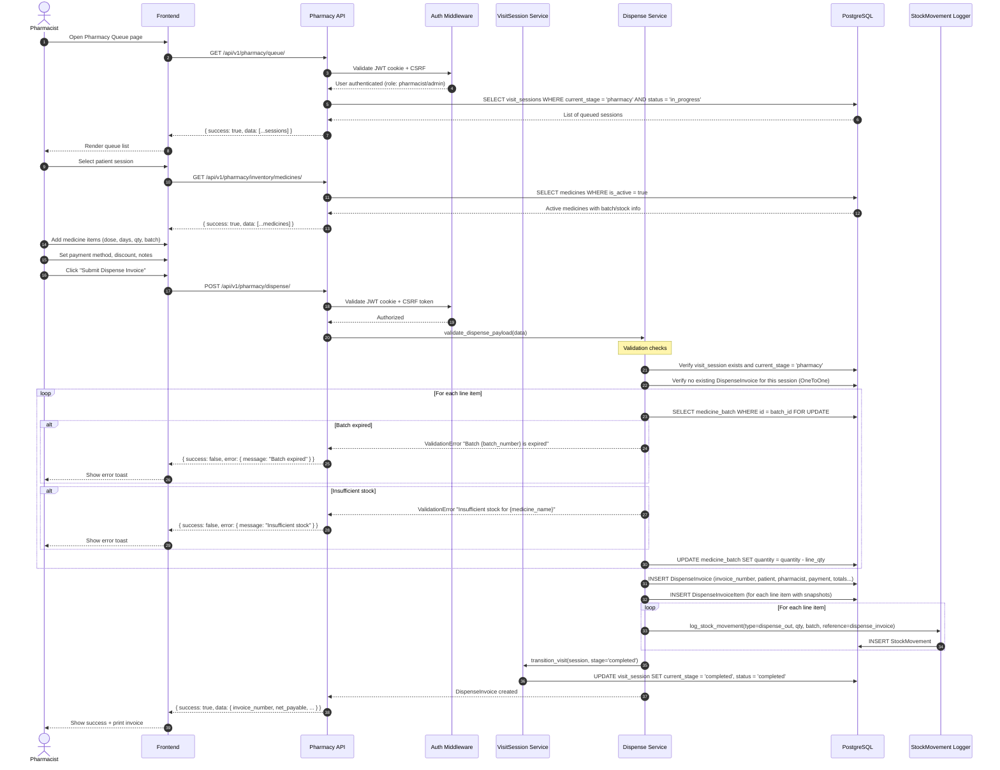
```mermaid
sequenceDiagram
    autonumber
    actor Pharmacist
    participant FE as Frontend
    participant API as Pharmacy API
    participant Auth as Auth Middleware
    participant VS as VisitSession Service
    participant DS as Dispense Service
    participant DB as PostgreSQL
    participant SM as StockMovement Logger

    Pharmacist->>FE: Open Pharmacy Queue page
    FE->>API: GET /api/v1/pharmacy/queue/
    API->>Auth: Validate JWT cookie + CSRF
    Auth-->>API: User authenticated (role: pharmacist/admin)
    API->>DB: SELECT visit_sessions WHERE current_stage = 'pharmacy' AND status = 'in_progress'
    DB-->>API: List of queued sessions
    API-->>FE: { success: true, data: [...sessions] }
    FE-->>Pharmacist: Render queue list

    Pharmacist->>FE: Select patient session
    FE->>API: GET /api/v1/pharmacy/inventory/medicines/
    API->>DB: SELECT medicines WHERE is_active = true
    DB-->>API: Active medicines with batch/stock info
    API-->>FE: { success: true, data: [...medicines] }

    Pharmacist->>FE: Add medicine items (dose, days, qty, batch)
    Pharmacist->>FE: Set payment method, discount, notes
    Pharmacist->>FE: Click "Submit Dispense Invoice"

    FE->>API: POST /api/v1/pharmacy/dispense/
    API->>Auth: Validate JWT cookie + CSRF token
    Auth-->>API: Authorized

    API->>DS: validate_dispense_payload(data)

    Note over DS: Validation checks
    DS->>DB: Verify visit_session exists and current_stage = 'pharmacy'
    DS->>DB: Verify no existing DispenseInvoice for this session (OneToOne)

    loop For each line item
        DS->>DB: SELECT medicine_batch WHERE id = batch_id FOR UPDATE
        alt Batch expired
            DS-->>API: ValidationError "Batch {batch_number} is expired"
            API-->>FE: { success: false, error: { message: "Batch expired" } }
            FE-->>Pharmacist: Show error toast
        end
        alt Insufficient stock
            DS-->>API: ValidationError "Insufficient stock for {medicine_name}"
            API-->>FE: { success: false, error: { message: "Insufficient stock" } }
            FE-->>Pharmacist: Show error toast
        end
        DS->>DB: UPDATE medicine_batch SET quantity = quantity - line_qty
    end

    DS->>DB: INSERT DispenseInvoice (invoice_number, patient, pharmacist, payment, totals...)
    DS->>DB: INSERT DispenseInvoiceItem (for each line item with snapshots)

    loop For each line item
        DS->>SM: log_stock_movement(type=dispense_out, qty, batch, reference=dispense_invoice)
        SM->>DB: INSERT StockMovement
    end

    DS->>VS: transition_visit(session, stage='completed')
    VS->>DB: UPDATE visit_session SET current_stage = 'completed', status = 'completed'

    DS-->>API: DispenseInvoice created
    API-->>FE: { success: true, data: { invoice_number, net_payable, ... } }
    FE-->>Pharmacist: Show success + print invoice
```

**Explanation:** The dispensing flow is a **single atomic transaction** (wrapped in `transaction.atomic()`). Each batch is locked with `SELECT ... FOR UPDATE` to prevent concurrent deductions. Validation happens before any writes: expired batches and insufficient stock are caught early. After all line items are persisted and stock deducted, the visit session is automatically transitioned to `completed`. Stock movements are logged for every deducted batch.

---

## 4. Purchase Invoice Processing — Sequence Diagram

This diagram shows how a purchase invoice flows from data entry through validation to batch creation/update and stock movement logging.

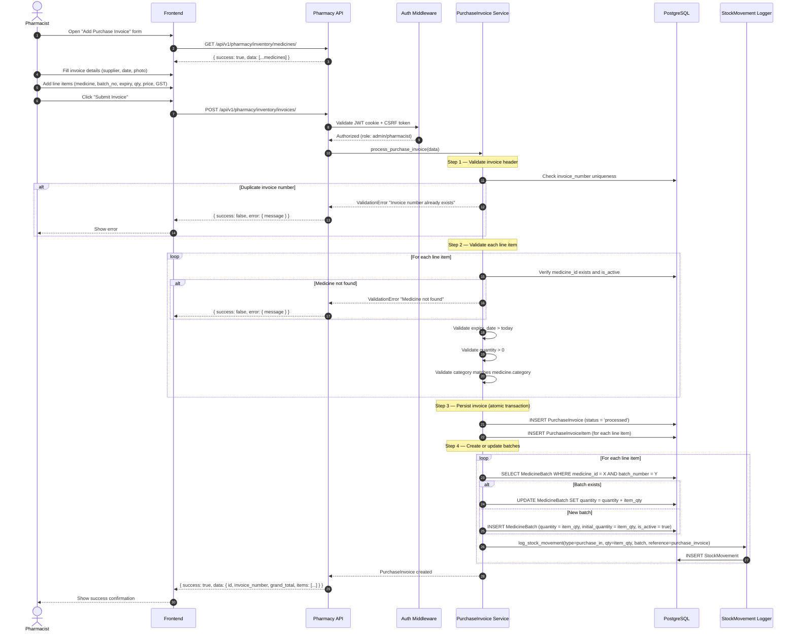
```mermaid
sequenceDiagram
    autonumber
    actor Pharmacist
    participant FE as Frontend
    participant API as Pharmacy API
    participant Auth as Auth Middleware
    participant PIS as PurchaseInvoice Service
    participant DB as PostgreSQL
    participant SM as StockMovement Logger

    Pharmacist->>FE: Open "Add Purchase Invoice" form
    FE->>API: GET /api/v1/pharmacy/inventory/medicines/
    API-->>FE: { success: true, data: [...medicines] }

    Pharmacist->>FE: Fill invoice details (supplier, date, photo)
    Pharmacist->>FE: Add line items (medicine, batch_no, expiry, qty, price, GST)
    Pharmacist->>FE: Click "Submit Invoice"

    FE->>API: POST /api/v1/pharmacy/inventory/invoices/
    API->>Auth: Validate JWT cookie + CSRF token
    Auth-->>API: Authorized (role: admin/pharmacist)

    API->>PIS: process_purchase_invoice(data)

    Note over PIS: Step 1 — Validate invoice header
    PIS->>DB: Check invoice_number uniqueness
    alt Duplicate invoice number
        PIS-->>API: ValidationError "Invoice number already exists"
        API-->>FE: { success: false, error: { message } }
        FE-->>Pharmacist: Show error
    end

    Note over PIS: Step 2 — Validate each line item
    loop For each line item
        PIS->>DB: Verify medicine_id exists and is_active
        alt Medicine not found
            PIS-->>API: ValidationError "Medicine not found"
            API-->>FE: { success: false, error: { message } }
        end
        PIS->>PIS: Validate expiry_date > today
        PIS->>PIS: Validate quantity > 0
        PIS->>PIS: Validate category matches medicine.category
    end

    Note over PIS: Step 3 — Persist invoice (atomic transaction)
    PIS->>DB: INSERT PurchaseInvoice (status = 'processed')
    PIS->>DB: INSERT PurchaseInvoiceItem (for each line item)

    Note over PIS: Step 4 — Create or update batches
    loop For each line item
        PIS->>DB: SELECT MedicineBatch WHERE medicine_id = X AND batch_number = Y
        alt Batch exists
            PIS->>DB: UPDATE MedicineBatch SET quantity = quantity + item_qty
        else New batch
            PIS->>DB: INSERT MedicineBatch (quantity = item_qty, initial_quantity = item_qty, is_active = true)
        end

        PIS->>SM: log_stock_movement(type=purchase_in, qty=item_qty, batch, reference=purchase_invoice)
        SM->>DB: INSERT StockMovement
    end

    PIS-->>API: PurchaseInvoice created
    API-->>FE: { success: true, data: { id, invoice_number, grand_total, items: [...] } }
    FE-->>Pharmacist: Show success confirmation
```

**Explanation:** Purchase invoice processing is fully **idempotent with respect to batch management**: if a batch number already exists for a given medicine, its quantity is incremented rather than a duplicate batch being created. The `(medicine, batch_number)` unique constraint enforces this at the DB level. Every quantity addition generates a corresponding `purchase_in` stock movement for full audit traceability.

---

## 5. Stock Audit Removal — Sequence Diagram

This covers the flow when a pharmacist removes stock due to destruction, return, damage, or defect.

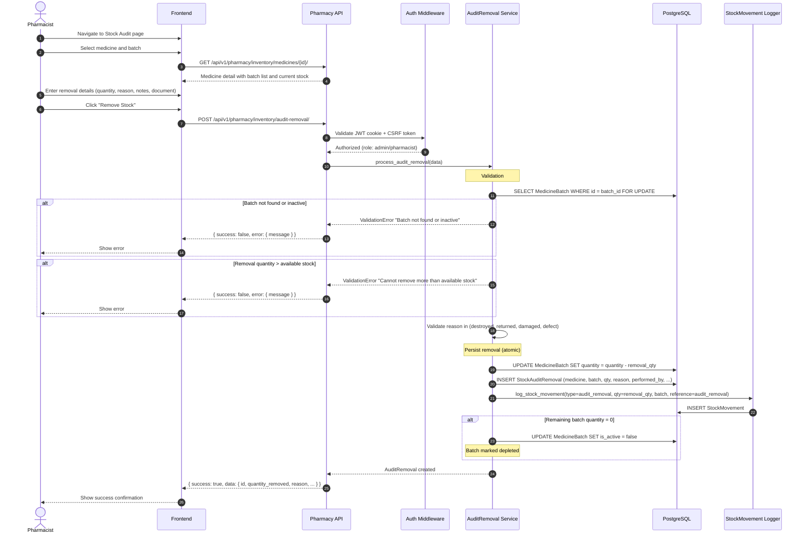
```mermaid
sequenceDiagram
    autonumber
    actor Pharmacist
    participant FE as Frontend
    participant API as Pharmacy API
    participant Auth as Auth Middleware
    participant ARS as AuditRemoval Service
    participant DB as PostgreSQL
    participant SM as StockMovement Logger

    Pharmacist->>FE: Navigate to Stock Audit page
    Pharmacist->>FE: Select medicine and batch
    FE->>API: GET /api/v1/pharmacy/inventory/medicines/{id}/
    API-->>FE: Medicine detail with batch list and current stock

    Pharmacist->>FE: Enter removal details (quantity, reason, notes, document)
    Pharmacist->>FE: Click "Remove Stock"

    FE->>API: POST /api/v1/pharmacy/inventory/audit-removal/
    API->>Auth: Validate JWT cookie + CSRF token
    Auth-->>API: Authorized (role: admin/pharmacist)

    API->>ARS: process_audit_removal(data)

    Note over ARS: Validation
    ARS->>DB: SELECT MedicineBatch WHERE id = batch_id FOR UPDATE
    alt Batch not found or inactive
        ARS-->>API: ValidationError "Batch not found or inactive"
        API-->>FE: { success: false, error: { message } }
        FE-->>Pharmacist: Show error
    end
    alt Removal quantity > available stock
        ARS-->>API: ValidationError "Cannot remove more than available stock"
        API-->>FE: { success: false, error: { message } }
        FE-->>Pharmacist: Show error
    end
    ARS->>ARS: Validate reason in (destroyed, returned, damaged, defect)

    Note over ARS: Persist removal (atomic)
    ARS->>DB: UPDATE MedicineBatch SET quantity = quantity - removal_qty
    ARS->>DB: INSERT StockAuditRemoval (medicine, batch, qty, reason, performed_by, ...)

    ARS->>SM: log_stock_movement(type=audit_removal, qty=removal_qty, batch, reference=audit_removal)
    SM->>DB: INSERT StockMovement

    alt Remaining batch quantity = 0
        ARS->>DB: UPDATE MedicineBatch SET is_active = false
        Note over ARS: Batch marked depleted
    end

    ARS-->>API: AuditRemoval created
    API-->>FE: { success: true, data: { id, quantity_removed, reason, ... } }
    FE-->>Pharmacist: Show success confirmation
```

**Explanation:** Audit removal uses `SELECT ... FOR UPDATE` to lock the batch row and prevent race conditions. The removal quantity is validated against current stock. If removal brings the batch to zero, the batch is automatically deactivated. A full audit trail is maintained via both the `StockAuditRemoval` record and the corresponding `StockMovement` entry.

---

## 6. Inventory Stock Flow Diagram

This flowchart visualises **every path** through which stock enters and exits the system, and how `StockMovement` records track each transition.

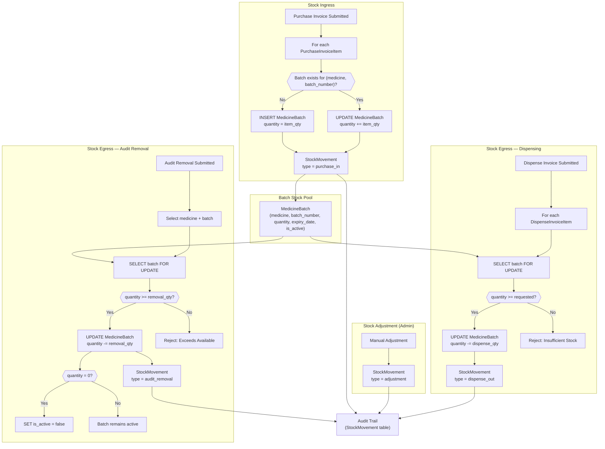
```mermaid
flowchart TB
    subgraph INGRESS["Stock Ingress"]
        PI["Purchase Invoice Submitted"]
        PI --> PII["For each PurchaseInvoiceItem"]
        PII --> BC{{"Batch exists for (medicine, batch_number)?"}}
        BC -- Yes --> BU["UPDATE MedicineBatch<br/>quantity += item_qty"]
        BC -- No --> BN["INSERT MedicineBatch<br/>quantity = item_qty"]
        BU --> SM_IN["StockMovement<br/>type = purchase_in"]
        BN --> SM_IN
    end

    subgraph STOCK["Batch Stock Pool"]
        BATCH["MedicineBatch<br/>(medicine, batch_number, quantity, expiry_date, is_active)"]
    end

    subgraph EGRESS_DISPENSE["Stock Egress — Dispensing"]
        DI["Dispense Invoice Submitted"]
        DI --> DII["For each DispenseInvoiceItem"]
        DII --> LOCK_D["SELECT batch FOR UPDATE"]
        LOCK_D --> CHK_D{{"quantity >= requested?"}}
        CHK_D -- Yes --> DED["UPDATE MedicineBatch<br/>quantity -= dispense_qty"]
        CHK_D -- No --> ERR_D["Reject: Insufficient Stock"]
        DED --> SM_OUT["StockMovement<br/>type = dispense_out"]
    end

    subgraph EGRESS_AUDIT["Stock Egress — Audit Removal"]
        AR["Audit Removal Submitted"]
        AR --> ARI["Select medicine + batch"]
        ARI --> LOCK_A["SELECT batch FOR UPDATE"]
        LOCK_A --> CHK_A{{"quantity >= removal_qty?"}}
        CHK_A -- Yes --> REM["UPDATE MedicineBatch<br/>quantity -= removal_qty"]
        CHK_A -- No --> ERR_A["Reject: Exceeds Available"]
        REM --> SM_REM["StockMovement<br/>type = audit_removal"]
        REM --> DEPL{{"quantity = 0?"}}
        DEPL -- Yes --> DEACT["SET is_active = false"]
        DEPL -- No --> KEEP["Batch remains active"]
    end

    subgraph ADJUSTMENT["Stock Adjustment (Admin)"]
        ADJ["Manual Adjustment"]
        ADJ --> SM_ADJ["StockMovement<br/>type = adjustment"]
    end

    SM_IN --> BATCH
    BATCH --> LOCK_D
    BATCH --> LOCK_A
    SM_OUT --> AUDIT_LOG["Audit Trail<br/>(StockMovement table)"]
    SM_REM --> AUDIT_LOG
    SM_ADJ --> AUDIT_LOG
    SM_IN --> AUDIT_LOG
```

**Explanation:** Stock has two ingress paths (purchase and manual adjustment) and two egress paths (dispensing and audit removal). Every movement — regardless of direction — is recorded in the `StockMovement` table with a `movement_type` discriminator and a generic `(reference_type, reference_id)` pair that links back to the originating record.

---

## 7. Medicine Lifecycle State Machine

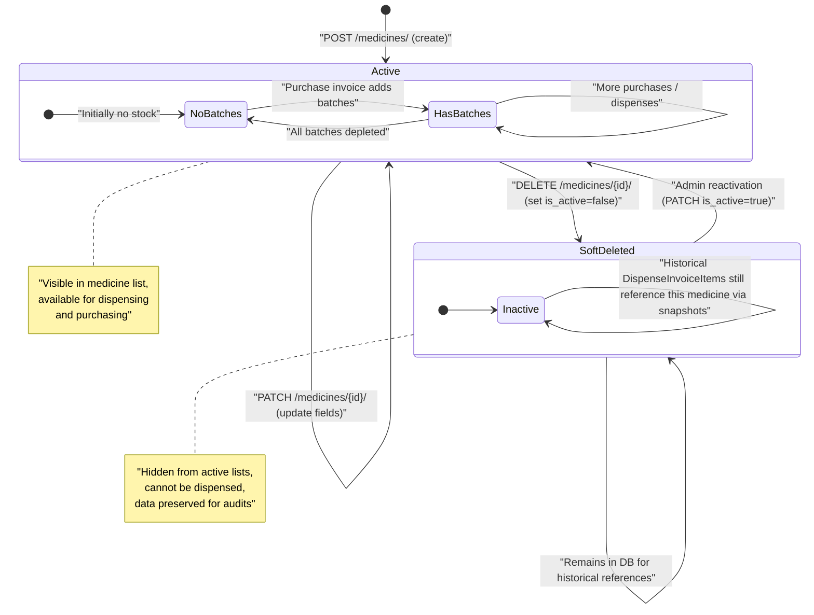
```mermaid
stateDiagram-v2
    [*] --> Active : "POST /medicines/ (create)"

    Active --> Active : "PATCH /medicines/{id}/ (update fields)"
    Active --> SoftDeleted : "DELETE /medicines/{id}/ (set is_active=false)"

    SoftDeleted --> Active : "Admin reactivation (PATCH is_active=true)"
    SoftDeleted --> SoftDeleted : "Remains in DB for historical references"

    state Active {
        direction LR
        [*] --> NoBatches : "Initially no stock"
        NoBatches --> HasBatches : "Purchase invoice adds batches"
        HasBatches --> HasBatches : "More purchases / dispenses"
        HasBatches --> NoBatches : "All batches depleted"
    }

    state SoftDeleted {
        direction LR
        [*] --> Inactive
        Inactive --> Inactive : "Historical DispenseInvoiceItems still reference this medicine via snapshots"
    }

    note right of Active : "Visible in medicine list,<br/>available for dispensing<br/>and purchasing"
    note right of SoftDeleted : "Hidden from active lists,<br/>cannot be dispensed,<br/>data preserved for audits"
```

**Explanation:** Medicines follow a **soft-delete pattern** — they are never physically removed. When `is_active` is set to `false`, the medicine disappears from active listings and cannot be used in new dispense or purchase operations, but all historical `DispenseInvoiceItem` and `StockMovement` records that reference it remain intact. An admin can reactivate a soft-deleted medicine.

---

## 8. Batch Lifecycle State Machine

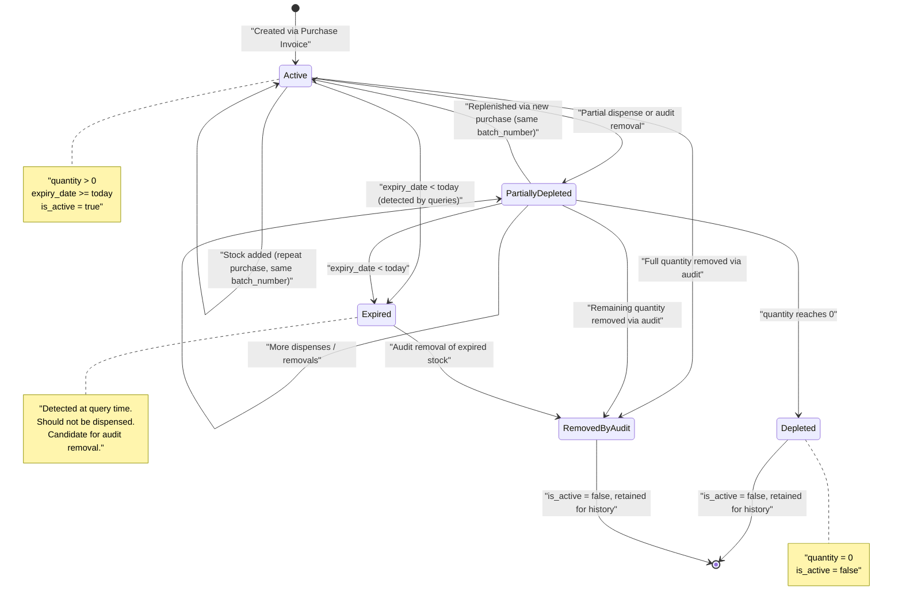
```mermaid
stateDiagram-v2
    [*] --> Active : "Created via Purchase Invoice"

    Active --> Active : "Stock added (repeat purchase, same batch_number)"
    Active --> PartiallyDepleted : "Partial dispense or audit removal"

    PartiallyDepleted --> PartiallyDepleted : "More dispenses / removals"
    PartiallyDepleted --> Depleted : "quantity reaches 0"
    PartiallyDepleted --> Active : "Replenished via new purchase (same batch_number)"

    Active --> Expired : "expiry_date < today (detected by queries)"
    PartiallyDepleted --> Expired : "expiry_date < today"

    Active --> RemovedByAudit : "Full quantity removed via audit"
    PartiallyDepleted --> RemovedByAudit : "Remaining quantity removed via audit"

    Depleted --> [*] : "is_active = false, retained for history"
    Expired --> RemovedByAudit : "Audit removal of expired stock"
    RemovedByAudit --> [*] : "is_active = false, retained for history"

    note right of Active : "quantity > 0<br/>expiry_date >= today<br/>is_active = true"
    note right of Expired : "Detected at query time.<br/>Should not be dispensed.<br/>Candidate for audit removal."
    note right of Depleted : "quantity = 0<br/>is_active = false"
```

**Explanation:** A batch is created when a purchase invoice introduces a new `(medicine, batch_number)` pair. It remains active as long as it has remaining quantity and has not expired. Expiry is a **computed state** detected at query time (not via a background job), meaning the `is_active` flag alone doesn't capture expiry — queries must also check `expiry_date`. Batches reaching zero quantity are deactivated automatically.

---

## 9. Dispense Invoice State Machine

Although the current system only uses a single `completed` status for dispense invoices, this diagram shows the **extensible design** that supports future states such as `draft`, `on_hold`, or `refunded`.

```mermaid
stateDiagram-v2
    [*] --> Completed : "POST /pharmacy/dispense/ (current implementation)"

    state "Future Extensibility" as FutureStates {
        direction TB
        [*] --> Draft : "Pharmacist begins invoice (future)"
        Draft --> OnHold : "Patient unable to pay (future)"
        Draft --> Completed : "Payment confirmed (future)"
        OnHold --> Completed : "Payment received later (future)"
        OnHold --> Cancelled : "Patient declines (future)"
        Completed --> PartialRefund : "Partial return (future)"
        Completed --> FullRefund : "Full return (future)"
        PartialRefund --> Completed : "Refund processed, remainder kept"
        FullRefund --> Reversed : "Full reversal, stock restored"
    }

    note right of Completed : "Current: Single atomic state.<br/>Invoice is created as 'completed'<br/>in one POST request."
    note left of FutureStates : "Designed for future phases.<br/>Not yet implemented."
```

**Explanation:** The current implementation creates dispense invoices directly in the `completed` state — there is no draft or pending step. The diagram also illustrates potential future states (draft, on-hold, partial/full refund) for when the system evolves to support more complex billing workflows.

---

## 10. API Request Lifecycle

This flowchart traces a **single HTTP request** from arrival through every middleware layer to the final JSON response.

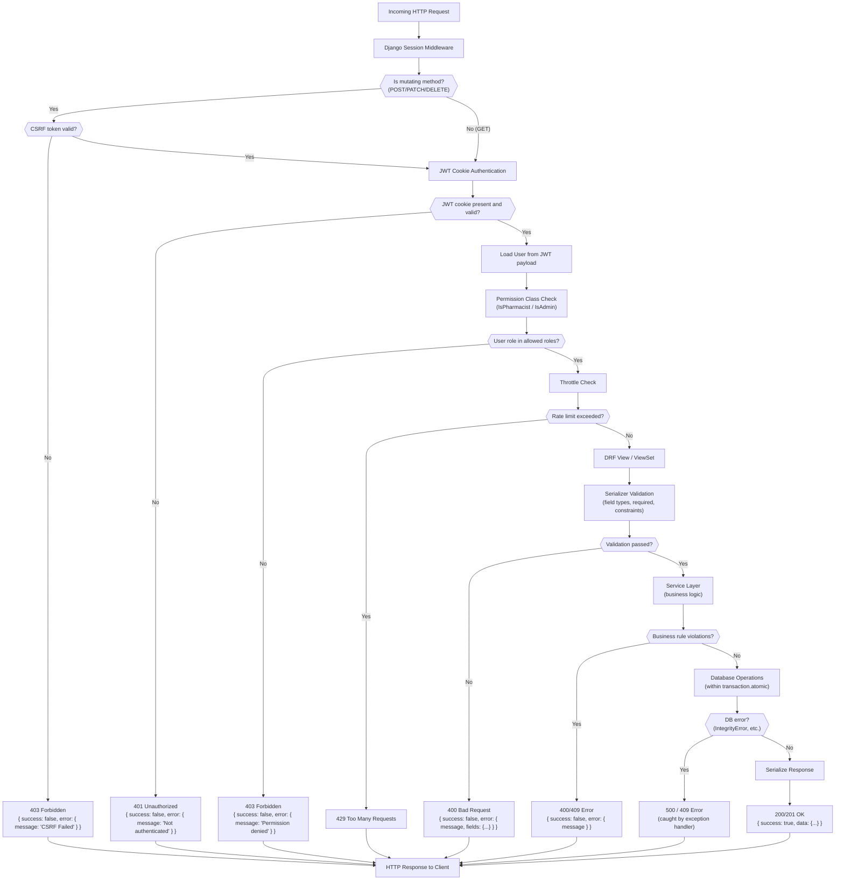
```mermaid
flowchart TD
    REQ["Incoming HTTP Request"] --> MW_SESSION["Django Session Middleware"]
    MW_SESSION --> MW_CSRF{{"Is mutating method?<br/>(POST/PATCH/DELETE)"}}

    MW_CSRF -- Yes --> CSRF_CHK{{"CSRF token valid?"}}
    CSRF_CHK -- No --> ERR_CSRF["403 Forbidden<br/>{ success: false, error: { message: 'CSRF Failed' } }"]
    CSRF_CHK -- Yes --> AUTH
    MW_CSRF -- No (GET) --> AUTH

    AUTH["JWT Cookie Authentication"] --> AUTH_CHK{{"JWT cookie present and valid?"}}
    AUTH_CHK -- No --> ERR_AUTH["401 Unauthorized<br/>{ success: false, error: { message: 'Not authenticated' } }"]
    AUTH_CHK -- Yes --> USER_LOAD["Load User from JWT payload"]

    USER_LOAD --> PERM["Permission Class Check<br/>(IsPharmacist / IsAdmin)"]
    PERM --> PERM_CHK{{"User role in allowed roles?"}}
    PERM_CHK -- No --> ERR_PERM["403 Forbidden<br/>{ success: false, error: { message: 'Permission denied' } }"]
    PERM_CHK -- Yes --> THROTTLE["Throttle Check"]

    THROTTLE --> THROTTLE_CHK{{"Rate limit exceeded?"}}
    THROTTLE_CHK -- Yes --> ERR_THROTTLE["429 Too Many Requests"]
    THROTTLE_CHK -- No --> VIEW["DRF View / ViewSet"]

    VIEW --> SERIAL["Serializer Validation<br/>(field types, required, constraints)"]
    SERIAL --> VALID_CHK{{"Validation passed?"}}
    VALID_CHK -- No --> ERR_VALID["400 Bad Request<br/>{ success: false, error: { message, fields: {...} } }"]
    VALID_CHK -- Yes --> SERVICE["Service Layer<br/>(business logic)"]

    SERVICE --> BIZ_CHK{{"Business rule violations?"}}
    BIZ_CHK -- Yes --> ERR_BIZ["400/409 Error<br/>{ success: false, error: { message } }"]
    BIZ_CHK -- No --> DB_OP["Database Operations<br/>(within transaction.atomic)"]

    DB_OP --> DB_CHK{{"DB error?<br/>(IntegrityError, etc.)"}}
    DB_CHK -- Yes --> ERR_DB["500 / 409 Error<br/>(caught by exception handler)"]
    DB_CHK -- No --> RESPONSE["Serialize Response"]

    RESPONSE --> SUCCESS["200/201 OK<br/>{ success: true, data: {...} }"]

    ERR_CSRF --> CLIENT["HTTP Response to Client"]
    ERR_AUTH --> CLIENT
    ERR_PERM --> CLIENT
    ERR_THROTTLE --> CLIENT
    ERR_VALID --> CLIENT
    ERR_BIZ --> CLIENT
    ERR_DB --> CLIENT
    SUCCESS --> CLIENT
```

**Explanation:** Every request passes through session middleware, CSRF validation (on mutating methods), JWT cookie authentication, role-based permission checks, and throttling before reaching the view layer. The view delegates to a serializer for structural validation and then to a service layer for business logic. All database writes occur within `transaction.atomic()`. A custom DRF exception handler ensures every error response conforms to the `{ success: false, error: { message } }` envelope.

---

## 11. Authentication & Authorization Flow

This diagram zooms into the **auth layer** specifically for pharmacy endpoints.

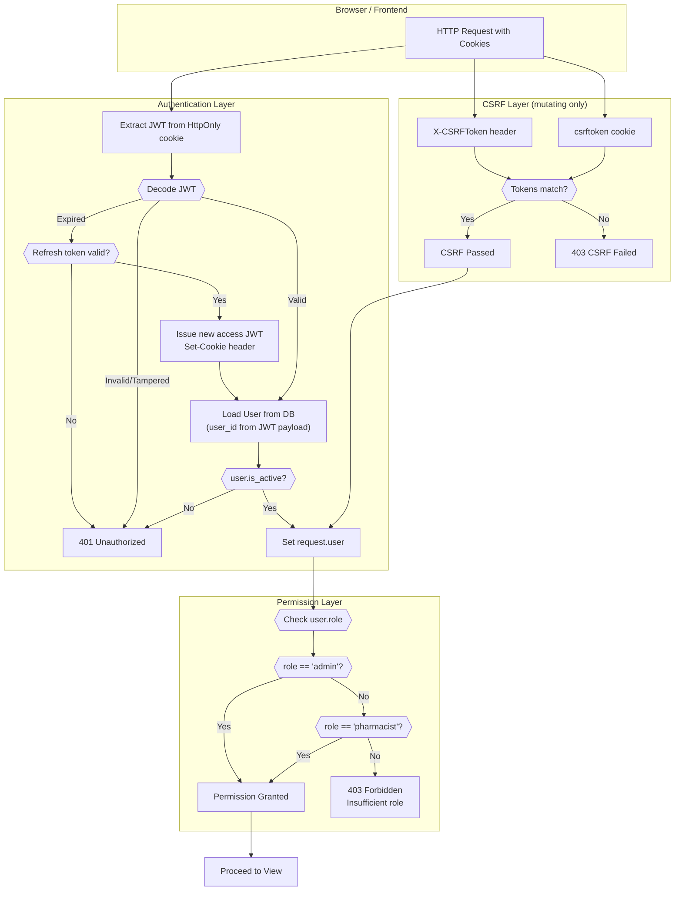
```mermaid
flowchart TD
    subgraph Client["Browser / Frontend"]
        REQ["HTTP Request with Cookies"]
    end

    subgraph AuthLayer["Authentication Layer"]
        COOKIE["Extract JWT from HttpOnly cookie"]
        COOKIE --> DECODE{{"Decode JWT"}}
        DECODE -- "Expired" --> REFRESH{{"Refresh token valid?"}}
        REFRESH -- Yes --> NEW_JWT["Issue new access JWT<br/>Set-Cookie header"]
        REFRESH -- No --> DENY_AUTH["401 Unauthorized"]
        NEW_JWT --> LOAD_USER
        DECODE -- "Valid" --> LOAD_USER["Load User from DB<br/>(user_id from JWT payload)"]
        DECODE -- "Invalid/Tampered" --> DENY_AUTH
        LOAD_USER --> USER_ACTIVE{{"user.is_active?"}}
        USER_ACTIVE -- No --> DENY_AUTH
        USER_ACTIVE -- Yes --> SET_USER["Set request.user"]
    end

    subgraph PermLayer["Permission Layer"]
        SET_USER --> ROLE_CHECK{{"Check user.role"}}

        ROLE_CHECK --> IS_ADMIN{{"role == 'admin'?"}}
        IS_ADMIN -- Yes --> GRANT["Permission Granted"]

        IS_ADMIN -- No --> IS_PHARMACIST{{"role == 'pharmacist'?"}}
        IS_PHARMACIST -- Yes --> GRANT

        IS_PHARMACIST -- No --> DENY_PERM["403 Forbidden<br/>Insufficient role"]
    end

    subgraph CSRFLayer["CSRF Layer (mutating only)"]
        CSRF_HEADER["X-CSRFToken header"]
        CSRF_COOKIE["csrftoken cookie"]
        CSRF_HEADER --> MATCH{{"Tokens match?"}}
        CSRF_COOKIE --> MATCH
        MATCH -- Yes --> PASS_CSRF["CSRF Passed"]
        MATCH -- No --> DENY_CSRF["403 CSRF Failed"]
    end

    REQ --> COOKIE
    REQ --> CSRF_HEADER
    REQ --> CSRF_COOKIE
    PASS_CSRF --> SET_USER
    GRANT --> VIEW["Proceed to View"]
```

**Explanation:** Authentication uses **HttpOnly secure cookies** carrying a JWT access token. When the access token expires, the system attempts to use a refresh token (also in a cookie) to issue a new access token transparently. CSRF protection is enforced via the double-submit pattern: the frontend sends the CSRF token both as a cookie and as the `X-CSRFToken` header. Only `admin` and `pharmacist` roles are granted access to pharmacy endpoints.

---

## 12. Dashboard Data Flow

This diagram shows how the **pharmacy dashboard** aggregates data from multiple queries and endpoints to build a complete overview.

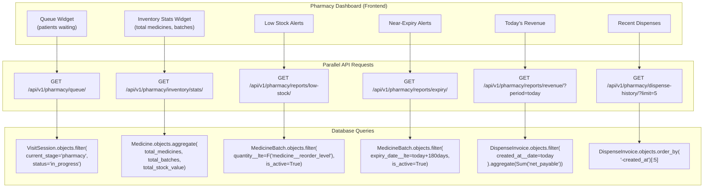
```mermaid
flowchart TD
    subgraph Dashboard["Pharmacy Dashboard (Frontend)"]
        direction TB
        QUEUE_WIDGET["Queue Widget<br/>(patients waiting)"]
        STATS_WIDGET["Inventory Stats Widget<br/>(total medicines, batches)"]
        LOW_STOCK_WIDGET["Low Stock Alerts"]
        EXPIRY_WIDGET["Near-Expiry Alerts"]
        REVENUE_WIDGET["Today's Revenue"]
        RECENT_WIDGET["Recent Dispenses"]
    end

    subgraph API_Calls["Parallel API Requests"]
        direction TB
        Q_API["GET /api/v1/pharmacy/queue/"]
        S_API["GET /api/v1/pharmacy/inventory/stats/"]
        LS_API["GET /api/v1/pharmacy/reports/low-stock/"]
        EX_API["GET /api/v1/pharmacy/reports/expiry/"]
        RV_API["GET /api/v1/pharmacy/reports/revenue/?period=today"]
        DH_API["GET /api/v1/pharmacy/dispense-history/?limit=5"]
    end

    subgraph DBQueries["Database Queries"]
        direction TB
        Q_DB["VisitSession.objects.filter(<br/>current_stage='pharmacy',<br/>status='in_progress')"]
        S_DB["Medicine.objects.aggregate(<br/>total_medicines, total_batches,<br/>total_stock_value)"]
        LS_DB["MedicineBatch.objects.filter(<br/>quantity__lte=F('medicine__reorder_level'),<br/>is_active=True)"]
        EX_DB["MedicineBatch.objects.filter(<br/>expiry_date__lte=today+180days,<br/>is_active=True)"]
        RV_DB["DispenseInvoice.objects.filter(<br/>created_at__date=today<br/>).aggregate(Sum('net_payable'))"]
        DH_DB["DispenseInvoice.objects.order_by(<br/>'-created_at')[:5]"]
    end

    QUEUE_WIDGET --> Q_API --> Q_DB
    STATS_WIDGET --> S_API --> S_DB
    LOW_STOCK_WIDGET --> LS_API --> LS_DB
    EXPIRY_WIDGET --> EX_API --> EX_DB
    REVENUE_WIDGET --> RV_API --> RV_DB
    RECENT_WIDGET --> DH_API --> DH_DB
```

**Explanation:** The dashboard fires **six parallel API requests** on load, each hitting a dedicated endpoint optimised for that specific widget. This avoids a single monolithic endpoint and allows each widget to refresh independently. The inventory stats endpoint performs aggregation queries, the low-stock endpoint uses an `F()` expression to compare batch quantity against the medicine's reorder level, and the expiry endpoint uses a 180-day lookahead window.

---

## 13. Revenue Calculation Flow

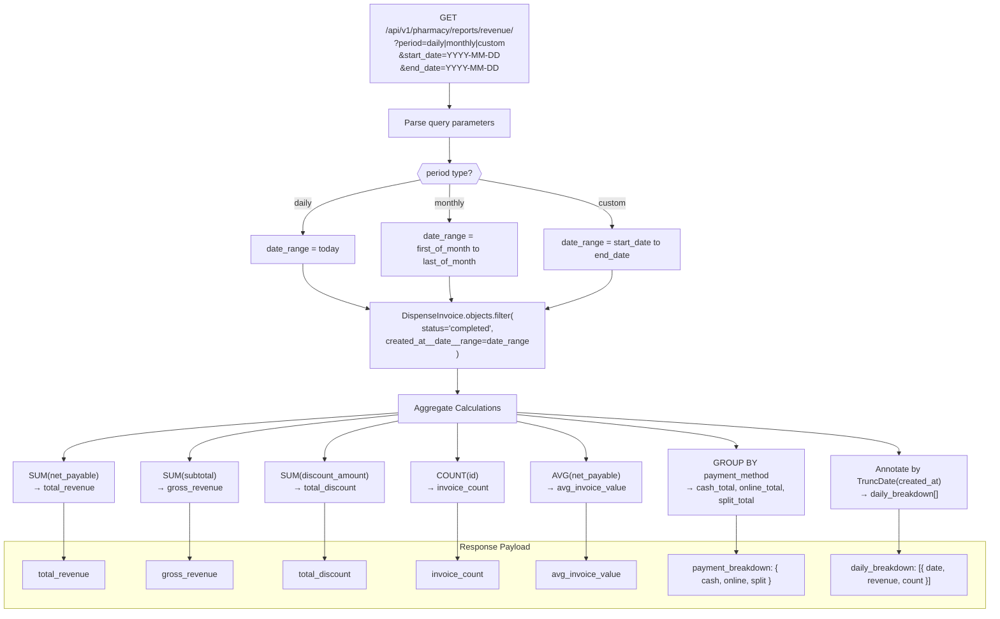
```mermaid
flowchart TD
    REQ["GET /api/v1/pharmacy/reports/revenue/<br/>?period=daily|monthly|custom<br/>&start_date=YYYY-MM-DD<br/>&end_date=YYYY-MM-DD"]

    REQ --> PARSE["Parse query parameters"]
    PARSE --> PERIOD{{"period type?"}}

    PERIOD -- "daily" --> DAILY_RANGE["date_range = today"]
    PERIOD -- "monthly" --> MONTHLY_RANGE["date_range = first_of_month to last_of_month"]
    PERIOD -- "custom" --> CUSTOM_RANGE["date_range = start_date to end_date"]

    DAILY_RANGE --> QUERY
    MONTHLY_RANGE --> QUERY
    CUSTOM_RANGE --> QUERY

    QUERY["DispenseInvoice.objects.filter(<br/>status='completed',<br/>created_at__date__range=date_range<br/>)"]

    QUERY --> AGG["Aggregate Calculations"]

    AGG --> TOTAL_REV["SUM(net_payable)<br/>→ total_revenue"]
    AGG --> TOTAL_DISC["SUM(discount_amount)<br/>→ total_discount"]
    AGG --> TOTAL_SUB["SUM(subtotal)<br/>→ gross_revenue"]
    AGG --> INV_COUNT["COUNT(id)<br/>→ invoice_count"]
    AGG --> AVG_INV["AVG(net_payable)<br/>→ avg_invoice_value"]

    AGG --> PAYMENT_BREAKDOWN["GROUP BY payment_method<br/>→ cash_total, online_total, split_total"]

    AGG --> DAILY_TREND["Annotate by TruncDate(created_at)<br/>→ daily_breakdown[]"]

    subgraph Response["Response Payload"]
        direction TB
        R1["total_revenue"]
        R2["gross_revenue"]
        R3["total_discount"]
        R4["invoice_count"]
        R5["avg_invoice_value"]
        R6["payment_breakdown: { cash, online, split }"]
        R7["daily_breakdown: [{ date, revenue, count }]"]
    end

    TOTAL_REV --> R1
    TOTAL_SUB --> R2
    TOTAL_DISC --> R3
    INV_COUNT --> R4
    AVG_INV --> R5
    PAYMENT_BREAKDOWN --> R6
    DAILY_TREND --> R7
```

**Explanation:** Revenue reporting supports three granularities: daily (today), monthly (current month), and custom (arbitrary date range). The query operates exclusively on `DispenseInvoice` records with `status = 'completed'`. Aggregation is performed at the database level using Django's `aggregate()` and `annotate()` with `TruncDate` for the daily trend breakdown. Payment method breakdown allows the frontend to render cash vs. online vs. split revenue charts.

---

## 14. Stock Alert Detection Flow

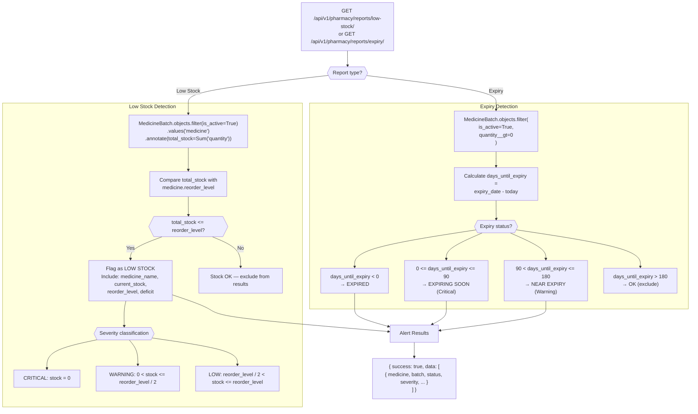
```mermaid
flowchart TD
    START["GET /api/v1/pharmacy/reports/low-stock/<br/>or GET /api/v1/pharmacy/reports/expiry/"]

    START --> TYPE{{"Report type?"}}

    TYPE -- "Low Stock" --> LS_QUERY
    TYPE -- "Expiry" --> EX_QUERY

    subgraph LowStockDetection["Low Stock Detection"]
        LS_QUERY["MedicineBatch.objects.filter(is_active=True)<br/>.values('medicine')<br/>.annotate(total_stock=Sum('quantity'))"]
        LS_QUERY --> LS_COMPARE["Compare total_stock with<br/>medicine.reorder_level"]
        LS_COMPARE --> LS_CHECK{{"total_stock <= reorder_level?"}}
        LS_CHECK -- Yes --> LS_ALERT["Flag as LOW STOCK<br/>Include: medicine_name, current_stock,<br/>reorder_level, deficit"]
        LS_CHECK -- No --> LS_OK["Stock OK — exclude from results"]

        LS_ALERT --> LS_CLASSIFY{{"Severity classification"}}
        LS_CLASSIFY --> LS_CRITICAL["CRITICAL: stock = 0"]
        LS_CLASSIFY --> LS_WARNING["WARNING: 0 < stock <= reorder_level / 2"]
        LS_CLASSIFY --> LS_LOW["LOW: reorder_level / 2 < stock <= reorder_level"]
    end

    subgraph ExpiryDetection["Expiry Detection"]
        EX_QUERY["MedicineBatch.objects.filter(<br/>is_active=True,<br/>quantity__gt=0<br/>)"]
        EX_QUERY --> EX_CALC["Calculate days_until_expiry =<br/>expiry_date - today"]
        EX_CALC --> EX_CHECK{{"Expiry status?"}}
        EX_CHECK --> EXPIRED["days_until_expiry < 0<br/>→ EXPIRED"]
        EX_CHECK --> EXPIRING_SOON["0 <= days_until_expiry <= 90<br/>→ EXPIRING SOON (Critical)"]
        EX_CHECK --> EXPIRING["90 < days_until_expiry <= 180<br/>→ NEAR EXPIRY (Warning)"]
        EX_CHECK --> OK["days_until_expiry > 180<br/>→ OK (exclude)"]
    end

    EXPIRED --> RESULT["Alert Results"]
    EXPIRING_SOON --> RESULT
    EXPIRING --> RESULT
    LS_ALERT --> RESULT

    RESULT --> RESPONSE["{ success: true, data: [<br/>{ medicine, batch, status, severity, ... }<br/>] }"]
```

**Explanation:** Stock alerts are **computed at query time** — there are no background jobs or cron tasks. Low-stock detection aggregates total stock across all active batches per medicine and compares against the `reorder_level` field. Expiry detection uses three tiers: expired (past due), expiring soon (≤ 90 days), and near expiry (91–180 days). Both reports return severity classifications so the frontend can colour-code alerts (red/orange/yellow).

---

## 15. Prescription Queue → Dispense → Complete Flow

This end-to-end flowchart covers the entire journey from a patient arriving at the pharmacy stage to the visit being completed.

```mermaid
flowchart TD
    START["Doctor completes consultation<br/>POST /sessions/{id}/transition/<br/>stage: doctor → pharmacy"] --> QUEUE["VisitSession updated:<br/>current_stage = 'pharmacy'<br/>status = 'in_progress'"]

    QUEUE --> APPEAR["Patient appears in Pharmacy Queue<br/>GET /api/v1/pharmacy/queue/"]

    APPEAR --> SELECT["Pharmacist selects patient from queue"]

    SELECT --> LOAD["Frontend loads:<br/>- Patient details<br/>- Visit prescription notes<br/>- Active medicines list"]

    LOAD --> ADD_ITEMS["Pharmacist adds line items:<br/>Medicine → Batch → Dose → Days → Qty"]

    ADD_ITEMS --> BATCH_SELECT{{"For each item: Select batch"}}
    BATCH_SELECT --> AUTO_BATCH["FEFO: First Expiry First Out<br/>(auto-suggest nearest expiry batch with stock)"]
    BATCH_SELECT --> MANUAL_BATCH["Manual: Pharmacist selects specific batch"]

    AUTO_BATCH --> CALC
    MANUAL_BATCH --> CALC

    CALC["Calculate totals:<br/>- line_total = qty × unit_price<br/>- subtotal = SUM(line_totals)<br/>- discount_amount = subtotal × discount_%<br/>- net_payable = subtotal - discount_amount"]

    CALC --> PAYMENT["Select payment method:<br/>Cash / Online / Split"]

    PAYMENT --> SPLIT_CHECK{{"Split payment?"}}
    SPLIT_CHECK -- Yes --> SPLIT_AMOUNTS["Enter cash_amount + online_amount<br/>Must equal net_payable"]
    SPLIT_CHECK -- No --> FULL_AMOUNT["Full amount via selected method"]

    SPLIT_AMOUNTS --> SUBMIT
    FULL_AMOUNT --> SUBMIT

    SUBMIT["Pharmacist clicks Submit<br/>POST /api/v1/pharmacy/dispense/"]

    SUBMIT --> VALIDATE["Server-side validation:<br/>1. Session exists at pharmacy stage<br/>2. No duplicate dispense invoice<br/>3. All batches have sufficient stock<br/>4. No expired batches<br/>5. Payment amounts valid"]

    VALIDATE --> VALID_OK{{"Validation passed?"}}
    VALID_OK -- No --> ERROR["Return error<br/>{ success: false, error: {...} }"]
    ERROR --> ADD_ITEMS

    VALID_OK -- Yes --> ATOMIC["BEGIN transaction.atomic()"]

    ATOMIC --> DEDUCT["Deduct stock from each batch<br/>(with row-level locking)"]
    DEDUCT --> CREATE_INV["Create DispenseInvoice"]
    CREATE_INV --> CREATE_ITEMS["Create DispenseInvoiceItems<br/>(with snapshot fields)"]
    CREATE_ITEMS --> LOG_MOVEMENTS["Log StockMovements<br/>(type = dispense_out)"]
    LOG_MOVEMENTS --> TRANSITION["Transition VisitSession:<br/>current_stage = 'completed'<br/>status = 'completed'"]
    TRANSITION --> COMMIT["COMMIT transaction"]

    COMMIT --> SUCCESS["Return success<br/>{ success: true, data: { invoice_number, ... } }"]
    SUCCESS --> PRINT["Frontend: Show success + Print invoice option"]

    PRINT --> DONE["Visit Complete ✓"]
```

**Explanation:** This is the **most critical user journey** in the pharmacy module. The pharmacist works through a structured flow: select patient → add medicines → calculate totals → choose payment → submit. The server performs comprehensive validation before entering an atomic transaction that deducts stock, creates the invoice with snapshot data, logs movements, and transitions the visit — all as a single indivisible operation.

---

## 16. Service / Module Interaction Diagram

This diagram shows how the **pharmacy module** interacts with other modules in the hospital management system.

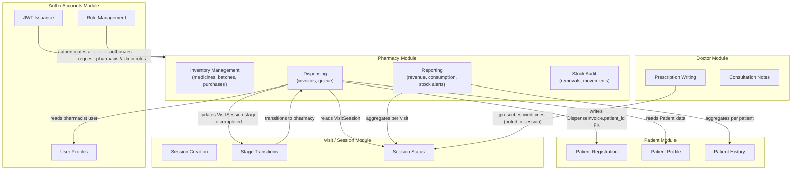
```mermaid
flowchart TD
    subgraph PharmacyModule["Pharmacy Module"]
        direction TB
        PM_INV["Inventory Management<br/>(medicines, batches, purchases)"]
        PM_DISP["Dispensing<br/>(invoices, queue)"]
        PM_RPT["Reporting<br/>(revenue, consumption, stock alerts)"]
        PM_AUDIT["Stock Audit<br/>(removals, movements)"]
    end

    subgraph PatientModule["Patient Module"]
        PAT_REG["Patient Registration"]
        PAT_PROF["Patient Profile"]
        PAT_HIST["Patient History"]
    end

    subgraph VisitModule["Visit / Session Module"]
        VIS_CREATE["Session Creation"]
        VIS_STAGE["Stage Transitions"]
        VIS_STATUS["Session Status"]
    end

    subgraph AuthModule["Auth / Accounts Module"]
        AUTH_JWT["JWT Issuance"]
        AUTH_ROLE["Role Management"]
        AUTH_USER["User Profiles"]
    end

    subgraph DoctorModule["Doctor Module"]
        DOC_RX["Prescription Writing"]
        DOC_NOTES["Consultation Notes"]
    end

    %% Cross-module relationships
    PM_DISP -- "reads Patient data" --> PAT_PROF
    PM_DISP -- "reads VisitSession" --> VIS_STATUS
    PM_DISP -- "writes DispenseInvoice.patient_id FK" --> PAT_REG
    PM_DISP -- "updates VisitSession stage to completed" --> VIS_STAGE
    PM_DISP -- "reads pharmacist user" --> AUTH_USER

    PM_RPT -- "aggregates per patient" --> PAT_HIST
    PM_RPT -- "aggregates per visit" --> VIS_STATUS

    DOC_RX -- "prescribes medicines (noted in session)" --> VIS_STATUS
    VIS_STAGE -- "transitions to pharmacy" --> PM_DISP

    AUTH_JWT -- "authenticates all pharmacy requests" --> PharmacyModule
    AUTH_ROLE -- "authorizes pharmacist/admin roles" --> PharmacyModule
```

**Explanation:** The pharmacy module has **read dependencies** on the Patient module (for patient info) and the Visit module (for session status and stage). It has **write dependencies** on the Visit module (transitioning stage to completed) and the Auth module (for user context). The Doctor module is an upstream producer that sends patients to the pharmacy queue via stage transitions. The pharmacy module does not directly depend on the Doctor module's internal data — the visit session acts as the contract between them.

---

## 17. Concurrent Dispensing Safety Flow

This diagram illustrates how the system prevents **race conditions** when two pharmacists or requests attempt to dispense from the same batch simultaneously.

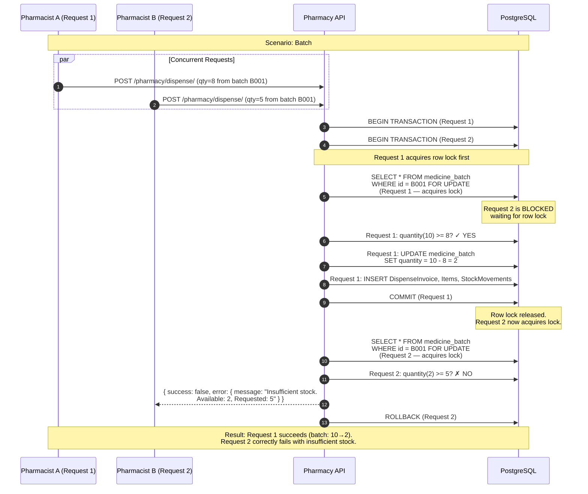
```mermaid
sequenceDiagram
    autonumber
    participant P1 as Pharmacist A (Request 1)
    participant P2 as Pharmacist B (Request 2)
    participant API as Pharmacy API
    participant DB as PostgreSQL

    Note over P1,DB: Scenario: Batch #B001 has quantity = 10

    par Concurrent Requests
        P1->>API: POST /pharmacy/dispense/ (qty=8 from batch B001)
        P2->>API: POST /pharmacy/dispense/ (qty=5 from batch B001)
    end

    API->>DB: BEGIN TRANSACTION (Request 1)
    API->>DB: BEGIN TRANSACTION (Request 2)

    Note over API,DB: Request 1 acquires row lock first

    API->>DB: SELECT * FROM medicine_batch<br/>WHERE id = B001 FOR UPDATE<br/>(Request 1 — acquires lock)

    Note over DB: Request 2 is BLOCKED<br/>waiting for row lock

    API->>DB: Request 1: quantity(10) >= 8? ✓ YES
    API->>DB: Request 1: UPDATE medicine_batch<br/>SET quantity = 10 - 8 = 2

    API->>DB: Request 1: INSERT DispenseInvoice, Items, StockMovements
    API->>DB: COMMIT (Request 1)

    Note over DB: Row lock released.<br/>Request 2 now acquires lock.

    API->>DB: SELECT * FROM medicine_batch<br/>WHERE id = B001 FOR UPDATE<br/>(Request 2 — acquires lock)

    API->>DB: Request 2: quantity(2) >= 5? ✗ NO
    API-->>P2: { success: false, error: { message: "Insufficient stock.<br/>Available: 2, Requested: 5" } }
    API->>DB: ROLLBACK (Request 2)

    Note over P1,DB: Result: Request 1 succeeds (batch: 10→2).<br/>Request 2 correctly fails with insufficient stock.
```

**Explanation:** Concurrency safety is achieved via **pessimistic row-level locking** using PostgreSQL's `SELECT ... FOR UPDATE`. When two transactions attempt to lock the same batch row, the second transaction **blocks** until the first commits or rolls back. This guarantees that stock checks always see the most recent committed quantity, preventing overselling. The locking scope is kept narrow (per-batch-row) to minimise contention.

---

## 18. Purchase Invoice Validation Flow

This flowchart details **every validation step** performed when a purchase invoice is submitted.

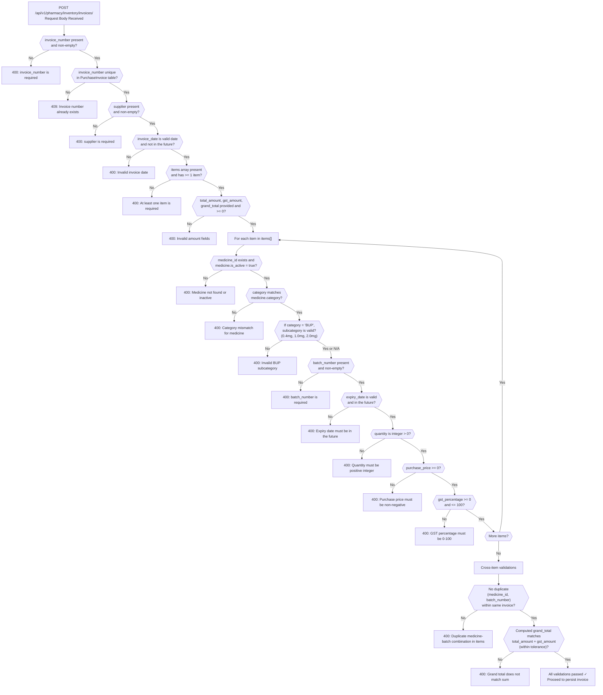
```mermaid
flowchart TD
    START["POST /api/v1/pharmacy/inventory/invoices/<br/>Request Body Received"]

    START --> V1{{"invoice_number present<br/>and non-empty?"}}
    V1 -- No --> E1["400: invoice_number is required"]
    V1 -- Yes --> V2{{"invoice_number unique<br/>in PurchaseInvoice table?"}}
    V2 -- No --> E2["409: Invoice number already exists"]
    V2 -- Yes --> V3

    V3{{"supplier present<br/>and non-empty?"}}
    V3 -- No --> E3["400: supplier is required"]
    V3 -- Yes --> V4

    V4{{"invoice_date is valid date<br/>and not in the future?"}}
    V4 -- No --> E4["400: Invalid invoice date"]
    V4 -- Yes --> V5

    V5{{"items array present<br/>and has >= 1 item?"}}
    V5 -- No --> E5["400: At least one item is required"]
    V5 -- Yes --> V6

    V6{{"total_amount, gst_amount,<br/>grand_total provided and >= 0?"}}
    V6 -- No --> E6["400: Invalid amount fields"]
    V6 -- Yes --> LOOP

    LOOP["For each item in items[]"]
    LOOP --> V7

    V7{{"medicine_id exists and<br/>medicine.is_active = true?"}}
    V7 -- No --> E7["400: Medicine not found or inactive"]
    V7 -- Yes --> V8

    V8{{"category matches<br/>medicine.category?"}}
    V8 -- No --> E8["400: Category mismatch for medicine"]
    V8 -- Yes --> V9

    V9{{"If category = 'BUP',<br/>subcategory is valid?<br/>(0.4mg, 1.0mg, 2.0mg)"}}
    V9 -- No --> E9["400: Invalid BUP subcategory"]
    V9 -- "Yes or N/A" --> V10

    V10{{"batch_number present<br/>and non-empty?"}}
    V10 -- No --> E10["400: batch_number is required"]
    V10 -- Yes --> V11

    V11{{"expiry_date is valid<br/>and in the future?"}}
    V11 -- No --> E11["400: Expiry date must be in the future"]
    V11 -- Yes --> V12

    V12{{"quantity is integer > 0?"}}
    V12 -- No --> E12["400: Quantity must be positive integer"]
    V12 -- Yes --> V13

    V13{{"purchase_price >= 0?"}}
    V13 -- No --> E13["400: Purchase price must be non-negative"]
    V13 -- Yes --> V14

    V14{{"gst_percentage >= 0<br/>and <= 100?"}}
    V14 -- No --> E14["400: GST percentage must be 0-100"]
    V14 -- Yes --> V15

    V15{{"More items?"}}
    V15 -- Yes --> LOOP
    V15 -- No --> CROSS

    CROSS["Cross-item validations"]
    CROSS --> V16{{"No duplicate<br/>(medicine_id, batch_number)<br/>within same invoice?"}}
    V16 -- No --> E16["400: Duplicate medicine-batch combination in items"]
    V16 -- Yes --> V17

    V17{{"Computed grand_total matches<br/>total_amount + gst_amount<br/>(within tolerance)?"}}
    V17 -- No --> E17["400: Grand total does not match sum"]
    V17 -- Yes --> SUCCESS

    SUCCESS["All validations passed ✓<br/>Proceed to persist invoice"]
```

**Explanation:** Purchase invoice validation is **multi-layered**: header-level checks (invoice number uniqueness, supplier, date), item-level checks (medicine existence, category consistency, BUP subcategory rules, batch/expiry/quantity/price validity), and cross-item checks (duplicate detection, total reconciliation). Each validation failure returns a specific error message identifying exactly what went wrong and on which item.

---

## Appendix: Quick Reference — Model Relationship Summary

| Parent Model | Child Model | Relationship | FK Field | Constraint |
|---|---|---|---|---|
| Medicine | MedicineBatch | One-to-Many | `medicine_id` | Unique: `(medicine, batch_number)` |
| Medicine | PurchaseInvoiceItem | One-to-Many | `medicine_id` | — |
| Medicine | DispenseInvoiceItem | One-to-Many | `medicine_id` | — |
| Medicine | StockAuditRemoval | One-to-Many | `medicine_id` | — |
| Medicine | StockMovement | One-to-Many | `medicine_id` | — |
| MedicineBatch | DispenseInvoiceItem | One-to-Many | `medicine_batch_id` | — |
| MedicineBatch | StockAuditRemoval | One-to-Many | `batch_id` | — |
| MedicineBatch | StockMovement | One-to-Many | `batch_id` | — |
| PurchaseInvoice | PurchaseInvoiceItem | One-to-Many | `invoice_id` | CASCADE delete |
| DispenseInvoice | DispenseInvoiceItem | One-to-Many | `dispense_invoice_id` | CASCADE delete |
| VisitSession | DispenseInvoice | **OneToOne** | `visit_session_id` | Unique |
| Patient | DispenseInvoice | One-to-Many | `patient_id` | — |
| User | DispenseInvoice | One-to-Many | `pharmacist_id` | — |
| User | StockAuditRemoval | One-to-Many | `performed_by_id` | — |
| User | StockMovement | One-to-Many | `performed_by_id` | — |

---

## Appendix: Stock Movement Type Reference

| Movement Type | Direction | Triggered By | Reference Model |
|---|---|---|---|
| `purchase_in` | ➕ Ingress | Purchase Invoice submission | `PurchaseInvoice` |
| `dispense_out` | ➖ Egress | Dispense Invoice creation | `DispenseInvoice` |
| `audit_removal` | ➖ Egress | Stock Audit Removal | `StockAuditRemoval` |
| `adjustment` | ➕/➖ | Manual admin correction | N/A |

---

*End of Pharmacy System Diagrams Document*
